# Quantum Computing Basics

This is a short introduction to some basic concepts of quantum computation using the quantum gate model. Some knowledge of linear algebra is assumed.

### Contents

- [Quantum Computing Basics](#quantum-computing-basics)
    - [Contents](#contents)
  - [Introduction](#introduction)
  - [Qubits](#qubits)
  - [Quantum Probability and Interference](#quantum-probability-and-interference)
  - [Bloch Sphere](#bloch-sphere)
  - [Dirac Bra-Ket Notation](#dirac-bra-ket-notation)
    - [Inner Product](#inner-product)
    - [Outer Product](#outer-product)
    - [Tensor Product](#tensor-product)
    - [Projectors](#projectors)
  - [Multi-Qubit States](#multi-qubit-states)
  - [Unitary Operators](#unitary-operators)
  - [No-Cloning Theorem](#no-cloning-theorem)
  - [Quantum Circuits](#quantum-circuits)
    - [Conventions](#conventions)
    - [Operations on Multiple Qubits](#operations-on-multiple-qubits)
    - [Composing Circuits](#composing-circuits)
    - [Rearranging Qubits](#rearranging-qubits)
  - [Other Bases](#other-bases)
  - [Quantum Gates](#quantum-gates)
    - [Introduction](#introduction)
    - [Identity (I) Gate](#identity-i-gate)
    - [X Gate (aka NOT gate)](#x-gate-aka-not-gate)
    - [Hadamard (H) Gate](#hadamard-h-gate)
    - [Hadamard Transform](#hadamard-transform)
    - [Phase (P) Gate](#phase-p-gate)
    - [Controlled-X (CX) Gate](#controlled-x-cx-gate)
    - [Controlled-U (CU) Gate](#controlled-u-cu-gate)
    - [SWAP Gate](#swap-gate)
  - [Entanglement](#entanglement)
    - [Creating Entanglement](#creating-entanglement)
    - [Bell States](#bell-states)
    - [Bell Measurement](#bell-measurement)
    - [Monogomy of Entanglement](#monogomy-of-entanglement)
    - [GHZ State](#ghz-state)
  - [Measurement](#measurement)
    - [Introduction](#introduction)
    - [Simulated Measurements](#simulated-measurements)
    - [Measurement Operators](#measurement-operators)
    - [Measurement in Different Bases](#measurement-in-different-bases)
    - [Measurement as Entanglement](#measurement-as-entanglement)
    - [Principle of Implicit Measurement](#principle-of-implicit-measurement)
    - [Principle of Deferred Measurement](#principle-of-deferred-measurement)
    - [Mid-Circuit Measurement](#mid-circuit-measurement)
  - [Examples](#examples)
    - [Quantum Teleportation](#quantum-teleportation)
    - [Exploring the Teleportation Example](#exploring-the-teleportation-example)
    - [Quantum Fourier Transform](#quantum-fourier-transform)
    - [Quantum Phase Estimation](#quantum-phase-estimation)
  - [Conclusions](#conclusions)
  - [Bibliography](#bibliography)

## Introduction

Quantum computing uses the special properties of quantum systems, such as superposition and entanglement, to perform computations. In principle, this makes it possible to solve certain problems that would be totally intractable on a conventional (classical) computer.

Classical computers represent information in the form of *bits* that can have either the value 0 or 1. Quantum computers, on the other hand, use *qubits* that can be in a *superposition* of both 0 and 1. When one or more qubits are in a superposition, the states can be made to *interfere* with one another, either cancelling or reinforcing each other. The qubits can be *entangled* with one another so that information is encoded in the relationships between qubits and the qubits no longer have independent states of their own. These mechanisms give quantum computing enormous power, which we are still in the early stages of learning how to exploit.

The idea of Quantum Computers was proposed by physicist Richard Feynman in 1982 when he published a paper called "Simulating Physics with Computers" [Fey82]. He pointed out that many physical systems that we would like to simulate are quantum mechanical, so it would make sense to simulate them using a computer that works at the quantum level. Indeed, nowadays, the simulation of chemicals, drugs and materials at the quantum level is seen to be an important prospective application area.

There are two main types of quantum computer: the gate-model quantum computer and the adiabatic quantum computer. This document only considers the gate-model. The gate model uses *quantum gates*, analogous to the logic gates of classical computers. These implement quantum operators that can manipulate a quantum state to evolve it towards a solution. A *quantum circuit* defines a sequence of gates that can perform an algorithm.

In 1994, Peter Shor published a quantum algorithm, known as Shor's algorithm, that can theoretically factor large integers exponentially faster than a classical computer. This led to a lot of interest as it would allow a quantum computer to break widely-used encryption codes such as RSA. However, quantum technology also provides new solutions to cryptography, such as Quantum Key Distribution (QKD), that are secure against quantum computers.

Quantum computers work on a completely different principle to classical computers, so the quantum algorithm to solve a problem is entirely different to a classical one. A lot of work is needed to find quantum algorithms that can exploit the power of a quantum computer. As yet, only a few exist.

Current quantum computers are referred to as Noisy Intermediate-Scale Quantum (NISQ) devices. They are susceptible to *decoherence* of the fragile quantum state, caused by noise from their environment, leading to high error rates. Devices are cooled down to near absolute zero to reduce the thermal noise and shielded against other forms of radiation. Noise can to some extent be countered by quantum error correction, implemented using many physical qubits to make one logical qubit. Consequently, the number of useful qubits can be much less that the physical number. The key challenge in the years ahead is to scale quantum computers up to the tens or hundreds of thousands of logical qubits needed to tackle real-world problems, while keeping noise and errors under control.

An added benefit of developing the technology for quantum computers is that we are learning new ways to manipulate nature at the quantum level. This is certain to have applications in other areas such as quantum sensing and quantum metrology.

## Qubits

The unit of information for classical computers is the *bit*, which has two possible states that we label 0 and 1. The unit of information for quantum computers is the *qubit*.

The qubit is an abstraction of a two-level quantum system, such as the spin of an electron. It has two orthonormal basis states denoted by $\ket{0}$ and $\ket{1}$. The *ket* symbol $\ket{\psi}$ is part of the Dirac *Bra-Ket* notation and represents a complex vector with label $\psi$.

```math
\ket{0} =  \begin{bmatrix}1\\0\end{bmatrix}\quad\text{and}\quad\ket{1} =  \begin{bmatrix}0\\1\end{bmatrix}
```

The $\ket{0}$ and $\ket{1}$ basis states can be thought of as corresponding to the classical bit states 0 and 1. This basis is known as the *computational basis* or Z-basis.

Unlike a classical bit, which must be in *either* the state 0 *or* the state 1, a qubit may also be in a linear superposition of its two basis states:

```math
\ket{\psi} = \alpha_0 \ket{0} + \alpha_1 \ket{1} = \begin{bmatrix}\alpha_0\\ \alpha_1\end{bmatrix},\qquad \alpha_0,\alpha_1 \in \mathbb{C}
```

where $\alpha_0$ and $\alpha_1$ are called *probability amplitudes*.

The quantum state of a qubit is not something we can observe. The only information we can get is as the result of a quantum measurement that results in the state collapsing into one of the two basis states $\ket{0}$ and $\ket{1}$, with probabilities $|\alpha_0|^2$ and $|\alpha_1|^2$ respectively. Measurement is discussed in more detail below.

## Quantum Probability and Interference

Classical physics is deterministic, whereas quantum mechanics has an inherent randomness. In classical probability theory, if an outcome can occur in two mutually exclusive ways, the probability of it happening is the sum of the probabilities for the two cases:

```math
p = p_1 + p_2
```

However, nature doesn't work this way at the quantum level. Instead, we need to allow for the outcome arising from a superposition of the two cases. This requires using *probability amplitudes* that are complex numbers. The probability is the square of the absolute value of the probability amplitude $\alpha$:

```math
p = \alpha^*\,\alpha = \lvert \alpha \rvert ^2,  \qquad \alpha \in \mathbb{C}
```

where $\alpha^*$ denotes the complex conjugate of $\alpha$.

If something can happen in two different ways, we add the probability amplitudes:

```math
\begin{align*}
p &= (\alpha_1 + \alpha_2)^*\  (\alpha_1 + \alpha_2)\\
&= \lvert \alpha_1 + \alpha_2 \rvert ^2
\end{align*}
```

Writing the complex probability amplitudes in polar form:

```math
\alpha_1 = \lvert \alpha_1 \rvert e^{i \phi_1} \quad\text{and}\quad \alpha_2 = \lvert \alpha_2 \rvert e^{i \phi_2}
```

results in:

```math
\begin{align*}
	p &=  (\alpha_1 + \alpha_2)^*\  (\alpha_1 + \alpha_2) \\
	& = \lvert \alpha_1 \rvert^2 + \lvert \alpha_2 \rvert^2 + \alpha_1 \alpha_2^* + \alpha_1^* \alpha_2 \\
	& = \lvert \alpha_1 \rvert^2 + \lvert \alpha_2 \rvert^2 + \lvert\alpha_1\rvert\lvert\alpha_2\rvert (e^{i(\phi_1-\phi_2)} + e^{-i(\phi_1-\phi_2)}\\
	& = \lvert \alpha_1 \rvert^2 + \lvert \alpha_2 \rvert^2 + 2 \lvert \alpha_1\rvert \lvert \alpha_2 \rvert \cos{(\phi_1 - \phi_2)}]
\end{align*}
```

The first two terms are the classical probabilities $p_1$ and $p_2$.

The final term represents quantum *interference*. This term can be positive (constructive interference) or negative (destructive interference), depending on the relative phase $(\phi_1 - \phi_2)$.

In the classical case, the two states of a bit (0 and 1) are mutually exclusive, so that the interference term disappears and the probability reduces to the normal classical one:

```math
p = \lvert \alpha_1 \rvert^2 + \lvert \alpha_2 \rvert^2 = p_1 + p_2
```

Interference is one of the key quantum phenomena that is exploited in quantum computing. We get quantum states to interfere so that the required solutions interfere constructively and other solutions interfere destructively.

## Bloch Sphere

The state of a qubit is described by two complex numbers. However, it is possible to describe the state with only two (real) angles because there is redundant information.

One degree of freedom is lost because the total probability must be one:

```math
\lvert\alpha_0\rvert^2 + \lvert\alpha_1\rvert^2 = 1
```

A second degree of freedom is lost because there are many kets that describe the same physical state, since a global phase term $e^{i\beta}$ does not affect the result of a measurement:

```math
\lvert\ket{\psi}\rvert^2 = \lvert e^{i\beta}\ket{\psi}\rvert^2
```

The state $\ket{\psi}$ of a qubit may be mapped onto a sphere, known as the Bloch sphere, as follows:

```math
\ket{\psi} = \cos(\frac{\theta}{2})\ket{0} + e^{i\phi} \sin(\frac{\theta}{2})\ket{1}
```

where $0 \le\theta\le\pi$ and $0\le\phi\le2\pi$.

<div style="text-align: center;">

</div>

The probability of a measurement outcome of $\ket{0}$ or $\ket{1}$ depends only on the polar angle $\theta$ and not on the azimuthal (phase) angle $\phi$:

```math
\begin{align*}
p(\ket{0}) &= \lvert \cos({\small\frac{\theta}{2}}) \rvert^2 = \frac{1 + \cos\theta}{2}\\[0.4em]
p(\ket{1}) &= \lvert e^{i\phi}\sin({\small\frac{\theta}{2}}) \rvert^2 = \frac{1 - \cos\theta}{2}
\end{align*}
```

Evaluating these gives:

```math
 p(\ket{0}) = \begin{cases} 
      1 & \theta=0 \\
      0.5 & \theta=\frac{\pi}{2} \\
      0 & \theta=\pi 
   \end{cases}
```

```math
 p(\ket{1}) = \begin{cases} 
      0 & \theta=0 \\
      0.5 & \theta=\frac{\pi}{2} \\
      1 & \theta=\pi 
   \end{cases}
```

So, on the "equator" where $\theta=\frac{\pi}{2}$, there is an equal probability of measuring $\ket{0}$ or $\ket{1}$. This is called an *equal superposition*.

We are only considering *pure* states that can be described by a state vector with a norm of one. These are represented by points on the sphere. Points within the sphere correspond to *mixed states*.

The unitary operators implemented by quantum gates are norm-preserving. Since the norm of a pure state vector is one, one-qubit gates perform rotations on the sphere.

The Bloch sphere is mostly useful for single qubits because the qubits of a multi-qubit system can become *entangled* such that the qubits no longer have an individual pure state. However, it is a useful way to visualize and understand the effects of single-qubit gates, which can then be used to build multi-qubit systems.

Note that the basis states $\ket{0}$ and $\ket{1}$ are 180 degrees apart on the Bloch sphere, whereas they are 90 degrees apart in the complex vector space $\mathbb{C}^2$. When quantum gates are said to perform a rotation by some angle, this refers to the angle on the Bloch sphere.

## Dirac Bra-Ket Notation

Dirac’s *Bra-Ket* notation is used in quantum mechanics to describe quantum states as vectors in a complex vector space. It provides a concise way to write vector equations and manipulate them symbolically in a coordinate-free way. The notation automatically takes care of complex conjugation where appropriate.

A quantum state is represented by the *Ket* symbol $\ket{A}$, where $A$ is just a label. The *Conjugate Transpose* (aka *Hermitian Transpose*) $\ket{A}^\dagger$ of the ket $\ket{A}$ is called a *Bra* and is written $\bra{A}$. The symbols are called *Bra* and *Ket* because together they are like a pair of brackets: $\braket{A|B}$.

If we consider the quantum state in a specific orthonormal basis, we can represent a Ket by a column vector:

```math
\ket{A} = \begin{bmatrix}a_1\\a_2\\...\\a_n\end{bmatrix}
```

The corresponding Bra $\bra{A}$ is the conjugate transpose , which is a row vector:

```math
\bra{A} = \ket{A}^\dagger =  \begin{bmatrix}a_1^*, & a_2^*, ...\, a_n^*\end{bmatrix}
```

There are three products of interest: the *inner product* $\braket{A|B}$, the *outer product* $\ket{A}\bra{B}$ and the *tensor product* $\ket{A}\ket{B}$.

### Inner Product

The *inner product* $\braket{A|B} \in\mathbb{C}$ is:

```math
\begin{align*}
	\braket{A|B} &= \begin{bmatrix}a_1^*,\dots,a_n^*\end{bmatrix}  \begin{bmatrix}b_1\\ \dots\\b_n\end{bmatrix}\\
	\\
	&= a_1^* b_1 + a_2^* b_2 +...+ a_n^* b_n
\end{align*}
```

For example, the fact that $\ket{0}$ and $\ket{1}$ are orthonormal can be expressed as:

```math
\begin{align*}
\braket{0|1} = \braket{1|0} = 0\\
\braket{0|0} = \braket{1|1} = 1
\end{align*}
```

### Outer Product

The outer product is:

```math
\ket{A}\bra{B} = \begin{bmatrix}a_1\\\dots\\a_m\end{bmatrix} \begin{bmatrix}b_1^*,\dots,b_n\end{bmatrix}
	=  \begin{bmatrix}a_1 b_1^*&\dots&a_1 b_n^*\\\dots\\a_mb_1^*&\dots&a_mb_n^*\end{bmatrix}
```

For example, the quantum NOT operator $X$ can be expressed as:

```math
X=\ketbra{0}{1}+\ketbra{1}{0}=\begin{bmatrix}0&1\\1&0\end{bmatrix}
```

### Tensor Product

The tensor product (denoted by $\otimes$) is:

```math
\ket{A}\otimes\ket{B} = \begin{bmatrix}a_1\\a_2\end{bmatrix} \otimes  \begin{bmatrix}b_1\\ b_2\end{bmatrix}
	= \begin{bmatrix}a_1 b_1\\a_1 b_2\\a_2 b_1\\a_2 b_2\end{bmatrix}
```

The tensor product can be written in several different ways. The tensor product symbol $\otimes$ is usually omitted in Dirac notation as it is implied by the concatenation of kets:

```math
\ket{A}\otimes\ket{B} \equiv \ket{A}\ket{B} \equiv \ket{A,B}\equiv \ket{AB}
```

The tensor product of $n$ identical states can be written as a *tensor power*. For example:

```math
\ket{0}^{\otimes n}=\ket{0}\otimes\dots\otimes\ket{0}
```

### Projectors

The outer product $\ketbra{\psi}{\psi}$ of a vector with its conjugate transpose is known as a *projector*. If a projector is applied to a vector $\ket{\phi}$, the result is:

```math
\begin{align*}
(\ket{\psi}\bra{\psi})\ \ket{\phi} &= \ket{\psi}\ \braket{\psi|\phi}\\
&=\braket{\psi|\phi}\ \ket{\psi}
\end{align*}
```

The regrouping of terms allowed by associativity results in an inner product $\braket{\psi|\phi}$, which is just a complex number. This can then be moved to the left as a coefficient multiplier of $\ket{\psi}$.

The effect of the projector $\ketbra{\psi}{\psi}$ is to project the vector $\ket{\phi}$ onto the basis vector $\ket{\psi}$.

## Multi-Qubit States

The states of two qubits in $\mathbb{C}^2$ can be combined into one state in $\mathbb{C}^4$ by taking their tensor product:

```math
\ket{A}\otimes\ket{B} = \begin{bmatrix}a_1\\a_2\end{bmatrix}
	\otimes  \begin{bmatrix}b_1\\ b_2\end{bmatrix}
	= \begin{bmatrix}a_1 b_1\\a_1 b_2\\a_2 b_1\\a_2 b_2\end{bmatrix}
```

The tensor product is associative, so we can combine arbitrarily many qubits:

```math
\ket{\psi} = \ket{A_1}\otimes \ket{A_2}\otimes\dots\otimes\ket{A_n}
```

In general, an N-qubit state is represented by a vector in the 2N-dimensional complex vector space $\mathbb{C}^{2N}$. Vectors which only differ by a complex phase are equivalent as far as the quantum state is concerned, so the vector space representation has redundancy, as mentioned in the section on the Bloch Sphere.

Note: The term *Hilbert Space* is used in Quantum Mechanics. A Hilbert space is a complex vector space with an inner product that is generalized to infinite dimensional spaces. As we only need finite-dimensional vector spaces for quantum computing, we will just use the term "complex vector space".

The tensor product of individual pure qubit states gives the state of the N-qubit system. However, it is not necessarily possible to factor the state back into individual qubit states after quantum gate operations have been applied. For example, the following is an *entangled* state that is not separable into the tensor product of individual qubit states:

```math
\frac{1}{\sqrt{2}} (\ket{01} + \ket{10} )
```

Unentangled states are separable and can therefore be simulated efficiently on a classical computer. Without entanglement, quantum computers would be no more powerful than classical computers.

A classical computer requires only 38 bytes of storage to represent 300 classical bits. In contrast, a quantum computer with 300 qubits requires a vector of $2^{300}$ (about $10^{93}$) complex values to represent the state, which is much more than the number of atoms in the observable universe (estimated to be around $10^{80}$ ). Simulating a quantum computer with more than a few tens of qubits is infeasible even on a supercomputer.

Quantum states represent exponentially more information than classical states. However, we cannot access that information because measuring it will only give one of the classical states. The art of writing quantum algorithms is to utilize the vast state space, but then evolve the state towards one of the basis states, having some required property, which can be read out as the answer.

## Unitary Operators

A *unitary* operator $U$ is one whose inverse is its *conjugate transpose* (aka *Hermitian transpose*):

```math
U^\dagger U = U U^\dagger = I
```

Unitary operators are norm-preserving and invertible. The eigenvalues $\lambda$ of a unitary operator have a norm of one.


```math
U\ket{\psi} = \lambda \ket{\psi},\quad |\lambda|=1
```

The time evolution of a closed quantum system is *unitary*, according to the *Schrödinger equation*. If the state of a quantum system is $\ket{\psi}$, then the state $\ket{\psi'}$ at a later time corresponds to the application of a unitary operator:

```math
\ket{\psi'} = U\ket{\psi}
```

The evolution does not depend on the state and is therefore *linear*. Consequently, the result of applying a unitary operator $U$ to the sum (e.g. superposition) of two states is the sum of the results of applying the operator to the states individually:

```math
U (\ket{\psi} + \ket{\phi}) = U \ket{\psi} + U \ket{\phi}
```

The norm-preserving property of unitary operators implies that they preserve probabilities. The quantum state vector of a pure state has a norm of one, since the total probability of all measurement outcomes must be one. The operators applied to evolve the state must be unitary so as to preserve the norm.

The unitary operators in a gate-model quantum computer are called “quantum gates” by analogy with the logic gates of traditional computers. Unitary operators are reversible, since by definition their inverse is their conjugate transpose. Consequently, quantum gates (and quantum circuits) are reversible. Measurement is not considered to be a gate because it is not reversible.

Unitary operators can be expressed as unitary matrices. A unitary matrix is one whose inverse is its conjugate transpose. It is the complex equivalent of a real orthonormal matrix. Unitary matrices are square, which results in quantum gates (and hence quantum circuits) having the same number of outputs as inputs. This is very different to ordinary digital logic gates where, for example, a NAND gate has two inputs and one output. The inputs of a NAND gate cannot be inferred from the output, so it is not reversible.

## No-Cloning Theorem

The *no-cloning* theorem of quantum mechanics says that, given an unknown quantum state, it is not possible to create an exact independent copy of it. For example, in quantum teleportation, it is not possible to send an unknown state from A to B, unless the original state at A is lost in the process.

Cloning would be the operation:

```math
\ket{\psi 0} \rightarrow \ket{\psi\psi} = \ket{\psi} \otimes \ket{\psi}
```
Note that the result can be expressed as the tensor product of two independent (but identical) states.

It is possible to create two identical quantum states by applying the same sequence of unitary operators to a $\ket{00\dots 0}$ state, but this is not the same as creating a copy of a given unknown state. Creating entanglement also does not count as cloning because the entangled qubits are not independent.

The related *no-deleting theorem* says that, given two identical quatum states, it is not possible to throw one away. This follows because the evolution of quantum state is reversible, so if deletion were possible then, in reverse, cloning would be possible.

Deletion would be the operation:

```math
\ket{\psi \psi} \rightarrow \ket{\psi 0}
```

The no-cloning theorem implies that it is not possible to connect the output of one quantum gate to the input of two other gates, which is a normal occurence with classical logical gates.

## Quantum Circuits

A quantum circuit is a network of quantum gates applied to a set of qubits. It can be described by a quantum circuit diagram or in a quantum programming language. Quantum circuit diagrams allow a more intuitive level of understanding than equations.

A quantum circuit has a fixed number of qubits, as required by unitarity and the no-cloning theorem. No qubits can be added to the circuit or deleted. Any extra qubits (known as *ancilla* qubits) that the computation needs must be included and initialized as part of the initial state.

### Conventions

The qubit on the left side of a tensor product is refered to as the most-significant qubit.

This document uses the *big-endian* qubit convention in which qubit 0 is the most-significant qubit. Note that some books and papers use the *little-endian* convention in which qubit 0 is the least significant qubit. This can lead to confusion when comparing examples from different sources.

The circuits in this document are drawn with the most-significant qubit at the top, so tensor products are applied in a downward direction.

### Operations on Multiple Qubits

A quantum circuit consists of a sequence of gates representing unitary operations. These are placed on a set of parallel lines representing the qubits. Measurement operations may be added to the outputs (not shown).

<div style="text-align: center;">

</div>

The input state on the left-hand side is $\ket{xy}=\ket{x}\otimes\ket{y}$. The qubit on the left side of a tensor product is refered to as the *most-significant* qubit. 

The quantum gates in the circuit simply represent quantum operations that are applied to the qubits. There is no implication that the gates are physical entities. In fact, the gates are often just quantum operations applied in-place to a fixed set of qubits. The inputs and outputs of the gates are not physical ports but simply the *before* and *after* states of the same qubits.

### Composing Circuits

A sequence of operations can be composed by matrix multiplication, whereas operations on different qubits are combined by tensor multiplication.

The following example shows the series composition of two one-qubit gates:

<div style="text-align: center;">

</div>

```math
\ket{\psi}=BA\ket{x}
```

where  $\ket{\psi}$ is the ouput state on the right-hand side.

Note that the operations in the diagram are applied left to right, whereas the order in the equation is from right to left. The order of the gates cannot be interchaged unless the associated operators commute.

Single qubit operators may be applied to the tensor product of qubit states by taking the tensor product of the operators:

<div style="text-align: center;">

</div>

```math
\begin{align*}
\ket{\psi}&=A \ket{x} \otimes B \ket{y}\\[0.3em]
&\equiv (A\otimes B) (\ket{x}\otimes\ket{y})\\[0.3em]
&\equiv (A \otimes B) \ket{xy}
\end{align*}
```

This makes use of the following important identity:

```math
(A\otimes B)(C\otimes D) = (AC)\otimes(BD)
```

If gate B is absent in the above example, we must replace it with an imaginary identity gate, so that we can still form the tensor product to expand A to operate on the full quantum state:

<div style="text-align: center;">

</div>

```math
\begin{align*}
\ket{\psi}&= A \ket{x}\otimes I \ket{y}\\[0.3em]
&\equiv (A\otimes I) (\ket{x}\otimes\ket{y})\\[0.3em]
&\equiv (A \otimes I) \ket{xy}
\end{align*}
```

Taking the tensor product with $I$ converts the one-qubit $A$ gate into a 2-qubit gate that operates on one of the qubits. The identity gate is not normally drawn in the circuit diagram as it is a 'do-nothing' operation that doesn't need a physical implementation in hardware.

Returning to the example given above:

<div style="text-align: center;">

</div>

This corresponds to the following operations:

```math
\ket{\psi} = (D \otimes I) C (A \otimes B) \ket{xy}
```

First, A and B are applied to the two qubit inputs $\ket{x}$ and $\ket{y}$. Then a two-qubit gate C is applied. Finally, D is applied to the first qubit.

The A and B gates in this example may be applied in either order, or they can both be performed in parallel:

```math
(A\otimes I)(I\otimes B) = A\otimes B = (I\otimes B)(A\otimes I)
```

However, both A and B must be complete before C is applied. The circuit should be thought of as a *partially ordered* Directed Acyclic Graph (DAG), rather than as a strict time-sequence having time on the horizontal axis.

### Rearranging Qubits

It is more complicated when we want to apply a multi-qubit gate to non-consecutive qubits or to qubits that are in a different order. One possibility is to use [SWAP](#swap-gate) gates to swap pairs of qubits to make the required qubits adjacent and in the correct order, then apply the gate and finally reverse all the swaps to put the qubits back in the original order.

Non-consecutive qubits are a problem in real quantum computers because the qubits are typically physically arranged in a one or two dimensional array. Operations that involve interactions between qubits (e.g. CX), require them to be physically adjacent. A single swap of two non-adjacent qubits may be built from a sequence of smaller swaps of adjacent qubits. Consequently, many swaps may be needed.

Quantum computer programming languages and quantum circuit diagrams work at a higher level of abstraction, where multi-qubit gates can be applied to arbitrary qubits, without worrying about such issues. Software then compiles these into sequences of lower-level operations for the quantum hardware, taking into account the qubit topology and primitive operations available.

In a simulator, rather than real quantum hardware, the state vector can be rearranged by permutation before applying the multi-qubit operation. Another technique is to represent the state vector as a tensor, then the qubits can be rearranged simply by permuting the tensor indices, rather than rearranging the data.

## Other Bases

So far, only the computational (Z) basis has been considered. However, there are other orthonormal bases that are useful, particularly the X and Y bases.

The X basis vectors are denoted by $\ket{+}$ and $\ket{-}$ and are related to the computational (Z) basis vectors $\ket{0}$ and $\ket{1}$ as follows:

```math
\begin{align*}
	\ket{+} &= {\small\frac{1}{\sqrt{2}}}(\ket{0} + \ket{1}) =  {\small\frac{1}{\sqrt{2}}} \begin{bmatrix}1\\1\end{bmatrix}\\[1ex]
	\ket{-} &= {\small\frac{1}{\sqrt{2}}}(\ket{0} - \ket{1} =  {\small\frac{1}{\sqrt{2}}} \begin{bmatrix}1\\-1\end{bmatrix}
\end{align*}
```

The Y basis vectors are denoted by $\ket{R}$ and $\ket{L}$, or sometimes $\ket{i}$ and $\ket{-i}$. They are related to the computational (Z) basis vectors $\ket{0}$ and $\ket{1}$ as follows:

```math
\begin{align*}
	\ket{R} &= {\small\frac{1}{\sqrt{2}}}(\ket{0} + i\ket{1}) =  {\small\frac{1}{\sqrt{2}}} \begin{bmatrix}1\\i\end{bmatrix}\\[1ex]
	\ket{L} &= {\small\frac{1}{\sqrt{2}}}(\ket{0} - i\ket{1} =  {\small\frac{1}{\sqrt{2}}} \begin{bmatrix}1\\-i\end{bmatrix}
\end{align*}
```

The scaling factor of $\frac{1}{\sqrt{2}}$ is to normalize the vectors, so that the probabilities of the measurement outcomes sum to one.

A basis state in the Z-basis corresponds to an equal superposition in the X-basis and vice versa. If we measure a qubit in the Z basis, the state will collapse into the Z basis state $\ket{0}$ or $\ket{1}$. If we then measure it in the X-basis, there is an equal probability that we will measure $\ket{+}$ or $\ket{-}$ and the state will become that X-basis eigenstate. If we then measure it again in the Z-basis, there will be an equal probability of measuring $\ket{0}$ or $\ket{1}$.

This is an example of the *Uncertainty Principle*. If a qubit is measured in one measurement basis (e.g. Z), the state becomes an eigenstate in that basis. The value of the state is then completely unknown (i.e. in an equal superposition) in the complementary measurement basis (e.g. X).

The operator that converts a qubit from the Z basis to the X basis, or vice versa, is the *Hadamard* operator $H$:

```math
H = \frac{1}{\sqrt{2}} \begin{bmatrix}1 & 1 \\ 1 & -1 \end{bmatrix}
```

So, for example:

```math
H\ket{1} = \frac{1}{\sqrt{2}} \begin{bmatrix}1 & 1 \\ 1 & -1 \end{bmatrix}\begin{bmatrix}0\\1\end{bmatrix}=\frac{1}{\sqrt{2}}\begin{bmatrix}1\\-1\end{bmatrix}=\ket{-}
```

The X basis is also known as the Hadamard basis. The Hadamard operator H can be thought of as a one-qubit [Hadamard Transform](#hadamard-transform). It is also equivalent to a one-qubit [Quantum Fourier Transform](#quantum-fourier-transform).

## Quantum Gates

### Introduction

The simplest quantum gates operate on a single qubit. However, if this were the only kind of gate, the state would remain separable. i.e. it could be factored into individual qubits and the same computation could be done efficiently on a classical computer. It is essential to have at least one type of multi-qubit gate that allows entanglement to be created.

There are many kinds of quantum gates, but any quantum circuit can be built (or closely approximated) using a small subset known as a universal gate set. There are several such sets, with as few as three gates being sufficient. The minimum is a couple of one-qubit rotation gates that can reach or approximate any point on the Bloch sphere and a two-qubit entangling gate, such as CX, to allow entanglement to be created. Any unitary can be decomposed into a circuit constructed from one and two qubit unitaries.

In practice, real quantum computers implement a small subset that is physically realizable given the technology available. Working at this level would make algorithm development very difficult and the algorithms would be specific to a given gate set. Consequently, quantum development tools usually have a wide range of gates that provide useful abstractions. A compiler then takes the quantum circuit, optimizes it and compiles it into a sequence of operations for a particular quantum computer, taking into account the topology and primitive operations of the machine.

The following sections describe some of the most important gates including the X, CX, H and P gates.

### Identity (I) Gate

The most trivial quantum gate is the identity gate that is described by the following cicuit symbol, Dirac notation and unitary matrix:

<div style="text-align: center;">
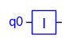
</div>

```math
I = \ketbra{0}{0} + \ketbra{1}{1} = \begin{bmatrix}1 & 0 \\ 0 & 1 \end{bmatrix}
```

This may seem rather pointless, but it is useful when we want to apply gates to a subset of qubits as discussed earlier. However, the physical implementation in a quantum computer is simply to 'do nothing' and it is usually omitted from quantum circuit diagrams.

### X Gate (aka NOT gate)

The quantum NOT operator X is described by the following cicuit symbol, Dirac notation and unitary matrix:

<div style="text-align: center;">

</div>

```math
X = \ketbra{0}{1}+\ketbra{1}{0}=\begin{bmatrix}0 & 1 \\ 1 & 0 \end{bmatrix}
```

When applied to a qubit state, the X gate simply swaps the amplitudes (and hence probabilities) of $\ket{0}$ and $\ket{1}$ :

```math
\begin{bmatrix}0 & 1 \\ 1 & 0 \end{bmatrix} \begin{bmatrix}\alpha_0 \\ \alpha_1 \end{bmatrix} = \begin{bmatrix}\alpha_1 \\ \alpha_0 \end{bmatrix}
```

When applied to the basis states $\ket{0}$ or $\ket{1}$, it reduces to the classical NOT operation:

```math
\begin{align*}
 X \ket{0} = \begin{bmatrix}0 & 1 \\ 1 & 0 \end{bmatrix} \begin{bmatrix}1 \\ 0 \end{bmatrix} = \begin{bmatrix}0 \\ 1 \end{bmatrix} = \ket{1}\\[1ex]
X \ket{1} = \begin{bmatrix}0 & 1 \\ 1 & 0 \end{bmatrix} \begin{bmatrix}0 \\ 1 \end{bmatrix} = \begin{bmatrix}1 \\ 0 \end{bmatrix}= \ket{0}
 \end{align*}
```

### Hadamard (H) Gate

The Hadamard gate (H) is described by the following cicuit symbol, Dirac notation and unitary matrix:

<div style="text-align: center;">

</div>

```math
\begin{align*}
H &= {\small\frac{1}{\sqrt{2}}}(\ketbra{0}{0} +\ketbra{0}{1} + \ketbra{1}{0} - \ketbra{1}{1}) \\
&={\small\frac{1}{\sqrt{2}}} \begin{bmatrix}1 & 1 \\ 1 & -1 \end{bmatrix} \end{align*}
```

The Hadamard gate is important because it takes a basis state and converts it to a superposition with equal probabilities of state $\ket{0}$ and $\ket{1}$.

```math
\begin{align*}
H \ket{0} = {\small\frac{1}{\sqrt{2}}} \ket{0} + {\small\frac{1}{\sqrt{2}}}\ket{1} &= \ket{+}\\[1ex]
H \ket{1} = {\small\frac{1}{\sqrt{2}}} \ket{0} - {\small\frac{1}{\sqrt{2}}} \ket{1} &= \ket{-}
 \end{align*}
 ```
 
See the section on the [Hadamard Transform](#hadamard-transform) for the generalization of this to N-qubit states.

On the Bloch sphere, this corresponds to a rotation by $\frac{\pi}{2}$ radians about the Y axis followed by $\pi$ about the X axis. Equivalently, it is a rotation by $\pi$ radians about the axis shown by the red arrow:

<div style="text-align: center;">
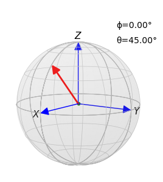
</div>

This effectively interchanges the X and Z axes and flips the sign of the Y axis.

The Hadamard gate transforms the state of a single qubit between the Z and X basis, or vice versa:

```math
\begin{align*}
H \ket{0} = \ket{+}\qquad\quad H \ket{+} = \ket{0}\\[1ex]
H \ket{1} = \ket{-}\qquad\quad H \ket{-} = \ket{1}
 \end{align*}
 ```
 
The Hadamard gate is its own inverse, so applying it a second time undoes the effect of the first application:

```math
H H = \frac{1}{2} \begin{bmatrix}1 & 1 \\ 1 & -1 \end{bmatrix} \begin{bmatrix}1 & 1 \\ 1 & -1 \end{bmatrix} = \begin{bmatrix}1 & 0 \\ 0 & 1 \end{bmatrix} = I
```

If we sandwich a Z-basis operator between the two H gates, the operation is carried out in the X basis. For example:

```math
\quad HZH \equiv X
```

### Hadamard Transform

One reason that the Hadamard gate is important is that it takes a basis state and converts it to a superposition with equal probabilities of state $\ket{0}$ and $\ket{1}$.

```math
\begin{align*}
H \ket{0} = {\small\frac{1}{\sqrt{2}}} \ket{0} + {\small\frac{1}{\sqrt{2}}}\ket{1} &= \ket{+}\\[1ex]
H \ket{1} = {\small\frac{1}{\sqrt{2}}} \ket{0} - {\small\frac{1}{\sqrt{2}}} \ket{1} &= \ket{-}
 \end{align*}
 ```

Many quantum algorithms work by first putting the system into a superposition of all possible solution states using Hadamard gates. They then apply quantum operators to increase the relative amplitude of the solution by interference. Finally, the state is measured causing it to assume the (classical) solution state with a high probability.

If Hadamard gates are applied to each of the qubits of an N-qubit all-zeros state $\ket{00\dots 0}$, the effect is to place the whole state into an equal superposition of all $2^N$ basis states. For example, for $N=3$:

<div style="text-align: center;">

</div>

```math
\ket{\psi} = {\small\frac{1}{\sqrt{8}}} (\ket{000} + \ket{001} + \ket{010} + \ket{011} + \ket{100} + \ket{101} + \ket{110} + \ket{111})
```

This operation is known a *Hadamard Transform*. A Hadamard gate is just a one-qubit Hadamard transform.
 
### Phase (P) Gate

The phase gate rotates the phase of a qubit around the Z axis in the Bloch sphere by an angle $\phi$.

<div style="text-align: center;">
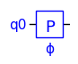
</div>

```math
\begin{align*}
P(\phi) &= \ketbra{0}{0} + e^{i\phi}\ketbra{1}{1} \\[0.5em]
&= \begin{bmatrix}1 & 0 \\ 0 & e^{i\phi} \end{bmatrix}
\end{align*}
```

When the phase gate is applied to a qubit $\alpha_0\ket{0} + \alpha_1\ket{1}$, the result is:

```math
\begin{bmatrix}1 & 0 \\ 0 & e^{i\phi} \end{bmatrix}\begin{bmatrix}\alpha_0 \\ \alpha_1 \end{bmatrix}=\begin{bmatrix}\alpha_0 \\ \alpha_1 e^{i\phi}\end{bmatrix}
```

Note that all the phase is applied to the $\ket{1}$ state. It is not necessary to apply separate phases to the two basis states as only the relative phase matters. The global phase does not affect the measurement outcome.

The following are special cases of the phase gate that are given their own names as they are frequently used:

```math
\begin{align*}
Z &= P(\pi)\\[0.3em]
S &= P(\frac{\pi}{2})= \sqrt{Z}\\[0.3em]
T &= P(\frac{\pi}{4})= \sqrt{S}
\end{align*}
```

### Controlled-X (CX) Gate

The Controlled-X (CX or CNOT) gate is a quantum gate that operates on two qubits. Consequently, it is represented by a 4x4 unitary matrix:

<div style="text-align: center;">

</div>

```math
\begin{align*}
CX &= \ket{0}\bra{0} \otimes I + \ket{1}\bra{1} \otimes X\\[0.5em]
&= \ket{00}\bra{00} + \ket{01}\bra{01} + \ket{10}\bra{11} + \ket{11}\bra{10}\\[0.5em]
&= \begin{bmatrix}1&0&0&0 \\ 0&1&0&0 \\0&0&0&1 \\0&0&1&0 \end{bmatrix}
\end{align*}
```

Note that this definition assumes the big-endian qubit convention.

If the inputs are in the basis states $\ket{0}$ or $\ket{1}$, the CX gate behaves like the classical exclusive-OR (XOR) gate, with one of the inputs propagated as an output to make it reversible. It applies the X operation to the second qubit if the first qubit is $\ket{1}$.

If the control input is in a superposition $\alpha\ket{0}$ + $\beta\ket{1}$, the output is a superposition of the outputs for $\ket{0}$ and $\ket{1}$, because unitary operators are linear.

The CX gate is important because it allows two qubits to be [entangled](#entanglement).

For example, if the input to the gate is $\ket{\psi 0}$ where:
```math
\ket{\psi}=\alpha\ket{0}+\beta\ket{1}
```
then the effect of the gate is:

```math
\ket{\psi0}\rightarrow \alpha\ket{00} + \beta\ket{11}
```

Although, the two resulting qubits are the same, the gate is performing entanglement, not cloning. The output state cannot be factored into the tensor product of two independent qubit states (except in the trivial case that $\alpha=0$ or $\beta=0$).

Cloning (which is not allowed by the [No-Cloning Theorem](#no-cloning-theorem)) would be the operation:

```math
\ket{\psi 0} \rightarrow \ket{\psi\psi} = \ket{\psi} \otimes \ket{\psi}
```

### Controlled-U (CU) Gate

We can make a controlled version of any one-qubit gate $U$ as follows.

<div style="text-align: center;">

</div>

```math
\textrm{cu}(U) = \ket{0}\bra{0} \otimes I + \ket{1}\bra{1} \otimes U
```

This can be written as a *block matrix* (i.e. one made of sub-matrices):

```math
\textrm{cu}(U) = \begin{bmatrix}I_2&0_2\\0_2&U_2 \end{bmatrix}
```

The suffices indicate the size of the sub-matrix. The suffix is 2 in the simple case that U is a one-qubit gate (2x2 matrix). However, this generalizes to K-qubit gates as follows:

```math
\textrm{cu}(U) = \begin{bmatrix}I_{\small M}&0_{\small M}\\0_{\small M}&U_{\small M} \end{bmatrix}\quad\textrm{where}\quad M=2^K
```

Note that the above definition assumes the big-endian qubit convention.

In this way, we can build controlled versions of any gate, such as the controlled-controlled-NOT (CCX).

### SWAP Gate

The SWAP gate swaps the state of two qubits. As the gate operates on two qubits, it is represented by a 4x4 unitary matrix:

<div style="text-align: center;">

</div>

```math
\begin{align*}
SWAP &= \ketbra{00}{00} + \ketbra{01}{10} + \ketbra{10}{01} + \ketbra{11}{11}\\[0.5em]
&= \begin{bmatrix}1&0&0&0 \\ 0&0&1&0 \\ 0&1&0&0 \\ 0&0&0&1 \end{bmatrix}
\end{align*}
```

This definition is the same for both big-endian and little-endian conventions because the swap operation is symmetrical with respect to the two qubits. Consequently, the symbol makes no distinction between the two qubits.

SWAP operations are important on a real quantum computer because two-qubit gates (like CX) need the qubits to be physically-adjacent so that they can interact. The SWAP operation allows the qubits to be moved around.

SWAP itself is usually not a primitive operation but it is equivalent to the application of three CX gates as follows:

<div style="text-align: center;">
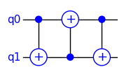
</div>

A sequence of swaps of adjacent qubits may be needed to realize a swap of two qubits that are seveal qubits apart. The topology of the physical qubit array is obviously important in minimizing the number of swap operations required.

## Entanglement

### Creating Entanglement

Entanglement was introduced in the earlier section on [Multi-Qubit States](#multi-qubit-states). Together with superposition and interference, it is one of the three main quantum phenomena exploited by quantum computers.

The following example shows how entanglement can be created using just a Hadamard (H) gate and a CX gate, from the intial state $\ket{00}$:

<div style="text-align: center;">
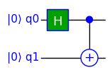
</div>

The Hadamard gate creates an equal superposition of $\ket{0}$ and $\ket{1}$:

```math
H \ket{0} = \frac{1}{\sqrt{2}}(\ket{0} + \ket{1})
```

The CX gate applies an X operation to the second input if the first input is $\ket{1}$.:

```math
CX = \ket{0}\bra{0} \otimes I + \ket{1}\bra{1} \otimes X
```

The first input of the CX gate is in a superposition, so the output is also in a superposition:

```math
\begin{align*}
\ket{\psi}&=CX\,(H\otimes I)\ket{00}\\
&={\scriptsize\frac{1}{\sqrt{2}}}(\ket{0}\ket{0} + \ket{1} (X \ket{0}))\\
 &= {\scriptsize\frac{1}{\sqrt{2}}} (\ket{00} + \ket{11} )
\end{align*}
```

This is an entangled state that cannot be factored as the tensor product of two individual qubit states.

Although very simple, this circuit is an important building block because entanglement is essential in order to perform useful quantum computations.

### Bell States

The entangled state created above is one of the four maximally-entangled states of two qubits, known as the *Bell states*. They are named after the physicist John Stewart Bell. The different Bell states are created by using different initial states, as follows:

```math
\begin{align*}
\ket{00} &\rightarrow {\scriptsize\frac{1}{\sqrt{2}}} (\ket{00} + \ket{11} )\\
\ket{01} &\rightarrow {\scriptsize\frac{1}{\sqrt{2}}} (\ket{01} + \ket{10} )\\
\ket{10} &\rightarrow {\scriptsize\frac{1}{\sqrt{2}}} (\ket{00} - \ket{11} )\\
\ket{11} &\rightarrow {\scriptsize\frac{1}{\sqrt{2}}} (\ket{01} - \ket{10} )
\end{align*}
```

### Bell Measurement

Given two qubits that are in a Bell state, a *Bell measurement* can be used to determine which of the four Bell states the qubits are in.

The following circuit shows a Bell state being created (to the left of the barrier) and then measured with a Bell measurement (to the right of the barrier):

<div style="text-align: center;">

</div>

The two successive CX gates cancel as they both apply an X (NOT) conditional on the same qubit. The two H gates then cancel because the Hadamard operator is its own conjugate transpose (i.e. Hermitian). Normally, of course, the Bell measurement would be performed on an arbitrary entangled state and not one we had just created.

The two meter symbols denote Z-basis measurements, as described in the section on [Measurement](#measurement).

### Monogomy of Entanglement

The principle of the *Monogomy of Entanglement* says that if two qubits are maximally entangled with one another, they cannot have any entanglement with a third qubit.

However, this does not mean that multi-qubit entanglement is impossible, just that there are some restrictions on what is allowed. This principle is important in quantum cryptography.

For example, three qubits can be fully entangled, but without any entanglement between the two qubits of any pair. Examples of this are the GHZ state:

```math
\ket{\mathrm{GHZ}}={\scriptsize\frac{1}{\sqrt{2}}} (\ket{000} + \ket{111} )
```
 and the W state:

```math
\ket{\textrm{W}}={\scriptsize\frac{1}{\sqrt{3}}} (\ket{100} + \ket{010} + \ket{001})
```

### GHZ State

The following example shows a 3-qubit entangled state, known as a *GHZ state* after Greenberger, Horne and Zeilinger.

<div style="text-align: center;">

</div>

The resulting entangled state is:

```math
\ket{\psi}={\scriptsize\frac{1}{\sqrt{2}}} (\ket{000} + \ket{111} )
```

Any number of qubits can be entangled this way by cascading more CX gates.

## Measurement

### Introduction

It is not possible to inspect the quantum state of a real quantum computer. The only way to get a result is to perform a measurement that collapses the quantum state by projecting it onto one of the basis states. Each possible measurement outcome has an associated probability and the state actually measured is a random sample from this probability distribution. Ideally, the state will have been evolved in a way that gives a high probability of getting the required result.

It is usual for all measurements to be applied as the last step in a quantum circuit, although it is possible to have mid-circuit measurements as discussed later.

The following circuit shows measurements added to the output of some arbitrary quantum circuit $U$:

<div style="text-align: center;">
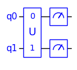
</div>

If the state has multiple qubits, they may be measured together or one-at-a-time in any order. It makes no difference to the result. If any of the qubit outputs are unused, they can be left unmeasured without affecting the measurement outcomes of the other qubits.

The meter symbol denotes measurement of a single qubit in the computational (Z) basis. The measurement is often drawn with two outputs:

<div style="text-align: center;">

</div>

The output on the right is the qubit, which has collapsed into the basis state $\ket{0}$ or $\ket{1}$. The lower output is the boolean result of the measurement: 0 or 1. It is drawn with a double line to indicate that it is a classical bit.

Running the circuit will result in a single classical result (i.e. basis state) that is a random sample from the probability distribution of the output of the $U$ circuit. In order to estimate the probabilities of the various outcomes, the circuit can be run many times. The relative frequencies of outcomes will approach the true probabilities as the number of runs is increased.

### Simulated Measurements

When a quantum circuit is simulated, the probabilities can be calculated directly, since the quantum state is accessible in a simulation. Consequently, it is often possible to omit the measurements at the end of the circuit. because the probabilities tell us what we need to know.

If it is required to simulate collapse measurements (for example to see some typical measurement counts), it is possible to simulate them by just re-sampling the probability distribution, without the need to re-run the whole simulation. This assumes that there are no mid-circuit measurements. If mid-circuit measurements are present, they can first be moved to the end of the circuit, by the [Principle of Deferred Measurement](#principle-of-deferred-measurement). Otherwise, the whole circuit needs to be re-run.

### Measurement Operators

Measurement of the state of a quantum system is associated with a measurement operator $M$, for the measurement basis. The act of measurement changes the state to an eigenvector $\ket{\psi}$ of the measurement operator, which is one of the basis states. The measured value is the corresponding eigenvalue $\lambda$:

```math
M \ket{\psi} = \lambda \ket{\psi}
```

The operator must be *Hermitian* (self-adjoint). A Hermitian matrix is equal to its own conjugate transpose. The diagonal elements are real because they are their own conjugates. Hermitian matrices have the property that their eigenvalues are real and their eigenvectors are orthogonal.

For measurements in the computational (Z) basis, the measurement operator is the Pauli Z matrix (aka $\sigma_z$):

```math
Z = \begin{bmatrix}1 & 0 \\ 0 & -1 \end{bmatrix}
```

This has eigenvectors:

```math
\ket{0} = \begin{bmatrix}1\\0\end{bmatrix}, \qquad \ket{1} = \begin{bmatrix}0\\1\end{bmatrix}
```

The corresponding eigenvalues are $\lambda=+1$ and $-1$ respectively, which are labelled 0 and 1.

Consider a single qubit with the state:

```math
\ket{\psi} = \alpha_0 \ket{0} + \alpha_1 \ket{1}
```

The probability of the measurement resulting in a particular eigenvector is given by the squared magnitude of the corresponding amplitude. This is known as the *Born Rule*.

```math
p(\ket{0}) = \lvert\alpha_0\rvert^2, \qquad p(\ket{1}) = \lvert\alpha_1\rvert^2
```

The total probability must be one, so:

```math
\lvert\alpha_0\rvert^2 + \lvert\alpha_1\rvert^2 = 1
```

Measurement of the state of the qubit results in the state changing (collapsing) to one of the basis states with a probability given by the squared magnitude of the corresponding amplitude.

After a measurement, the system is in an eigenstate. So, if we measure it again, we will get the same result with probability $p=1$.

The above approach generalizes to the measurement of a set of $N$ qubits, where there are $2^N$ basis states. If one qubit is measured, it will affect the probabilities of the remaining posible outcomes. However, the order in which a set of qubits is measured does not affect the measurement outcomes.

### Measurement in Different Bases

The measurement operators for the X, Y and Z bases are the well-known Pauli $\sigma_x$, $\sigma_y$ and $\sigma_z$ matrices, which are also known as the X, Y and Z matrices:

```math
X=\begin{bmatrix}0 & 1 \\ 1 & 0 \end{bmatrix},\quad Y=\begin{bmatrix}0 & -i \\ i & 0 \end{bmatrix},\quad Z=\begin{bmatrix}1 & 0 \\ 0 & -1 \end{bmatrix}
```

These are related by:

```math
X^2=Y^2=Z^2=-iXYZ=\begin{bmatrix}1&0\\0&1\end{bmatrix} = I
```

The measurement denoted by the meter symbol is a normal Z-basis measurement:

<div style="text-align: center;">

</div>

A Z-basis measurement can be used to make measurements in other bases, by first transforming between bases. For example, to perform an X-basis measurement, simply apply a Hadamard (H) gate before the Z-basis measurement.

<div style="text-align: center;">

</div>

Similarly, to make a Y-basis measurement, first apply an $S^\dagger$ gate and then a Hadamard gate before the Z-basis measurement.

<div style="text-align: center;">

</div>

The $S^\dagger$ (S-dagger) gate is a special case of the phase gate (P) that applies a phase rotation of $-\frac{\pi}{2}$ radians:

```math
S^\dagger = P(\frac{-\pi}{2})
```

In terms of the Bloch sphere, these operations can be thought of as rotating the X or Y axis to the original position of the Z axis, so that a Z-basis measurement is effectively an X or Y basis measurement.

It is also possible to perform a measurement in Bell basis, as discussed is the section on [Bell Measurement](#bell-measurement)

### Measurement as Entanglement

Viewed as collapse, a quantum measurement is a non-reversible operation that projects the quantum state onto one of the basis states. Indeed, if we measure the state of a physical qubit (e.g. the spin of an electron), the state of the qubit will actually change to one of the basis states $\ket{0}$ or $\ket{1}$. 

Another way to think about measurement is to consider the measuring device as another quantum system that becomes entangled with the system being measured when a measurement is made. The simplest case is when the system being measured is a single qubit and the measuring device is also a single qubit:

<div style="text-align: center;">

</div>

If the data qubit is initially in the superposition state:

 ```math
 \ket{\psi}=\alpha\ket{0} + \beta\ket{1}
 ```
 
Then the joint state of the combined system after entanglement is:

```math
\alpha\ket{00} + \beta\ket{11}
```

In other words, there are two possible outcomes:

- The data qubit is $\ket{0}$ and the measurement qubit is also $\ket{0}$
- The data qubit is $\ket{1}$ and the measurement qubit is also $\ket{1}$

The whole system, including the data qubit and the measurement qubit is now in a joint superposition.

In a real-world measurement, where we obtain a result outside the quantum system, the measuring aparatus is not a single qubit. The measurement qubit becomes entangled with more and more other qubits (e.g. atoms) in the measuring device and the entanglement spreads into the environment, so that there is a big multi-qubit entanglement which has a consistent view of the measurement outcome. Entanglements are easy to create but difficult to destroy, so the measurement becomes irreversible.

This loss of information to the environment is called *Decoherence*. The evolution of the system being measured is no longer unitary, although the system as a whole, including the environment, is still unitary.

### Principle of Implicit Measurement

The *principle of implicit measurement* states any qubits which have not been terminated at the end of the computation (i.e. they are not used as ouputs), may be assumed to be measured.

In other words, measuring these qubits has no effect on the probability distribution for measurement of the other qubits. Consequently, they can be ignored and there is no need to measure them. This is related to remark made earlier, that the order of measuring qubits make no difference to the probability distribution of outcomes.

For an example, see the section on [Exploring the Teleportation Example](#exploring-the-teleportation-example).

### Principle of Deferred Measurement

The *principle of deferred measurement* states that a quantum circuit with mid-circuit measurements can always be replaced by a circuit which has all the measurements at the end. If the intermediate measurements are used to control (i.e. enable) operations later in the circuit, then the classically-controlled operations can be replaced by ones with quantum controls.

In particular, measurement commutes with controls. For example, consider the following circuit:

<div style="text-align: center;">

</div>

This can be be replaced by:

<div style="text-align: center;">
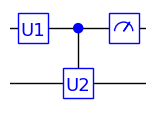
</div>

In other cases, measurement can be replaced by a CX gate that entangles the qubit with an ancilla qubit initialized to $\ket{0}$. This can subsequently be measured at the end of the circuit giving the result that the intermediate measurement would have given.

 In the following circuit, the first measurement cannot simply be moved to the end:

<div style="text-align: center;">
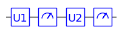
</div>

However, the first measurement can be replaced by a CX gate that entangles the qubit with an ancilla bit initialized to $\ket{0}$ that can subsequently be measured at the end of the circuit.

<div style="text-align: center;">

</div>

Adding an ancilla bit may not be appropriate as qubits are in short supply with today's quantum computers.

### Mid-Circuit Measurement

One reason that mid-circuit measurements may be made is that the measurement result is used to control a subsequent quantum operation. As discussed above, it is possible to move such measurements to the end of the circuit by the principle of deferred measurement. However, this may be at the expense of an ancilla qubit, which may be a problem given that qubits are a precious resource in today's quantum computers and simulators.

With a real quantum computer, there are other reasons why it may be desirable to perform mid-circuit measurements. For example, noise is a significant problem, so there is an advantage in measuring a qubit as early as possible, before it loses coherence.

Another possible reason for a mid-circuit measurement is that it allows the qubit to be reused. This can be done by applying an X gate when the measurement result is 1, so that the qubit is reset to $\ket{0}$. This goes against the concept of reversible evolution of state, but it can be a pragmatic solution to gain a qubit when qubits are in short supply.

The use of mid-circuit measurements, the principle of deferred measurement and the principle of implicit measurement are all illustrated by the quantum teleportation example below.

## Examples

### Quantum Teleportation

Quantum teleportation is a protocol for sending quantum information (i.e. qubits) from one place to another.

Imagine that Alice has a data qubit that she wishes to send to Bob. The [No-Cloning Theorem](#no-cloning-theorem) of quantum mechanics says that it is impossible to create an independent and identical copy of an unknown quantum state. This implies that if Alice sends a qubit to Bob, then she no longer has access to the qubit herself.

The protocol requires Alice and Bob to each have one of an entangled pair of qubits. Alice makes a joint [Bell Measurement](#bell-measurement) of the data qubit with her entangled qubit. This results in two classical bits of information corresponding to the four possible measurement outcomes. If Alice sends these two classical bits to Bob, he can can use them with his entangled qubit to recreate the qubit that Alice sent. The Bell measurement that Alice performs destroys the quantum state of her data qubit, so the no-cloning theorem is not violated.

The following quantum circuit shows Alice's part of the protocol:

<div style="text-align: center;">

</div>

The part to the left of the barrier shows the creation of an entangled pair of qubits. Alice has one qubit and Bob has the other. Alice could create the entangled pair and send one to Bob or a third-party could create the pair and send one to each of them. This does not violate the no-cloning theorem because the two qubits are not independent.

If Alice were to simply measure her qubit, she would get a random result of 0 or 1. If Bob then measured his qubit, he would get the same result. However, this alone cannot be used to send information as Alice has no control over the result of her measurement.

Instead, Alice performs a joint [Bell Measurement](#bell-measurement) of the data qubit with her entangled qubit. This results in two bits of classical information that say which of the four possible Bell states the qubits are in. Alice then sends these two bits of information to Bob over a normal (classical) communictaion channel.

Bob applies one of the following quantum operations to his entangled qubit, depending on the two classical bits he receives from Alice:

```math
\begin{align*}
0,0 &\rightarrow \textrm{none}\\
0,1 &\rightarrow X\\
1,0 &\rightarrow Z\\
1,1 &\rightarrow X \textrm{ then } Z
\end{align*}
```

Bob's part of the protocol can be drawn as a circuit as follows. Classical bits are normally drawn as a double lines in quantum circuits, but here they are just shown as single lines. The X and Z gates have classical controls, which simply means that Bob applies an X or Z operation, depending on the classical bits he received.

<div style="text-align: center;">

</div>

This results in Bob having the data qubit that Alice sent. Note that although entanglement is used, the information cannot be sent faster than the speed of light because Bob cannot decode his qubit until he receives the two bits over a classical channel.

If Bob were to just guess what the two classical bits would be, he would have a 25% chance of correctly decoding the qubit but, if sent a sequence of qubits, he would not know which ones were correct.

### Exploring the Teleportation Example

The quantum teleportation example will be used to illustrate some of the principles introduced earlier.

First, let us put Alice and Bob's parts of the circuit together:

<div style="text-align: center;">

</div>

The outputs of the two measurements are now shown as qubits but, because they are measurement results, they can only be in the state $\ket{0}$ or $\ket{1}$, corresponding to the classical bits 0 and 1. So the qubits are only conveying classical information. Because they are now qubits, the conditional application of X and Z gates can be replaced by quantum CX and CZ gates as shown in the circuit. The final gate in this circuit is a controlled-Z (CZ) gate.

Next, the [Principle of Deferred Measurement](#principle-of-deferred-measurement) may be used to move the two measurements to the end of the circuit, as follows:

<div style="text-align: center;">

</div>

The required output of the circuit is just the data qubit, which is now on qubit 2. Consequently, the measurements on qubits 0 and 1 can be removed, using the [Principle of Implicit Measurement](#principle-of-implicit-measurement).

<div style="text-align: center;">

</div>

### Quantum Fourier Transform

The Quantum Fourier Transform (QFT) is in important algorithm in quantum computing. It is used for estimating phase and periodicities in algorithms such as Shor's well-known integer factorization algorithm.

The QFT has the same effect as applying the normal inverse Discrete Fourier Transform (DFT) to the quantum state vector. It is equivalent to the *inverse* DFT, rather than forward DFT, simply because a different sign convention is used. However, for a quantum computer, we have to find a way to implement the transform using only quantum gates.

The inverse DFT, with $\frac{1}{\sqrt{N}}$ normalization, can be defined as:

```math
X_n = \frac{1}{\sqrt{N}} \sum_{m=0}^{N-1} x_m\omega_N^{mn},\quad n=0,1,2,\dots,N-1
```

where $\omega_N = e^\frac{2\pi i}{N}$

The result is in bit-reversed order, so we need to finally apply a bit-reversal operation.

The DFT can be expressed as a matrix as follows, where the $\omega^0$ terms have been written as $1$.

```math
U_N=\frac{1}{\sqrt{N}}\begin{bmatrix}1&1&1&\dots&1\\
1&\omega&\omega^2&\dots&\omega^{N-1}\\
1&\omega^2&\omega^4&\dots&\omega^{2(N-1)}\\
\vdots&\vdots&\vdots&\dots&\vdots\\
1&\omega^{N-1}&\omega^{2(N-1)}&\dots&\omega^{(N-1)(N-1)}\\
\end{bmatrix}
```

The QFT is equivalent to the application of this unitary matrix to the quantum state. The columns of the matrix are the DFTs of the N orthogonal quantum basis vectors $[1,0,0,\dots], [0,1,0,\dots],[0,0,1,\dots], $etc. Because of linearity, we can apply it to a general quantum state that is a superposition of the basis states.

However, to implement the algorithm on a quantum computer, we need a way to implement it using quantum gates. The QFT algorithm is an ingeneous way to decompose the matrix into the sequential application of Hadamard (H) gates and Controlled-phase (CP) gates.

The time complexity of the basic DFT algorithm is $\mathcal{O}(n^2)$. However, it is normally implemented by the Fast Fourier Transform algorithm which is $\mathcal{O}(n\log{}n)$. The QFT algorithm does much better at $\mathcal{O}(\log^2{}n)$, which is exponentially faster than even the FFT.

The following circuit shows a 4-qubit QFT:

<div style="text-align: center;">

</div>

The details of how the QFT algorithm works are beyond the scope of this introduction. A key part is using phase gates to rotate the phase of qubits to perform the $\omega_n$ phase shifts. The swap gates are used to reverse the order of qubits in the result of the QFT. This is like the bit-reversal that is performed in a normal Discrete Fourier Transform (DFT).

The inverse QFT is the inverse of this circuit. By definition, a unitary operator is one whose inverse is its conjugate transpose. To reverse the circuit, we simply reverse the sequence of gates and replace each gate by its conjugate transpose:

```math
(U_1 U_2\dots U_{n-1})^\dagger = U^\dagger_{n-1}\dots U^\dagger_2 U^\dagger_1
```

In the QFT circuit above, the Hadamard and swap gates are Hermitian (i.e. equal to their own conjugates transposes). The conjugate transpose of the phase gate is given by:

```math
P^\dagger(\phi) = P(-\phi)
```

Consequently the 4-qubit inverse QFT is implemented by the following circuit:

<div style="text-align: center;">
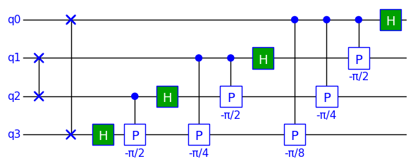
</div>

### Quantum Phase Estimation

Quantum Phase Estimation (QPE) is an important part of many quantum algorithms, such as Shor's factorization algorithm. The aim of QPE is to find the phase associated with an eigenvector $\ket{\psi}$ of a unitary $U$.

Any unitary operator can be expressed in terms of the phases of its eigenvectors:

```math
U=\sum_k{e^{i\phi_k}\,\ket{\psi_k}\bra{\psi_k}}
```

where $\lambda_k = e^{i\phi_k}$ are the corresponding eigenvalues.

The eigenvalue always has a magnitude of one because the operator is unitary.

If we apply the unitary to one of its eigenvectors $\ket{\psi_k}$, the result will be the corresponding eigenvalue $e^{i\phi_k}$ multiplied by the eigenstate:

```math
\begin{align*}
U \ket{\psi_k} &= ({e^{i\phi_k}\,\ket{\psi_k}\bra{\psi_k}})\ \ket{\psi_k}\\
&= e^{i\phi_k}\ket{\psi_k}
\end{align*}
```

The QPE algorithm works by expressing the phase as a binary fraction $\,\theta\in[0,1]$, where $\phi = 2\pi\theta$, so that it can be approximated to the required precision one bit at a time:

```math
\theta=\sum_{k=1}^n{\theta_k} 2^{-k} = 0.\theta_1\theta_2\dots\theta_n
```

where $\phi_k\in\{0,1\}$ and .' denotes the *binary point* analogous to a decimal point.

To start with, consider the simplest case of a one-qubit binary estimation:

<div style="text-align: center;">

</div>

The X gate initializes qubit 1 to $\ket{1}$, which is the eigenvector of the unitary P for which we want to find $\phi$. The barrier symbol is simply to separate the initialization from the actual QPE algorithm.

A phase gate has been used for the unitary operator in this example.

```math
P(\phi) =\begin{bmatrix}1 & 0 \\ 0 & e^{i\phi} \end{bmatrix}
```
The objective is to find the unknown $\phi$.

The X gate gives qubit 1 an initial state of $\ket{1}$, which is an eigenstate of the phase gate we are trying to measure. The *phase kickback* effect kicks the phase of the phase gate back to the control qubit q0. The first Hadamard (H) gate places qubit 0 in the superposition state $\ket{+}$ by effectively transforming between the Z and X bases. The second Hadamard gate would simply undo the effect of the first one if there were no phase kickback to q0. However, with the phase kickback, the second Hadamard transforms the phase back to the Z-basis, resulting in a change in the probability of measuring $\ket{0}$ or $\ket{1}$. The second Hadamard is actually performing an inverse Quantum Fourier transform (QFT), but in the trivial case of one qubit this reduces to the Hadamard operator.

The result of measuring qubit 0 is the first bit $\theta_1$ in the binary expansion of $\theta$.

To improve the accuracy, we need to add more qubits, each calculating the next bit in the binary expansion of the phase. The following circuit shows a 3-bit binary estimation of the phase:

<div style="text-align: center;">
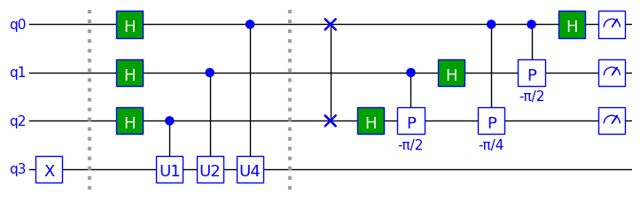
</div>

The qubits are in two groups, which we call *registers*. The top three qubits are the phase register that is used to estimate the phase as a binary fraction of $2\pi$. Qubit q3 is an M-qubit register, where $M$ is the number of qubits of the unitary U. In this simple example, $M=1$. The gates U1, U2 and U4 implement $U^1$, $U^2$ and $U^4$. For an unknown unitary $U$, $U^k$ can be implemented by repeating the $U$ gate $k$ time.

The part of the circuit to the right of the second barrier is an inverse 3-qubit QFT to change the basis. In the previous example of 1-bit phase estimation, the 1-qubit QFT reduced to a single Hadamard gate.

The following histogram shows the counts for different measurement outcomes from 1000 runs on a simulator, with the phase of the unitary set to $\phi=\frac{3}{8} 2\pi$ radians. The 8 in the denominator is $2^3$ as there are 3 qubits in the phase register.

<div style="text-align: center;">
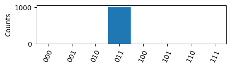
</div>

The resulting state is $\ket{011}$. Placing a binary point before the '011' gives the binary fraction $0.011_2$ which is the value $\theta=\frac{3}{8}$ expressed in binary.

## Conclusions

This has been a look at the basics of quantum computing, mostly from the perspective of information processing rather than physical implementation. There are many more topics to learn about, but it is hoped that this has been a useful start.

If you wish to explore further, the [Bibliography](#bibliography) contains some suggestions.

## Bibliography

[Fey82]: R. Feynman, Simulating Physics with Computers, *International Journal of Theoretical Physics*, Vol 21, Nos 6/7, 1982.

[Mer07]: D.Mermin, *Quantum Computer Science*, Cambridge Univerity Press, 2007.

[NC10]: M.A. Nielsen and I.L.Chuang, *Quantum Computation and Quantum Information*, 10th anniversary edition, Cambridge University Press, 2010.


*Jon Brumfitt
19 June 2024*
