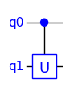

# Quantum Computing Basics

This is a short introduction to some basic concepts of quantum computation. Some knowledge of linear algebra is assumed.

### Contents

- [Quantum Computing Basics](#quantum-computing-basics)
    - [Contents](#contents)
  - [Qubits](#qubits)
  - [Quantum Probability and Interference](#quantum-probability-and-interference)
  - [Bloch Sphere](#bloch-sphere)
  - [Dirac Bra-Ket Notation](#dirac-bra-ket-notation)
    - [Inner Product](#inner-product)
    - [Outer Product](#outer-product)
    - [Tensor Product](#tensor-product)
    - [Projectors](#projectors)
  - [Multi-Qubit States](#multi-qubit-states)
  - [Unitary Operators](#unitary-operators)
  - [No-Cloning Theorem](#no-cloning-theorem)
  - [Quantum Circuits](#quantum-circuits)
    - [Conventions](#conventions)
    - [Operations on Multiple Qubits](#operations-on-multiple-qubits)
    - [Composing Circuits](#composing-circuits)
    - [Non-Consecutive Qubits](#non-consecutive-qubits)
  - [Other Bases](#other-bases)
  - [Quantum Gates](#quantum-gates)
    - [Introduction](#introduction)
    - [Identity (I) Gate](#identity-i-gate)
    - [X Gate (aka NOT gate)](#x-gate-aka-not-gate)
    - [Hadamard (H) Gate](#hadamard-h-gate)
    - [Phase (P) Gate](#phase-p-gate)
    - [Controlled-X (CX) Gate](#controlled-x-cx-gate)
    - [Controlled-U (CU) Gate](#controlled-u-cu-gate)
    - [SWAP Gate](#swap-gate)
  - [Measurement](#measurement)
  - [Example](#example)
  - [Simulating a Quantum Computer](#simulating-a-quantum-computer)
  - [Conclusions](#conclusions)


## Qubits

The unit of information for classical computers is the *bit*, which has two possible states that we label 0 and 1. The unit of information for quantum computers is the *qubit*.

The qubit is an abstraction of a two-level quantum system, such as the spin of an electron. It has two orthonormal basis states denoted by $\ket{0}$ and $\ket{1}$. The *ket* symbol $\ket{\psi}$ is part of the Dirac *Bra-Ket* notation and represents a complex vector with label $\psi$.

```math
\ket{0} =  \begin{bmatrix}1\\0\end{bmatrix}\quad\text{and}\quad\ket{1} =  \begin{bmatrix}0\\1\end{bmatrix}
```

The $\ket{0}$ and $\ket{1}$ basis states can be thought of as corresponding to the classical bit states 0 and 1. This basis is known as the *computational basis* or Z-basis. The Z-basis will be assumed unless otherwise stated.

Unlike a classical bit, which must be in *either* the state 0 *or* the state 1, a qubit may also be in a linear superposition of its two basis states:

```math
\ket{\psi} = \alpha_0 \ket{0} + \alpha_1 \ket{1} = \begin{bmatrix}\alpha_0\\ \alpha_1\end{bmatrix},\qquad \alpha_0,\alpha_1 \in \mathbb{C}
```

where $\alpha_0$ and $\alpha_1$ are called *probability amplitudes*.

The quantum state of a qubit is not something we can observe. The only information we can get is as the result of a quantum measurement which collapses the state into one of the two basis states $\ket{0}$ and $\ket{1}$, with probabilities $|\alpha_0|^2$ and $|\alpha_1|^2$ respectively. Measurement is discussed in more detail below.

## Quantum Probability and Interference

Classical physics is deterministic, whereas quantum mechanics has an inherent randomness. In classical probability theory, if something can happen in two mutually exclusive ways, the probability of it happening is the sum of the probabilities for the two cases:

```math
p = p_1 + p_2
```

However, nature doesn't work this way at the quantum level. Instead, we need to use *probability amplitudes* that are complex numbers. The probability $p$ is then the square of the absolute value of the probability amplitude $\alpha$:

```math
p = \lvert \alpha \rvert ^2 = \alpha^*\,\alpha \qquad \alpha \in \mathbb{C}
```

where $\alpha^*$ denotes the complex conjugate of $\alpha$.

If something can happen in two different ways, we add the probability amplitudes:

```math
p =  \lvert \alpha_1 + \alpha_2 \rvert ^2
```

Writing the complex probability amplitudes in polar form:

```math
\alpha_1 = \lvert \alpha_1 \rvert e^{i \phi_1} \quad\text{and}\quad \alpha_2 = \lvert \alpha_2 \rvert e^{i \phi_2}
```

results in:

```math
\begin{align*}
	p &=  \lvert \alpha_1 + \alpha_2 \rvert ^2 \\
	& = \lvert \alpha_1 \rvert^2 + \lvert \alpha_2 \rvert^2 + \alpha_1 \alpha_2^* + \alpha_1^* \alpha_2 \\
	& = \lvert \alpha_1 \rvert^2 + \lvert \alpha_2 \rvert^2 + \lvert\alpha_1\rvert\lvert\alpha_2\rvert (e^{i(\phi_1-\phi_2)} + e^{-i(\phi_1-\phi_2)}\\
	& = \lvert \alpha_1 \rvert^2 + \lvert \alpha_2 \rvert^2 + 2 \lvert \alpha_1\rvert \lvert \alpha_2 \rvert \cos{(\phi_1 - \phi_2)}]
\end{align*}
```

The first two terms are the classical probabilities $p_1$ and $p_2$.

The final term represents quantum *interference*. This term can be positive (constructive interference) or negative (destructive interference), depending on the relative phase $(\phi_1 - \phi_2)$.

In the classical case, the two states of a bit (0 and 1) are mutually exclusive and the interference term disappears. In the quantum case, a qubit can be in a superposition of states $\ket{0}$ and $\ket{1}$ and interference can occur.

Interference is one of the key quantum phenomena that is exploited in quantum computing. We get quantum states to interfere so that the required solutions interfere constructively and other solutions interfere destructively.

## Bloch Sphere

The state of a qubit is described by two complex numbers. However, it is possible to describe the state with only two (real) angles because there is redundant information.

We lose one degree of freedom because the norm must be one:

```math
\lvert\alpha_0\rvert^2 + \lvert\alpha_1\rvert^2 = 1
```

We lose a second degree of freedom because there are many kets that describe the same physical state, since a global phase term $e^{i\beta}$ does not affect the result of a measurement:

```math
\lvert\ket{\psi}\rvert^2 = \lvert e^{i\beta}\ket{\psi}\rvert^2
```

A ket may be mapped onto a sphere, known as the Bloch sphere, as follows:

```math
\ket{\psi} = \cos(\frac{\theta}{2})\ket{0} + e^{i\phi} \sin(\frac{\theta}{2})\ket{1}
```

where $0 \le\theta\le\pi$ and $0\le\phi\le2\pi$.

<div style="text-align: center;">

</div>

Quantum operators, in the form of quantum gates, can be used to manipulate the state of a qubit. Since the norm of the state vector must be one, the operators on a single qubit must be norm-preserving rotations on the sphere. These are known as *unitary* operators.

The Bloch sphere is mostly useful for single qubits because the qubits of a multi-qubit system can become *entangled* such that the qubits no longer have an individual pure state. However, it is a useful way to visualize and understand the effects of single-qubit gates, which can then be used to build multi-qubit systems.

## Dirac Bra-Ket Notation

Dirac’s *Bra-Ket* notation is used in quantum mechanics to describe quantum states as vectors in a complex vector space. It provides a concise way to write vector equations and manipulate them symbolically in a coordinate-free way. The notation automatically takes care of complex conjugation where appropriate.

A quantum state is represented by the *Ket* symbol $\ket{A}$, where $A$ is just a label. The *Conjugate Transpose* (aka *Hermitian Transpose*) $\ket{A}^\dagger$ of the ket $\ket{A}$ is called a *Bra* and is written $\bra{A}$. The symbols are called *Bra* and *Ket* because together they are like a pair of brackets: $\braket{A|B}$.

If we consider the quantum state in a specific orthonormal basis, we can represent a Ket by a column vector:

```math
\ket{A} = \begin{bmatrix}a_1\\a_2\\...\\a_n\end{bmatrix}
```

The corresponding Bra is then the conjugate transpose , which is a row vector:

```math
\bra{A} = \ket{A}^\dagger =  \begin{bmatrix}a_1^*, & a_2^*, ...\, a_n^*\end{bmatrix}
```

There are three products of interest: the *inner product* $\braket{A|B}$, the *outer product* $\ket{A}\bra{B}$ and the *tensor product* $\ket{A}\ket{B}$.

### Inner Product

The *inner product* $\braket{A|B} \in\mathbb{C}$ is:

```math
\begin{align*}
	\braket{A|B} &= \begin{bmatrix}a_1^*,\dots,a_n^*\end{bmatrix}  \begin{bmatrix}b_1\\ \dots\\b_n\end{bmatrix}\\
	\\
	&= a_1^* b_1 + b_2^* b_2 +...+ a_n^* b_n
\end{align*}
```

For example, the fact that $\ket{0}$ and $\ket{1}$ are orthonormal can be expressed as:

```math
\begin{align*}
\braket{0|1} = \braket{1|0} = 0\\
\braket{0|0} = \braket{1|1} = 1
\end{align*}
```

### Outer Product

The outer product is:

```math
\ket{A}\bra{B} = \begin{bmatrix}a_1\\\dots\\a_m\end{bmatrix} \begin{bmatrix}b_1^*,\dots,b_n\end{bmatrix}
	=  \begin{bmatrix}a_1 b_1^*&\dots&a_1 b_n^*\\\dots\\a_mb_1^*&\dots&a_mb_n^*\end{bmatrix}
```

For example, the quantum NOT operator $X$ can be expressed as:

```math
X=\ketbra{0}{1}+\ketbra{1}{0}=\begin{bmatrix}0&1\\1&0\end{bmatrix}
```

### Tensor Product

The tensor product (denoted by $\otimes$) is:

```math
\ket{A}\otimes\ket{B} = \begin{bmatrix}a_1\\a_2\end{bmatrix} \otimes  \begin{bmatrix}b_1\\ b_2\end{bmatrix}
	= \begin{bmatrix}a_1 b_1\\a_1 b_2\\a_2 b_1\\a_2 b_2\end{bmatrix}
```

The tensor product can be written in several different ways. The tensor product symbol $\otimes$ is usually omitted in Dirac notation as it is implied by the concatenation of kets:

```math
\ket{A}\otimes\ket{B} \equiv \ket{A}\ket{B} \equiv \ket{A,B}\equiv \ket{AB}
```

The tensor product of $n$ identical states can be written as a *tensor power*. For example:

```math
\ket{0}^{\otimes n}=\ket{0}\otimes\dots\otimes\ket{0}
```

### Projectors

The outer product $\ketbra{\psi}{\psi}$ of a vector with its conjugate transpose is known as a *projector*. If a projector is applied to a vector $\ket{\phi}$, the result is:

```math
\begin{align*}
(\ket{\psi}\bra{\psi})\ \ket{\phi} &= \ket{\psi}\ \braket{\psi|\phi}\\
&=\braket{\psi|\phi}\ \ket{\psi}
\end{align*}
```

The regrouping of terms allowed by associativity results in an inner product $\braket{\psi|\phi}$, which is just a complex number. This can then be moved to the left as a coefficient multiplier of $\ket{\psi}$.

The effect of the projector $\ketbra{\psi}{\psi}$ is to project the vector $\ket{\phi}$ onto the basis vector $\ket{\psi}$.

## Multi-Qubit States

The states of two qubits in $\mathbb{C}^2$ can be combined into one state in $\mathbb{C}^4$ by taking their tensor product:

```math
\ket{A}\otimes\ket{B} = \begin{bmatrix}a_1\\a_2\end{bmatrix}
	\otimes  \begin{bmatrix}b_1\\ b_2\end{bmatrix}
	= \begin{bmatrix}a_1 b_1\\a_1 b_2\\a_2 b_1\\a_2 b_2\end{bmatrix}
```

The tensor product is associative, so we can combine arbitrarily many qubits:

```math
\ket{\psi} = \ket{A_1}\otimes \ket{A_2}\otimes\dots\otimes\ket{A_n}
```

In general, an N-qubit state is represented by a vector in the 2N-dimensional complex vector space $\mathbb{C}^{2N}$.

The tensor product of individual pure qubit states gives the state of the N-qubit system. However, it is not necessarily possible to factorize the state back into individual qubit states after quantum gate operations have been applied. For example, the following is an *entangled* state that is not separable into the tensor product of individual qubit states:

```math
\frac{1}{\sqrt{2}} (\ket{01} + \ket{10} )
```

Unentangled states are separable and can therefore be simulated efficiently on a classical computer. Without entanglement, quantum computers would be no more powerful than classical computers.

A classical computer requires only 38 bytes of storage to represent 300 classical bits. In contrast, a quantum computer with 300 qubits requires a vector of $2^{300}$ (about $10^{93}$) complex values to represent it, which is much more than the number of atoms in the observable universe (estimated to be around $10^{80}$ ). A unitary operator to manipulate this state would require a $10^{93} \times 10^{93}$ matrix. Simulating a quantum computer with more than a few tens of qubits is infeasible even on a supercomputer.

Quantum states represent exponentially more information than classical states. However, we cannot access that information because measuring it will only give one of the classical states. The art of writing quantum algorithms is to utilize the vast state space, but then evolve the state towards one of the basis states, having some required property, which can be read out as the answer.

## Unitary Operators

The time evolution of a closed quantum system is *unitary*. The quantum state vector has a norm of one, so that the total probability of the measurement outcomes is one. The operators (i.e. matrices) applied to evolve the state must be unitary so as to preserve the norm. A unitary matrix is a square matrix whose inverse is its conjugate transpose. It is the complex equivalent of a real orthonormal matrix.

The evolution of the state of a quantum system requires that the operators are *reversible* so that information is not lost. Operators that can be represented as a unitary matrix are reversible.

Unitary operators are linear. Consequently, the result of applying a unitary operator U to the sum (e.g. superposition) of two states is the sum of the results of applying the operator to the states individually:

```math
U (\ket{\psi} + \ket{\phi}) = U \ket{\psi} + U \ket{\phi}
```

For example:

```math
U (\alpha_0 \ket{0} + \alpha_1\ket{1}) = \alpha_0 U\ket{0} + \alpha_1 U\ket{1}
```

The unitary operators in a gate-model quantum computer are called “quantum gates” by analogy with the logic gates of traditional computers. A quantum gate can be represented by a unitary matrix or implemented in hardware by physical operations on the qubits. Measurement is not considered to be a normal gate because it is not reversible.

Unitary matrices are square, which results in quantum gates (and hence quantum circuits) having the same number of outputs as inputs. This is very different to ordinary digital logic gates where, for example, a NAND gate has two inputs and one output. The inputs of a NAND gate cannot be inferred from the output, so it is not reversible.

## No-Cloning Theorem

The *no-cloning* theorem of quantum mechanics says that, given an unknown quantum state, it is not possible to create an exact independent copy of it. For example, in quantum teleportation, it is not possible to send an unknown state from A to B, unless the original state at A is destroyed in the process.

Note that it is possible to create two identical quantum states by applying the same sequence of unitary operators to a $\ket{00\dots 0}$ state, but this is not the same as creating a copy of a given unknown state. Entanglement also does not count as cloning because the entangled qubits are not independent. Measuring one of them will affect the other one.

No-cloning implies that it is not possible to connect the output of one quantum gate to the input of two other gates.

The related *no-deleting theorem* says that, given two identical qunatum states, it is not possible to throw one away. This follows because the evolution of quantum state is reversible, so if deletion were possible then, in reverse, cloning would be possible.

Putting these things together implies that a quantum circuit must have the same number of inputs as outputs.

## Quantum Circuits

A quantum circuit is a network of quantum gates applied to a set of qubits. It can be described by a quantum circuit diagram or in a quantum programming language. Quantum circuit diagrams allow an intuitive level of understanding.

A quantum circuit has a fixed number of qubits, as required by unitary and the no-cloning theorem. No qubits can be added to the circuit or deleted. Any extra qubits (known as *ancilla* qubits) that the computation needs must be included and initialized as part of the initial state. This is required to satisfy unitarity of the quantum operations.

### Conventions

The qubit on the left side of a tensor product is refered to as the most-significant qubit.

This document uses the *big-endian* qubit convention in which qubit 0 is the most-significant qubit. Note that some books and papers use the *little-endian* convention in which qubit 0 is the least significant qubit. This can lead to confusion when comparing examples from different sources.

The circuits in this document are drawn with the most-significant qubit at the top, so tensor products are applied in a downward direction.

### Operations on Multiple Qubits

A quantum circuit consists of a sequence of gates representing unitary operations. These are placed on a set of parallel lines representing the qubits. Measurement gates may be added to the outputs (not shown).

<div style="text-align: center;">

</div>

The input state on the left-hand side is $\ket{xy}=\ket{x}\otimes\ket{y}$. The qubit on the left side of a tensor product is refered to as the *most-significant* qubit. 

The quantum gates in the circuit simply represent quantum operations that are applied to the qubits. There is no implication that the gates are physical entities. In fact, the gates are often just quantum operations applied in-place to a fixed set of qubits. The inputs and outputs of the gates are not physical ports but simply the *before* and *after* states of the same qubits.

### Composing Circuits

A sequence of operations can be combined by matrix multiplication, whereas operations on different qubits are combined by tensor multiplication.

The following example shows the series composition of two one-qubit gates:

<div style="text-align: center;">

</div>

```math
\ket{\psi}=BA\ket{x}
```

where  $\ket{\psi}$ is the ouput state on the right-hand side.

Note that the operations in the diagram are applied left to right, whereas the order is from right to left in the equation. The order of the gates cannot be interchaged unless the associated operators commute.

Single qubit operators may be applied to the tensor product of qubit states by taking the tensor product of the operators:

<div style="text-align: center;">

</div>

```math
\begin{align*}
\ket{\psi}&=A \ket{x} \otimes B \ket{y}\\[0.3em]
&\equiv (A\otimes B) (\ket{x}\otimes\ket{y})\\[0.3em]
&\equiv (A \otimes B) \ket{xy}
\end{align*}
```

This makes use of the following importatnt identity:

```math
(A\otimes B)(C\otimes D) = (AC)\otimes(BD)
```

If gate B is absent in the above example, we must replace it with an imaginary identity gate, so that we can still form the tensor product to expand B to operate on the full quantum state:

<div style="text-align: center;">

</div>

```math
\begin{align*}
\ket{\psi}&= A \ket{x}\otimes I \ket{y}\\[0.3em]
&\equiv (A\otimes I) (\ket{x}\otimes\ket{y})\\[0.3em]
&\equiv (A \otimes I) \ket{xy}
\end{align*}
```

Taking the tensor product with $I$ converts the one-qubit $A$ gate into a 2-qubit gate that operates on one of the qubits. The identity gate is not normally drawn in the circuit diagram as it is a 'do-nothing' operation that doesn't need a physical implementation in hardware.

Returning to the example given above:

<div style="text-align: center;">

</div>

This corresponds to the following matrix operations:

```math
\ket{\psi} = (D \otimes I) C (A \otimes B) \ket{xy}
```

First, A and B are applied to the two qubit inputs $\ket{x}$ and $\ket{y}$. Then a two-qubit gate C is applied. Finally, D is applied to the first qubit.

The A and B gates in this example may be applied in either order, or they can both be performed in parallel. However, both these operations must be complete before the C gate is applied. The circuit defines a *partial order* for the gates.

### Non-Consecutive Qubits

It is more complicated when we want to apply a multi-qubit gate to non-consecutive qubits or to qubits in a different order. One possibility is to use SWAP gates to swap pairs of qubits to make the required qubits adjacent and in the correct order, then apply the gate and finally reverse all the swaps to put the qubits back in the original order.

Non-consecutive qubits are a problem in real quantum computers because the qubits are typically physically arranged in a grid. Operations such as CX (aka controlled-NOT) involve interactions between the qubits, requiring them to be to be physically adjacent.

In a quantum computer programming language it is usual to work at a higher level of abstraction, where multi-qubit gates can be applied to arbitrary qubits, without worrying about such issues. Software then compiles these into sequences of lower-level operations that supported by the quantum hardware.

## Other Bases

So far, only the computational (Z) basis has been considered. However, there are other orthonormal bases that are useful, particularly the X and Y bases.

The X basis vectors are denoted by $\ket{+}$ and $\ket{-}$ and are related to the computational (Z) basis vectors $\ket{0}$ and $\ket{1}$ as follows:

```math
\begin{align*}
	\ket{+} &= {\small\frac{1}{\sqrt{2}}}(\ket{0} + \ket{1}) =  {\small\frac{1}{\sqrt{2}}} \begin{bmatrix}1\\1\end{bmatrix}\\[1ex]
	\ket{-} &= {\small\frac{1}{\sqrt{2}}}(\ket{0} - \ket{1} =  {\small\frac{1}{\sqrt{2}}} \begin{bmatrix}1\\-1\end{bmatrix}
\end{align*}
```

The Y basis vectors are denoted by $\ket{R}$ and $\ket{L}$, or sometimes $\ket{i}$ and $\ket{-i}$. They are related to the computational (Z) basis vectors $\ket{0}$ and $\ket{1}$ as follows:

```math
\begin{align*}
	\ket{R} &= {\small\frac{1}{\sqrt{2}}}(\ket{0} + i\ket{1}) =  {\small\frac{1}{\sqrt{2}}} \begin{bmatrix}1\\i\end{bmatrix}\\[1ex]
	\ket{L} &= {\small\frac{1}{\sqrt{2}}}(\ket{0} - i\ket{1} =  {\small\frac{1}{\sqrt{2}}} \begin{bmatrix}1\\-i\end{bmatrix}
\end{align*}
```

The scaling factor of $\frac{1}{\sqrt{2}}$ is simply to normalize the vectors, so that the probabilities of the measurement outcomes sum to one.

A basis state in the Z-basis corresponds to an equal superposition in the X-basis and vice versa. If we measure a qubit in the Z basis, the state will collapse into the Z basis state $\ket{0}$ or $\ket{1}$. If we then measure it in the X-basis, there is an equal probability that we will measure $\ket{+}$ or $\ket{-}$ and the state will become that X-basis eigenstate. If we then measure it again in the Z-basis, there will be an equal probability of measuring $\ket{0}$ or $\ket{1}$.

This is an example of the *Uncertainty Principle*. If a qubit is measured in one measurement basis (e.g. Z), the state becomes an eigenstate in that basis. The value of the state is then completely unknown (i.e. in an equal superposition) in the complementary measurement basis (e.g. X).

The operator that that converts from the Z basis to the X basis, or vice versa, is the *Hadamard* operator $H$:

```math
H = \frac{1}{\sqrt{2}} \begin{bmatrix}1 & 1 \\ 1 & -1 \end{bmatrix}
```

So, for example:

```math
H\ket{1} = \frac{1}{\sqrt{2}} \begin{bmatrix}1 & 1 \\ 1 & -1 \end{bmatrix}\begin{bmatrix}0\\1\end{bmatrix}=\frac{1}{\sqrt{2}}\begin{bmatrix}1\\-1\end{bmatrix}=\ket{-}
```

The X basis is also known as the Hadamard basis. The Hadamard operator H can be thought of as a one-qubit Hadamard Transform. It is also equivalent to a one-qubit Quantum Fourier Transform.

The measurement operators for the X, Y and Z bases are the well-known Pauli $\sigma_x$, $\sigma_y$ and $\sigma_z$ matrices, which are also known as the X, Y and Z matrices:

```math
X=\begin{bmatrix}0 & 1 \\ 1 & 0 \end{bmatrix},\quad Y=\begin{bmatrix}0 & -i \\ i & 0 \end{bmatrix},\quad Z=\begin{bmatrix}1 & 0 \\ 0 & -1 \end{bmatrix}
```

These are related by:

```math
X^2=Y^2=Z^2=-iXYZ=\begin{bmatrix}1&0\\0&1\end{bmatrix} = I
```

## Quantum Gates

### Introduction

The simplest quantum gates operate on a single qubit. However, if this were the only kind of gate, the state would remain separable. i.e. it could be factored into individual qubits and the same computation could be done efficiently on a classical computer. It is essential to have at least one type of multi-qubit gate that allows entanglement to be created.

There are many kinds of quantum gates, but any quantum circuit can be built (or closely approximated) using a small subset known as a universal gate set. There are several such sets, with as few as three gates being sufficient. Essentially, what is required is two one-qubit rotation gates that can reach any point on the Bloch sphere and a two-qubit entangling gate, such as CX, to allow entanglement to be created.

In practice, real quantum computers implement a small subset that is physically realizable given the technology available. Working at this level would make algorithm development very difficult and the algorithms would be specific to a given gate set. Consequently, quantum development tools usually have a wide range of gates that provide useful abstractions. A compiler then takes the quantum circuit, optimizes it and compiles it into a sequence of operations for a particular quantum computer.

The following sections describe some of the most important gates including the X, CX, H and P gates.

### Identity (I) Gate

The most trivial quantum gate is the identity gate that is described by the following cicuit symbol, Dirac notation and unitary matrix:

<div style="text-align: center;">

</div>

```math
I = \ketbra{0}{0} + \ketbra{1}{1} = \begin{bmatrix}1 & 0 \\ 0 & 1 \end{bmatrix}
```

This may seem rather pointless, but it is useful when we want to analyze circuits in which gates are applied to a subset of qubits. However, the physical implementation in a quantum computer is simply to 'do nothing' and it is usually omitted from quantum circuit diagrams.

### X Gate (aka NOT gate)

The quantum NOT operator X is described by the following cicuit symbol, Dirac notation and unitary matrix:

<div style="text-align: center;">

</div>

```math
X = \ketbra{0}{1}+\ketbra{1}{0}=\begin{bmatrix}0 & 1 \\ 1 & 0 \end{bmatrix}
```

This is the Pauli $\sigma_x$ matrix which we have already encountered as the X-basis measurement operator.

When applied to a qubit state, the X gate simply swaps the amplitudes (and hence probabilities) of $\ket{0}$ and $\ket{1}$ :

```math
\begin{bmatrix}0 & 1 \\ 1 & 0 \end{bmatrix} \begin{bmatrix}\alpha_0 \\ \alpha_1 \end{bmatrix} = \begin{bmatrix}\alpha_1 \\ \alpha_0 \end{bmatrix}
```

When applied to the basis states $\ket{0}$ or $\ket{1}$, it reduces to the classical NOT operation:

```math
\begin{align*}
 X \ket{0} = \begin{bmatrix}0 & 1 \\ 1 & 0 \end{bmatrix} \begin{bmatrix}1 \\ 0 \end{bmatrix} = \begin{bmatrix}0 \\ 1 \end{bmatrix} = \ket{1}\\[1ex]
X \ket{1} = \begin{bmatrix}0 & 1 \\ 1 & 0 \end{bmatrix} \begin{bmatrix}0 \\ 1 \end{bmatrix} = \begin{bmatrix}1 \\ 0 \end{bmatrix}= \ket{0}
 \end{align*}
```

### Hadamard (H) Gate

The Hadamard gate (H) is described by the following cicuit symbol, Dirac notation and unitary matrix:

<div style="text-align: center;">

</div>

```math
\begin{align*}
H &= {\small\frac{1}{\sqrt{2}}}(\ketbra{0}{0} +\ketbra{0}{1} + \ketbra{1}{0} - \ketbra{1}{1}) \\
&={\small\frac{1}{\sqrt{2}}} \begin{bmatrix}1 & 1 \\ 1 & -1 \end{bmatrix} \end{align*}
```

The Hadamard gate is important because it takes a basis state and converts it to a superposition with equal probabilities of state $\ket{0}$ and $\ket{1}$.

```math
\begin{align*}
H \ket{0} = {\small\frac{1}{\sqrt{2}}} \ket{0} + {\small\frac{1}{\sqrt{2}}} \ket{1}\\[1ex]
H \ket{1} = {\small\frac{1}{\sqrt{2}}} \ket{0} - {\small\frac{1}{\sqrt{2}}} \ket{1}
 \end{align*}
 ```

Many quantum algorithms work by first putting the system into a superposition of all possible solution states using Hadamard gates. They then apply quantum operators to increase the relative amplitude of the solution by interference. Finally, the state is measured causing it to assume the (classical) solution state with a high probability.

The Hadamard gate is its own inverse, so applying it a second time undoes the effect of the first application:

```math
H H = \frac{1}{2} \begin{bmatrix}1 & 1 \\ 1 & -1 \end{bmatrix} \begin{bmatrix}1 & 1 \\ 1 & -1 \end{bmatrix} = \begin{bmatrix}1 & 0 \\ 0 & 1 \end{bmatrix} = I
```

The Hadamard gate is also important because it switches the basis from Z to X or vice versa. So, for example:

```math
HXH = Z\quad\textrm{and}\quad HZH = X
```

### Phase (P) Gate

The phase gate rotates the phase of a qubit around the Z axis in the Bloch sphere.

<div style="text-align: center;">

</div>

```math
\begin{align*}
P(\phi) &= \ketbra{0}{0} + e^{i\phi}\ketbra{1}{1} \\[0.5em]
&= \begin{bmatrix}1 & 0 \\ 0 & e^{i\phi} \end{bmatrix}
\end{align*}
```

When the phase gate is applied to a qubit $\alpha_0\ket{0} + \alpha_1\ket{1}$, the result is:

```math
\begin{bmatrix}1 & 0 \\ 0 & e^{i\phi} \end{bmatrix}\begin{bmatrix}\alpha_0 \\ \alpha_1 \end{bmatrix}=\begin{bmatrix}\alpha_0 \\ \alpha_1 e^{i\phi}\end{bmatrix}
```

Note that all the phase is applied to the $\ket{1}$ state. It is not necessary to apply separate phases to the two basis states as only the relative phase matters. The global phase does not affect the measurement outcome.

The following are special cases of the phase gate that are given their own names as they are frequently used:

```math
\begin{align*}
Z &= P(\pi)\\[0.3em]
S &= P(\frac{\pi}{2})= \sqrt{Z}\\[0.3em]
T &= P(\frac{\pi}{4})= \sqrt{S}
\end{align*}
```

### Controlled-X (CX) Gate

The Controlled-X (CX or CNOT) gate is a quantum gate that operates on two qubits. Consequently, it is represented by a 4x4 unitary matrix:

<div style="text-align: center;">

</div>

```math
\begin{align*}
CX &= \ket{0}\bra{0} \otimes I + \ket{1}\bra{1} \otimes X\\[0.5em]
&= \ket{00}\bra{00} + \ket{01}\bra{01} + \ket{10}\bra{11} + \ket{11}\bra{10}\\[0.5em]
&= \begin{bmatrix}1&0&0&0 \\ 0&1&0&0 \\0&0&0&1 \\0&0&1&0 \end{bmatrix}
\end{align*}
```

Note that this definition assumes the big-endian qubit convention.

The CX gate is the quantum equivalent of the classical exclusive-OR (XOR) gate, with one of the inputs propagated as an output to make it reversible. It applies the X operation to the second qubit if the first qubit is $\ket{1}$:

```math
\begin{align*}
\ket{0,y} &\mapsto \ket{0,y}\\
\ket{1,y} &\mapsto \ket{1,X y}
\end{align*}
```

It is an important gate because, in conjunction with a Hadamard gate, it allows two qubits to be entangled.

If the control input $\ket{x}$ is placed in a superposition $\alpha_0\ket{0}$ + $\alpha_1\ket{1}$, the output is a superposition of the outputs for $\ket{0}$ and $\ket{1}$, because unitary operators are linear.

```math
(\alpha_0\ket{0} + \alpha_1\ket{1})\ket{y} \mapsto \alpha_0\ket{0}\ket{y} + \alpha_1\ket{1} (X\ket{y})
```

In particular, if $\alpha_0=\alpha_1$, the output is in a maximally entangled Bell state.

### Controlled-U (CU) Gate

We can make a controlled version of any one-qubit gate $U$ as follows.

<div style="text-align: center;">

</div>

```math
\textrm{cu}(U) = \ket{0}\bra{0} \otimes I + \ket{1}\bra{1} \otimes U
```

This can be written as a *block matrix* (i.e. one made of sub-matrices):

```math
\textrm{cu}(U) = \begin{bmatrix}I_2&0_2\\0_2&U_2 \end{bmatrix}
```

The suffices indicate the size of the sub-matrix. The suffix is 2 in the simple case that U is a one-qubit gate (2x2 matrix). However, this generalises to K-qubit gates as follows:

```math
\textrm{cu}(U) = \begin{bmatrix}I_M&0_M\\0_M&U_M \end{bmatrix}\quad\textrm{where}\quad M=2^K
```

In this way, we can make the controlled-SWAP (CSWAP) gate, which is also known as the *Fredkin* gate.

```math
CSWAP = \textrm{cu}(SWAP)
```

We can even make a controlled-controlled gate, such the controlled-controlled-X gate (CCX), which is also known as the *Toffoli* gate.

```math
CCX = \textrm{cu}(CX)
```

Note that this definition assumes the big-endian qubit convention.

### SWAP Gate

The SWAP gate swaps the state of two qubits. As the gate operates on two qubits, it is represented by a 4x4 unitary matrix:

<div style="text-align: center;">

</div>

```math
\begin{align*}
SWAP &= \ketbra{00}{00} + \ketbra{01}{10} + \ketbra{10}{01} + \ketbra{11}{11}\\[0.5em]
&= \begin{bmatrix}1&0&0&0 \\ 0&0&1&0 \\ 0&1&0&0 \\ 0&0&0&1 \end{bmatrix}
\end{align*}
```

This definition is the same for both big-endian and little-endian conventions because the swap operation is symmetrical with respect to the two qubits.

SWAP operations are important on a real quantum computer because two-qubit gates (like CX) need the qubits to be physically-adjacent so that they can interact. The SWAP operation allows the qubits to be moved around.

SWAP itself is usually not a primitive operation but it is equivalent to the application of three CX gates as follows:

<div style="text-align: center;">

</div>

A sequence of swaps of adjacent qubits may be needed to realize a swap of two qubits that are seveal qubits apart. The topology of the the physical qubit array is obviously important in minimizing the number of swap operations required.

## Measurement

Measurement of the state of a quantum system is associated with a measurement operator $M$, for the measurement basis. The act of measurement changes the state to an eigenvector $\ket{\psi}$ of the measurement operator, which is one of the basis states. The measured value is the corresponding eigenvalue $\lambda$:

```math
M \ket{\psi} = \lambda \ket{\psi}
```

The operator must be *Hermitian* (self-adjoint). A Hermitian matrix is equal to its own conjugate transpose. The diagonal elements are real because they are their own conjugates. Hermitian matrices have the property that their eigenvalues are real and their eigenvectors are orthogonal.

By convention, measurements are normally made in the Z basis, which has the eigenvectors:

```math
\ket{0} = \begin{bmatrix}1\\0\end{bmatrix}, \qquad \ket{1} = \begin{bmatrix}0\\1\end{bmatrix}
```

The measurement operator for the Z-basis is the Pauli Z matrix (aka $\sigma_z$):

```math
Z = \begin{bmatrix}1 & 0 \\ 0 & -1 \end{bmatrix}
```

Consider a single qubit with the state:

```math
\ket{\psi} = \alpha_0 \ket{0} + \alpha_1 \ket{1}
```

The probability of the measurement resulting in a particular eigenvector is given by the squared magnitude of the corresponding amplitude. This is known as the *Born Rule*.

```math
p(\ket{0}) = \lvert\alpha_0\rvert^2, \qquad p(\ket{1}) = \lvert\alpha_1\rvert^2
```

The total probability must be one, so:

```math
\lvert\alpha_0\rvert^2 + \lvert\alpha_1\rvert^2 = 1
```

Measurement of the state of the qubit results in the state changing (collapsing) to one of the basis states with a probability given by the squared magnitude of the corresponding amplitude.

After a measurement, the system is in an eigenstate. So, if we measure it again, we will get the same result with probability $p=1$.

The above approach generalizes to the measurement of a set of $N$ qubits, where there are $2^N$ basis states. If one qubit is measured, it may also cause the collapse of some other qubits due to entanglement. However, the order in which a set of qubits is measured does not affect the result.

## Example

The following simple example of a quantum circuit consists of a Hadamard gate and a CX gate, with an initial state of $\ket{00}$.

<div style="text-align: center;">

</div>

The Hadamard gate creates an equal superposition of $\ket{0}$ and $\ket{1}$:

```math
H \ket{0} = \frac{1}{\sqrt{2}}(\ket{0} + \ket{1})
```

The CX gate applies an X operation to the second input if the first input is $\ket{1}$.:

```math
CX = \ket{0}\bra{0} \otimes I + \ket{1}\bra{1} \otimes X
```

The first input of the CX gate is in a superposition, so the output is also in a superposition:

```math
\begin{align*}
\ket{\psi}&=CX\,(H\otimes I)\ket{00}\\
&={\scriptsize\frac{1}{\sqrt{2}}}(\ket{0}\ket{0} + \ket{1} (X \ket{0}))\\
 &= {\scriptsize\frac{1}{\sqrt{2}}} (\ket{00} + \ket{11} )
\end{align*}
```

This is an entangled state that cannot be factored as the tensor product of two individual qubit states.

Although very simple, this circuit is an important building block because entanglement is essential in order to perform useful quantum computations.

## Simulating a Quantum Computer

One way to simulate a quantum circuit is to represent the state as a vector and the gates as unitary matrices as described earlier. Some juggling of qubits is needed to apply the gates to the correct qubits and the matrices need to be extended to operate on the number of qubits in the state. Some optimization may be possible by multiplying matrices starting with the smallest ones, but at least one full-size matrix is needed, assuming that the circuit cannot be partitioned in disjoint sets of qubits that are not entangled with one another. If it can be partitioned, then it is effectively separate circuits, which is not very useful.

Although this works for small examples with a few qubits, it rapidly become impractical as the number of qubits is increased. For example, a 20-qubit state requires a $2^{20}\approx 10^6$ element complex vector and a $10^6 \times 10^6$ matrix! The number of multiplications required results in a time complexity of $\mathcal{O}(2^{2N})$ for $N$ qubits.

More efficient ways of performing the simulation are possible using tensors. A tensor representation of the state and unitary operators allows the operators to be applied without expanding the matrix. The time complexity reduces to $\mathcal{O}(2^N)$.

The quantum circuit can also be represented as a tensor network. Then rewrite rules can be applied to simplify the network so that the simulation is faster. One such approach is using ZX-calculus.

However, whatever approach is used, simulation of quantum circuits on a classical computer has a complexity that increases exponentially with the number of qubits. Real quantum computers will be required to solve real-world problems that need many thousands or millions of qubits.

## Conclusions

This has been a quick look at the basics of quantum computing, mostly from the perspective of information processing rather than physical implementation. There are many more topics to learn about, but it is hoped that this has been a useful start.

*Jon Brumfitt
7 June 2024*
