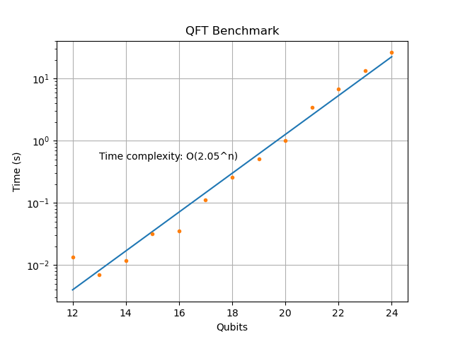

## TinyQsim Design Notes

This document provides some informal notes on the design of TinyQsim, as well as some ideas for further development.

<!-- TOC -->

- [TinyQsim Design Notes](#tinyqsim-design-notes)
  - [Introduction](#introduction)
  - [Simulation](#simulation)
  - [Example](#example)
  - [Performance](#performance)
  - [Endianness](#endianness)
  - [Software Modules](#software-modules)


<!-- TOC -->

### Introduction

TinyQsim was originally started as a fun project to learn about quantum computation and as a framework to explore new ideas. The aim was to 'keep it simple', rather than worrying about optimization. Nevertheless, it is capable of simulating a 20-qubit Quantum Fourier Transform in about one second. This is sufficient for most textbook examples.

The software is intended as a tool for interactive experiments. It is written in Python, using Jupyter notebooks as an environment for interaction. TinyQsim works in an incremental fashion by executing each gate as it is added to the circuit, so that the state is always up to date. This makes it very easy to examine the state, probabilities, etc, at any time, without having to run a simulator on the model each time. This is very convenient for interactive use, but limits the scope for circuit optimization. However, there is an experimental deferred-execution mode that allows a circuit to be constructed before it is run.

### Simulation

When a new instance of QCircuit is created, the quantum state is initialized to the all-zero state $\ket{000\dots 0}$. The state is represented by a tensor that is implemented as multi-dimensional array with one dimension per qubit. Tensors make it simple to apply unitary operators to specific qubits of the state with reasonable performance.

Ignoring for the moment that the gate operations are applied on-the-fly, running a simulation of the quantum circuit just involves applying each gate in the circuit in turn to the quantum state as a unitary operator. The quantum gates are defined as unitary matrices, which are then converted into tensors.

Each unitary tensor 'u' is applied to the state tensor 's' using numpy 'einsum' as follows, where a, b and c are arrays representing the subscripts of 's', 'u' and updated 's' tensors, respectively. (Einsum is a function that allows linear algebra operations to be specified in Einstein summation notation.)

```
  s = einsum(s, a, u, b, c, optimize=True)
```

### Example

An example may help to clarify how the tensor operations work.

Imagine a 4-qubit quantum state. A possible software implementation would be as a vector of $2^4=16$ complex numbers. While this is simple, it is difficult to apply a gate matrix to specific qubits because the array elements and matrix columns relate to basis vectors rather than qubits.

However, the vector 'v' can be turned into a tensor 's' by reshaping it, resulting in a 4-dimensional array that represents a tensor with one subscript per qubit.

```
   s = v.reshape([2,2,2,2])
```

Similarly, a 2-qubit unitary matrix 'm', representing a quantum operator, can be reshaped into a tensor 'u':
```
   u = m.reshape([2,2,2,2]
```
Let's say we want to apply this operator to qubits (3, 1) in that order:

$\qquad S_{abcd}\,U_{ef}^{db}\,\rightarrow S_{afce}$

This can be done using einsum as follows:
```
   einsum('abcd,efdb->afce', s, u)
```

Using subscript letters makes it clear how it relates to the familiar Einstein notation. However, in TinyQsim, the subscripts are generated algorithmically, so it is more convenient to work with lists of integers as follows:

```
   einsum(s, [0,1,2,3], u, [4,5,3,1], [0,5,2,4])
```

where a,b,c,... are replaced by 0,1,2,...

### Performance

The following graph shows the execution time for a Quantum Fourier Transform (QFT) performed on a random quantum state, for various numbers of qubits. The test was run on a Mac Mini M2.

<div style="text-align: center;">

</div>

The plot shows that the execution time doubles (a factor of 2.05) for each qubit that is added. In other words, it is linear in the length of the state vector.

For less than 12 qubits, the time complexity is no longer exponential because overheads, such as building the circuit, become significant. However, performance only becomes an issue once the exponential region is reached.

The time to run a 23-qubit QFT is about 10 seconds, or in just over one second for a 20-qubit one.

### Endianness

Some books, papers and online resources use the *big-endian* convention in which qubit 0 is the most-significant qubit, while others use the *little-endian* convention, in which qubit 0 is the least significant qubit. This can lead to confusion when comparing examples from different sources.

The big-endian convention was chosen for TinyQsim as it appeared to be more popular in books and papers. It would not be too difficult to add an option for selecting big or little endian mode.

### Software Modules

The main software modules are as follows:

| Module    | Purpose                                             | 
|:----------|:----------------------------------------------------|
| qcircuit  | API wrapper to present circuit as an object         |
| quantum   | Functions for quantum operations                    |       
| gates     | Gates defined as unitary matrices                   |
| model     | Simple model of the circuit                         |
| schematic | Graphics for drawing quantum circuits               |
| simulator | Execution of model or just single gates             |
| utils     | General utility functions                           |
| bloch     | Prototype graphics for Bloch sphere                 |

QCircuit is an API wrapper that presents the quantum circuit to the user as an object. Most of the actual functionality is in the other modules.
