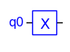

## TinyQsim Gates

This document describes the quantum gates implemented by TinyQsim.

<!-- TOC -->

- [TinyQsim Gates](#tinyqsim-gates)
- [Introduction](#introduction)
    - [Summary of Gates](#summary-of-gates)
    - [Imports and Definitions](#imports-and-definitions)
    - [Symbols and Notation](#symbols-and-notation)
    - [Controlled Gates](#controlled-gates)
    - [Global Phase](#global-phase)
- [Gates in Alphabetical Order](#gates-in-alphabetical-order)
    - [Barrier](#barrier)
    - [CCU](#ccu)
    - [CCX (aka Toffoli) Gate](#ccx-aka-toffoli-gate)
    - [CP Gate](#cp-gate)
    - [CS Gate](#cs-gate)
    - [CSWAP (aka Fredkin) Gate](#cswap-aka-fredkin-gate)
    - [CT Gate](#ct-gate)
    - [CU](#cu)
    - [CX (aka CNOT) Gate](#cx-aka-cnot-gate)
    - [CY Gate](#cy-gate)
    - [CZ Gate](#cz-gate)
    - [H Gate](#h-gate)
    - [I (aka ID) Gate](#i-aka-id-gate)
    - [Measure Gate](#measure-gate)
    - [P Gate](#p-gate)
    - [RX Gate](#rx-gate)
    - [RY Gate](#ry-gate)
    - [S Gate](#s-gate)
    - [SWAP Gate](#swap-gate)
    - [SX (aka SQRTX) Gate](#sx-aka-sqrtx-gate)
    - [T Gate](#t-gate)
    - [U Gate](#u-gate)
    - [X (aka NOT) Gate](#x-aka-not-gate)
    - [Y Gate](#y-gate)
    - [Z Gate](#z-gate)

<!-- TOC -->

## Introduction

### Summary of Gates

| API                               | Description                              | 
|:----------------------------------|:-----------------------------------------|
| qc.barrier()                      | Insert barrier in circuit (not a gate)   |
| qc.ccu(matrix, label, c1, c2, *t) | Controlled-controlled-U gate             |
| qc.ccx(c1, c2, t)                 | Controlled-controlled-X (aka Toffoli)    |
| qc.cp(phi, label, c, t)           | Controlled-P                             |
| qc.cs(c, t)                       | Controlled-S                             
| qc.cswap(c, t1, t2)               | Controlled SWAP (aka Fredkin)            |
| qc.ct(c, t)                       | Controlled-T                             |
| qc.cu(matrix, label, c, *t)       | Controlled-U gate                        |
| qc.cx(c, t)                       | Controlled-X (aka CNOT)                  |
| qc.cy(c, t)                       | Controlled-Y                             |
| qc.cz(c, t)                       | Controlled-Z                             |
| qc.h(t)                           | Hadamard                                 |
| qc.i(t)                           | Identity (aka ID)                        |
| qc.measure(*t)                    | Measurement operation (not a gate)       |
| qc.p(phi, label, t)               | Phase: 'phi' radians about Z axis        |
| qc.rx(theta, label, t)            | Rotation by 'theta' radians about X axis |
| qc.ry(theta, label, t)            | Rotation by 'theta' radians about Y axis |
| qc.s(t)                           | pi/4 phase (S = sqrt(Z))                 |
| qc.swap(t1, t2)                   | Swap 2 qubits                            |
| qc.sx(t)                          | Sqrt(X)                                  |
| qc.t(t)                           | pi/8 phase (T = sqrt(S))                 |
| qc.u(matrix, label, *t)           | Use unitary matrix as a gate             |
| qc.x(t)                           | Pauli X (aka NOT)                        |
| qc.y(t)                           | Pauli Y                                  |
| qc.z(t)                           | Pauli Z                                  |

The argument names are abbreviations for:

```
  c      Control qubit
  t      Target qubit
  *t     One or more target qubits
  label  Text label
  phi    Angle in radians
  theta  Angle in radians
```

The 'measure' operation is not a normal gate as it does not represent a unitary operation. However, it is included here as it has a gate symbol in the circuit.

### Imports and Definitions

The examples in the following sections assume that the following imports and definitions have been made:

```
from tinyqsim.qcircuit import QCircuit
import numpy as np
from math import pi

PI = '\u03C0'  # Unicode PI
```

Unicode $\pi$ is useful for annotating parameterized gates that have an angle argument, so that the angle is clear from the quantum circuit schematic.

### Symbols and Notation

The examples assume that a QCircuit instance has been created with the name 'qc'.
For example:

```
qc = QCircuit(2)
```

An instance of a gate (e.g. the CX gate) can then be added to the circuit as follows:

```
qc.cx(0, 1)
```

The 'draw' command can then be used to draw the quantum circuit:

```
qc.draw()
```

<div style="text-align: center;">

</div>

The horizontal lines represent the qubits of the quantum circuit, which are labelled q0, q1, q2, etc.

Gate names are usually upper case (e.g. 'CX') whereas the corresponding QCircuit method names are lower case (e.g. 'cx').

The CX gate has the following API:

```
cx(c: int, t: int)
   c : the control qubit
   t : the target qubit
```

The call `qc.cx(0,1)` creates an instance of the gate with the control connected to qubit q0 and the target connected to q1.

If the arguments had been in the reverse order, q1 would have been the control and q0 the target, as shown here:

```
qc.cx(1,0)
```

<div style="text-align: center;">

</div>

In a quantum circuit the gates are often applied to non-consective qubits, such as q0 and q2. For example:

```
qc = QCircuit(3)
qc.cx(0, 2)
```

<div style="text-align: center;">

</div> 

The vertical line passes over q1 without a dot, as q1 plays no role. If there were a dot on q1, it would indicate a gate with two controls, which would make it a CCX gate. For example:

```
qc = QCircuit(3)
qc.ccx(0,1,2)  # CCX with 3 arguments
```

<div style="text-align: center;">

</div>

Since, swapping the two controls of a CCX makes no difference, the symbol does not distinguish between them.

Finally, custom gates are represented by a rectangle as they have no special symbol. See the following example:

```
qc = QCircuit(5)
qc.u(mygate, 'U1', 0, 3, 1, 4)
```

<div style="text-align: center;">

</div>  

Note the following points about this example:

- If the qubits are non-consecutive, a dotted line is drawn to indicate that a qubit just passes through without playing a role, such as q2.

- The first two arguments (0, 3) of the call are the control qubits, which are indicated by a dot. The control qubits may be inside or outside the box as shown here.

- The numbers (0, 1) in the rectangle are the argument positions for the target qubits (excluding controls). Targets (0, 1) are connected to (q1, q4) respectively.

### Controlled Gates

Gates can have a *controlled* variant. The control enables the operation of the gate.

Consider an arbitrary one-qubit gate described by the following unitary matrix $U$:

```math
U = \begin{bmatrix}
U_{00}&U_{01}\\U_{10}&U_{11}
\end{bmatrix}
```

A controlled version $CU$ can be made as follows:

```math
CU(U) = \ket{0}\bra{0} \otimes I + \ket{1}\bra{1} \otimes U
```

This can be written as the matrix:

```math
CU(U) = \begin{bmatrix}
1&0&0&0\\
0&1&0&0\\
0&0&U_{00}&U_{01}\\
0&0&U_{10}&U_{11}
\end{bmatrix}
``` 

It can also be written as a *block matrix* (i.e. one made of sub-matrices):

```math
CU(U) = \begin{bmatrix}I_2&0_2\\0_2&U_2 \end{bmatrix}
``` 

The suffices indicate the size of the sub-matrices. $I_k$ is the $k\times k$ identity matrix, whilst $0_k$ is the $k\times k$ zero matrix.

The suffix is 2 in the simple case that U is a one-qubit gate. However, this generalises to K-qubit gates as follows:

```math
CU(U) = \begin{bmatrix}I_M&0_M\\0_M&U_M \end{bmatrix}\quad\text{where}\, M=2^K
```

Gates may have multiple controls, such as the CCX gate. The matrix can be derived by repeated application of the above procedure.

In the documentation that follows, the descriptions of the controlled gates do not include the matrix definition as this follows from the matrix of the uncontrolled version.

### Global Phase

Some gates may appear to be equivalent, but actually differ in a subtle way.

For example, the RX(theta) gate performs a rotation by 'theta' radians about the X axis, whilst the X gate performs a rotation by $\pi$ about the X axis. So it might seem that $RX(\pi) = X$.

However, because of the way they are defined:

```math
RX(\pi) = \begin{bmatrix}
0 & -i \\ -i  & 0
\end{bmatrix}\quad\textrm{and}\quad
X = \begin{bmatrix}
0 & 1 \\ 1  & 0
\end{bmatrix}
```

Hence $X=i\,RX(\pi)$.

A global phase term has no effect on any experiment we can perform. Consider a quantum state with a global phase term $e^{i\phi}$:

```math
 \ket{\psi} = e^{i\phi}(\alpha_0 \ket{0} + \alpha_1 \ket{1})
 ```

Then the probability of the measurement outcome $\ket{0}$, for example, is:

```math
\begin{align*}
p(\ket{0}) &= (e^{i\phi}\alpha_0)^*\, (e^{i\phi}\alpha_0)\\
&=\alpha_0^*\,\alpha_0\\
&=|\alpha_0|^2
\end{align*}
```

where $^*$ denotes complex conjugation.

Consequently, the global phase term has no effect on the measurement outcome.

This extends to a multi-qubit system since:

```math
(e^{i\phi} \ket{\psi}) \otimes \ket{\chi} = e^{i\phi}(\ket{\psi} \otimes \ket{\chi})
```

----

## Gates in Alphabetical Order

### Barrier

A barrier is not a real gate, but it is included here as it has a symbol in the circuit.

A barrier is drawn in the circuit as a vertical dotted line, like a fence separating sections of the circuit. Its purpose is the prevent circuit optimizations crossing boundaries. This does not apply to TinyQsim since it currently does no circuit optimization. However, a barrier can still useful for separating parts of the circuit for clarify, for example to separate initialization from processing.

<div style="text-align: center;">

</div>

```
Example:
   qc.barrier()
   
API:
   barrier()
```

### CCU

The CCU gate is a controlled-controlled custom unitary gate. See the U gate for further details.

It applies unitary matrix U to the target qubit if both the controls are $\ket{1}$.

<div style="text-align: center;">

</div>

```
Example:
   u = numpy.array([[0,1],[1,0]])
   qc.ccu(u, 'U', 0, 1, 2)
   
API:
   ccu(u: ndarray, name: str, c1: int, c2: int, *t: int)
      u    : unitary numpy matrix
      name : Name of gate   
      c1   : the first control qubit
      c2   : the second control qubit
      *t   : the target qubits
```

The unitary matrix is of size $2^k \times 2^k$ for $k$ target qubits.

### CCX (aka Toffoli) Gate

The CCX gate is a controlled-controlled-X gate. See the X gate for further details.

It applies an X (NOT) operation to the target qubit if both the controls are $\ket{1}$.

<div style="text-align: center;">

</div>

```
Example:
   qc.ccx(0, 1, 2)
   
API:
   ccx(c1: int, c2: int, t: int)
      c1 : the first control qubit
      c2 : the second control qubit
      t  : the target qubit
```

### CP Gate

The CP gate is a controlled version of the P gate. See the P gate for further details.

The first argument is the phase angle in radians. The second argument is the phase angle as a string that is used to label the circuit symbol. The phase angles are typically multiples of 'pi', so it is convenient to use the unicode 'pi' in the text string. See the P gate for further details.

<div style="text-align: center;">

</div>

```
Example:
   qc.cp(pi/2, f'{PI}/2', 0, 1)

API:
   cp(phi: float, phi_text: str, c: int, t: int)
      phi      : the phase angle in radians
      phi_text : Text annotation for the angle
      c        : the control qubit
      t        : the target qubit
```

### CS Gate

The CS gate is a controlled version of the S gate. See the S gate for further details.

<div style="text-align: center;">

</div>

```
Example:
   qc.cs(0, 1)

API:
   cs(c: int, t: int)
      c : the control qubits
      t : the target qubit
```

### CSWAP (aka Fredkin) Gate

The CSWAP gate is a controlled version of the SWAP gate. See the SWAP gate for further details.

<div style="text-align: center;">

</div>

```
Example:
   qc.cswap(0, 1, 2)

API:
   cswap(c: int, t1: int, t2: int)
      c  : the control qubits
      t1 : the first target qubit
      t2 : the second target qubit
```

### CT Gate

The CT gate is a controlled version of the T gate. See the T gate for further details.

<div style="text-align: center;">

</div>

```
Example:
   qc.ct(0, 1)

API:
   ct(c: int, t: int)
      c : the control qubit
      t : the target qubit
```

### CU

The CU gate is a controlled custom unitary gate. See the U gate for further details.

It applies unitary matrix U to the target qubit if the control is $\ket{1}$.

<div style="text-align: center;">

</div>

```
Example:
   u = numpy.array([[0,1],[1,0]])
   qc.cu(u, 'U', 0, 1)
   
API:
   cu(u: ndarray, name: str, c: int, *t: int)
      u    : unitary numpy matrix
      name : Name of gate   
      c    : the control qubit
      *t    : the target qubits
```

The unitary matrix is of size $2^k \times 2^k$ for $k$ target qubits.

### CX (aka CNOT) Gate

The CX gate is a controlled version of the X gate. It is also known as the CNOT gate. It plays an important role in quantum algorithms.

<div style="text-align: center;">

</div>

```
Exammple:
   qc.cx(0, 1)

API:
   cx(c: int, t: int)
      c : the control qubit
      t : the target qubit
```

### CY Gate

The CY gate is a controlled version of the Y gate. See the Y gate for further details.

<div style="text-align: center;">

</div>

```
Example:
   qc.cy(0, 1)

API:
   cy(c: int, t: int)
      c : the control qubit
      t : the target qubit
```

### CZ Gate

The CZ gate is a controlled version of the Z gate. See the Z gate for further details.

<div style="text-align: center;">

</div>

```
Example:
   qc.cz(0, 1)

API:
   cz(c: int, t: int)
      c : the control qubit
      t : the target qubit
```

### H Gate

The Hadamard (H) gate is an important gate in quantum computing because it can create a superposition from a basis state. It can also be used to switch between the Z basis and the X basis.

<div style="text-align: center;">

</div>

```
Example:
  qc.h(0)

API:
   h(t: int)
      t : the target qubit
```

The H gate is described by the following matrix:

```math
H = \frac{1}{\sqrt{2}}\begin{bmatrix}1 & 1 \\ 1 & -1 \end{bmatrix}
```

### I (aka ID) Gate

The I gate is the identity gate. The physical implementation in a quantum computer is simply 'do nothing'. Although it has no effect, it can be useful when analysing circuits. It is usually just drawn as a qubit line, but may occasionally be made explicit as follows:

<div style="text-align: center;">

</div>

```
Example:
   qc.i(0)

API:
   i(t: int)
      t : the target qubit
```

The I gate is described by the identity matrix:

```math
I = \begin{bmatrix}1 & 0 \\ 0 & 1 \end{bmatrix}
```

### Measure Gate

The 'measure' operation is not a normal gate as it is not a unitary operator. However, it is included here as it has a gate symbol in the circuit.

<div style="text-align: center;">

</div>

The use of the measurement is discussed in the TinyQsim User Guide.

```
Example:
   qc.measure(0, 1)

API:
   measure(t1, t2, ... : int)
      t1, t2, ... : the qubits to be measured
```

If the argument list is left blank, then all qubits will be measured.

### P Gate

The phase gate P rotates the phase of a qubit around the Z axis in the Bloch sphere.

<div style="text-align: center;">

</div>

The P gate is described by the following matrix:

```math
P(\phi) =\begin{bmatrix}1 & 0 \\ 0 & e^{i\phi} \end{bmatrix}
```

```
Example:
    qc.p(pi/2, f'{PI}/2', 0)

API:
   p(phi: float, label: str, t: int)
      phi   : the phase angle in radians
      label : text label for the angle
      t     : the target qubit
```

The first argument is the phase angle in radians. The second argument is the phase angle as a string. The phase angles are typically multiples of $\pi$, so it is convenient to use unicode $\pi$ in the text string.

The phase $\phi$ has no effect on the measurement outcome for a single qubit, but phases become important with multiple qubits because
*interference* can occur. This plays an important role in quantum algorithms.

When the phase gate is applied to a qubit $\alpha_0\ket{0} + \alpha_1\ket{1}$, the result is:

```math
\begin{bmatrix}1 & 0 \\ 0 & e^{i\phi} \end{bmatrix}\begin{bmatrix}\alpha_0 \\ \alpha_1 \end{bmatrix}=\begin{bmatrix}\alpha_0 \\ \alpha_1 e^{i\phi}\end{bmatrix}
```

Note that all the phase is applied to the $\ket{1}$ state. It is not necessary to apply separate phases to the two basis states as only the relative phase matters. The global phase does not affect the measurement outcome.

The following are special cases of the phase gate that have their own names as they are frequently used:

```math
\begin{align*}
Z &= P(\pi)\\[0.3em]
S &= P(\frac{\pi}{2})= \sqrt{Z}\\[0.3em]
T &= P(\frac{\pi}{4})= \sqrt{S}
\end{align*}
```

### RX Gate

The RX gate performs a rotation by 'theta' radians about the X axis of the Bloch Sphere.

<div style="text-align: center;">

</div>

```
Example:
   qc.rx(pi/4, f'{PI}/4', 0)

API:
   rx(theta: float, t: int)
      theta : the angle in radians
      label : text label for the angle
      t     : the target qubit
```

The RX gate is described by the following matrix:

```math
RX(\theta) = \begin{bmatrix}
\cos(\frac{\theta}{2}) & -i\sin(\frac{\theta}{2}) \\
 -i \sin(\frac{\theta}{2}) & \cos(\frac{\theta}{2}) \end{bmatrix}
```

Note: RX($\pi$) and X differ by a global phase of $i$:

```math
RX(\pi) = \begin{bmatrix}
0 & -i \\ -i  & 0
\end{bmatrix}\quad\textrm{whereas}\quad
X = \begin{bmatrix}
0 & 1 \\ 1  & 0
\end{bmatrix}
```

Hence $X=i\,RX(\pi)$.

### RY Gate

The RY gate performs a rotation by 'theta' radians about the Y axis of the Bloch Sphere.

<div style="text-align: center;">

</div>

```
Example:
   qc.ry(pi/4, f'{PI}/4', 0)

API:
   ry(theta: float, t: int)
      theta : the angle in radians
      label : text label for the angle
      t     : the target qubit
```

The RY gate is described by the following matrix:

```math
RY(\theta) =  \begin{bmatrix}
\cos(\frac{\theta}{2}) & -\sin(\frac{\theta}{2}) \\
 \sin(\frac{\theta}{2}) & \cos(\frac{\theta}{2}) \end{bmatrix}
```

Note: RY($\pi$) and Y differ by a global phase:

```math
RY(\pi) = \begin{bmatrix}
0 & -1 \\ 1  & 0
\end{bmatrix}\quad\textrm{whereas}\quad
Y = \begin{bmatrix}
0 & -i \\ i  & 0
\end{bmatrix}
```

Hence $Y=i\,RY(\pi)$.

### S Gate

The S gate performs a phase rotation by $\pi/2$ radians. It can be thought of as the square-root of the Z gate. Applying it twice is equivalent to a Z gate.

<div style="text-align: center;">

</div>

```math
S=\sqrt{Z}
```

```
Example:
   qc.s(0)

API:
   s(t: int)
      t : the target qubit
```

The S gate is described by the following matrix:

```math
S =\begin{bmatrix}1 & 0 \\ 0 & i \end{bmatrix}
```

### SWAP Gate

The SWAP gate swaps the state of two qubits.

<div style="text-align: center;">

</div>

```
Example:
   qc.swap(0, 1)

API:
   swap(c: int, t1: int, t2: int)
      t1 : the first target qubit
      t2 i: the second target qubit
```

The SWAP gate is described by the following matrix:

```math
SWAP =\begin{bmatrix}1&0&0&0 \\ 0&0&1&0 \\ 0&1&0&0 \\ 0&0&0&1 \end{bmatrix}
```

### SX (aka SQRTX) Gate

The SX gate can be thought of as the square-root of the X gate. Applying it twice is equivalent to an X gate:

<div style="text-align: center;">

</div>

```math
SX=\sqrt{X}
```

```
Example:
   qc.sx(0)

API:
   sx(t: int)
     t : the target qubit
```

The SX gate is described by the following matrix:

```math
SX =\frac{1}{\sqrt{2}}\begin{bmatrix}1+i & 1-i \\ 1-i & 1+i \end{bmatrix}
```

### T Gate

The T gate performs a phase rotation by $\pi/4$ radians. It can be thought of as the square-root of the S gate. Applying it twice is equivalent to a S gate:

<div style="text-align: center;">

</div>

```math
T = \sqrt{S}
```

```
Example:
   qc.t(0)

API:
   t(t1: int)
      t1 : the target qubit
```

The T gate is described by the following matrix:

```math
T =\begin{bmatrix}1 & 0 \\ 0 & e^{i\frac{\pi}{4}} \end{bmatrix}
```

### U Gate

The U gate takes a $2^N \times 2^N$ unitary matrix and applies it as an N-qubit gate. The simplest case is a single-qubit gate, which has a 2x2 matrix.

<div style="text-align: center;">

</div>

```
Example:
   u = numpy.array([[0,1],[1,0]])
   qc.u(u, 'U', 0)
   
API:
   u(u: ndarray, name: str, *t: int)
      u    : unitary numpy matrix
      name : Name of gate   
      *t    : the target qubits
```

The unitary matrix is of size $2^k \times 2^k$ for $k$ target qubits.

### X (aka NOT) Gate

The X gate is the quantum NOT operator. It is a rotation by $\pi$ about the X axis of the Bloch sphere.

<div style="text-align: center;">

</div>

```
Example:
   qc.x(0)

API:
   x(t: int)
      t : the target qubit
```

The X gate is described by the following matrix:

```math
X =\begin{bmatrix}0 & 1 \\ 1 & 0 \end{bmatrix}
```

### Y Gate

The Y gate It is a rotation by $\pi$ about the Y axis of the Bloch sphere.

<div style="text-align: center;">

</div>

```
Example:
   qc.y(0)

API:
   y(t: int)
      t : the target qubit
```

The Y gate is described by the following matrix:

```math
Y = \begin{bmatrix}0 & -i \\ i & 0 \end{bmatrix}
```

### Z Gate

The Z gate It is a rotation by $\pi$ about the Z axis of the Bloch sphere.

<div style="text-align: center;">

</div>

```
Example:
   qc.z(0)
   
API:
   z(t: int)
      t : the target qubit
```

The Z gate is described by the following matrix:

```math
Z =\begin{bmatrix}1&0 \\ 0&-1 \end{bmatrix}
