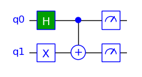

## TinyQsim User Guide

This guide provides a short introduction to using TinyQsim. The companion [TinyQsim Gates](TinyQsim_gates.md) guide describes the circuit symbols and the different kinds of gates that can be used to build a quantum circuit.

The Jupyter notebooks in the 'examples' directory contain some more detailed examples.

<!-- TOC -->

- [TinyQsim User Guide](#tinyqsim-user-guide)
  - [Installation](#installation)
  - [A Simple Example](#a-simple-example)
  - [Creating a Quantum Circuit](#creating-a-quantum-circuit)
  - [Drawing the Circuit](#drawing-the-circuit)
    - [1: In a Jupyter Notebook](#1-in-a-jupyter-notebook)
    - [2: Run from a Python Script](#2-run-from-a-python-script)
  - [Building the Circuit](#building-the-circuit)
  - [Inspecting the State (without collapse)](#inspecting-the-state-without-collapse)
    - [Quantum State Vector](#quantum-state-vector)
    - [Complex Components of State](#complex-components-of-state)
    - [Measurement Probabilities](#measurement-probabilities)
    - [Measurement Counts](#measurement-counts)
  - [Quantum Measurement (with collapse)](#quantum-measurement-with-collapse)
  - [Bloch Sphere](#bloch-sphere)


<!-- TOC -->

### Installation

TinyQsim can be downloaded from [https://github.com/jbrumf/tinyqsim](https://github.com/jbrumf/tinyqsim).

For installation instructions, see the README file in the source distribution.

### A Simple Example

The examples below require the following Python imports:

```
from tinyqsim.qcircuit import QCircuit
import numpy as np
```

The main interface to the simulator is through the QCircuit class.

First, create a quantum circuit with 2 qubits:

```
  qc = QCircuit(2)
```

Then add some quantum gates:

```
  qc.x(1)       # Add an X gate to qubit 1
  qc.h(0)       # Add an H gate to qubit 0
  qc.cx(0, 1)   # Add a CX gate to qubits 0 and 1
```

Draw the circuit:

```
  qc.draw()
```

<div style="text-align: center;">

</div>

This very simple circuit has created the entangled quantum state: $\frac{1}{\sqrt{2}}\ket{01} + \frac{1}{\sqrt{2}}\ket{10}$.

There are various ways to inspect the state (without collapsing it):

```
  # The quantum state vector
  print(qc.state_vector)
    [0. 0.70710678 0.70710678 0.]
    
  # Complex components of state
  print(qc.components())
    {'01': (0.7071+0j), '10': (0.7071+0j)}
   
  # Probabilities of each measurement outcome
  print(qc.probabilities())
    {'01': 0.5, '10': 0.5}
   
  # Measurement counts for repeated experiment
  print(qc.counts(nruns=1000))
    {'01': 503, '10': 497}
```

We can also perform a quantum measurement (with collapse):

```
  print(qc.measure())  # Output: [0 1] or [1 0]
```

As well as performing the measurement, this has also added measurement gates to the circuit:

```
  qc.draw()
```

<div style="text-align: center;">

</div>

By default, the gate operations are applied to the state as they are added to the circuit. There is no need to build the circuit and then run a simulator on it. Consequently, TinyQsim allows a very interactive way of working.

All these features are described in more detail in the following sections.

See the Jupyter notebooks in the 'examples' directory for more detailed examples.

### Creating a Quantum Circuit

To create an n-qubit quantum circuit:

```
  qc = QCircuit(n)
```

By default the quantum state is initialized to $\ket{00\dots 0}$. The required initial state can then be created using a few gates.

It is also possible to set the state using the `state_vector` property. The vector must have a norm of 1 and a length of $2^K$, where K is the number of qubits. For example:

```
  qc = QCircuit(2)
  qc.state_vector = np.array([0, 1, 0, 0])
```

A random quantum state is also possible using the `init` keyword argument:

```
  qc = QCircuit(3, init='random')
```

### Drawing the Circuit

The quantum circuit can be drawn using the 'draw' method:

```
  qc.draw(*options)
  
  options:
    scale = 1.2          # Draw with specified scale (default=1.0)
    show = True          # Display the circuit (default=True)
    save = 'bloch.png'   # Save to file in home directory (default=None)
```

If the circuit has a large number of gates, it may get reduced in size to fit in the window. The following sections explain how to zoom and pan the view.

#### 1: In a Jupyter Notebook

- Double click on the circuit in the notebook. This will zoom the circuit and display scroll bars.
- Then click on the area to the left of the qubit numbers. This will expand the view vertically so that all qubits are visible.
- If the circuit is too wide to fit in the window, the horizontal scroll bar can be used to explore the circuit.

#### 2: Run from a Python Script

If TinyQsim is run from a Python program, instead of from a notebook, the circuit will appear in a window with controls at the bottom for zooming and panning the view. A region can be zoomed into with the magnifier tool and then the view can be panned using the pan tool (which has 4 arrows).

Note: There is a bug at the moment that causes a crash when attempting to resize the window.

### Building the Circuit

The various gates and other components that can be used to build a quantum circuit are described in the [TinyQsim Gates](TinyQsim_gates.md) guide. This also explains the circuit symbols and several other matters relating to the use of gates.

The available gates include: CCU, CCX, CP, CS, CSWAP, CT, CU, CX, CY, CZ, H, I, P, RX, RY, S, SWAP, SX, T, U, X, Y and Z. It is also possible to define custom gates, including ones with parameters and controls.

The Gates guide also describes the 'barrier' symbol and the measurement gate, although measurement is not a normal gate as it is not unitary.

### Inspecting the State (without collapse)

It is not possible to examine the state of real qubits without collapsing them to one the basis states of the measurement basis. However, a simulator such as TinyQsim has access to the state, which can be very useful for understanding and developing quantum algorithms.

Four methods or properties are provided that allow you to access the state in different ways:

```
  qc.state_vector
  qc.components()
  qc.probabilities()
  qc.counts()
```

The state_vector property returns a copy of the raw state vector as a numpy array. This is useful if you want to write some Python code to perform your own processing of the result.

However, if you just want to examine the state, the other three methods may be more useful. These  return the result as a Python dictionary with the keys that are easy to relate to the basis states. By default, any elements that have a probabilities close to zero are omitted to make the output easier to read.

For example:

```
  {'01': (0.7071+0j), '10': (0.7071+0j)}
```

where the key '01' corresponds to the component $\ket{01}$.

The following subsections describe these methods in more detail.

#### Quantum State Vector

The quantum state vector can be accessed via a property of the quantum circuit. This returns a copy of the internal state as a numpy array.

```
Example:
  state = qc.state_vector
```

Example output for state $\frac{1}{\sqrt{2}}\ket{01} + \frac{1}{\sqrt{2}}\ket{10}$ :

```
  [0. 0.70710678 0.70710678 0.]
```

The state vector can be quite large, so it is often useful to format it to make it more readable. For example:

```
  with np.printoptions(precision=4, suppress=True, threshold=100, edgeitems=10):
      print(qc.state_vector)
```

The keywords have the following meanings:

- `suppress`  : Print in fixed-point notation
- `precision` : Set the number of decimal places
- `threshold` : Number of items that triggers summarization
- `edgeitems` : Number of array items to print at start/end of summarization

See the numpy 'printoptions' documentation for further options and details.

#### Complex Components of State

The projection of the quantum state onto each basis vector can be obtained as follows. This is not treated as a measurement, so the state is not collapsed. This is similar to just printing the state except that the result is in the form of a Python dictionary with keys that label the basis states.

```
API:
  qc.components(*options)
     options: decimals=5, include_zeros=False     

Example:
  qc.components(decimals=4)
```

Example output for state $\frac{1}{\sqrt{2}}\ket{01} + \frac{1}{\sqrt{2}}\ket{10}$ :

```
  {'01': (0.7071+0j), '10': (0.7071+0j)}
```

The options are as follows:

- `decimals` : Number of decimal places
- `include_zeros` : Include zero entries

#### Measurement Probabilities

The probabilities of a measurement returning each basis state can be obtained as follows. This is not treated as a measurement, so the state is not collapsed.

```
API:
  qc.probabilities(*options)
     options: decimals=5, include_zeros=False
     
Example:
  qc.probabilities()
```

Example output for state $\frac{1}{\sqrt{2}}\ket{01} + \frac{1}{\sqrt{2}}\ket{10}$ :

```    
  {'01': 0.5, '10': 0.5}
```

So, the probabilties of the measurement outcomes are:

```math
p(\ket{01}) = 0.5, \quad p(\ket{10})= 0.5
```

The options are as follows:

- `decimals` : Number of decimal places
- `include_zeros` : Include zero entries

#### Measurement Counts

The probabilities of different outcomes cannot be measured on a real quantum system, so it is common to run a quantum program many times to find the frequency with which each outcome occurs. This provides an approximation to the true probabilities which improves as the number of test runs is increased.

TinyQsim provides the following method that simulates such a sequence of test runs and returns a dictionary of the counts for each basis state. It does not affect the state. If you want the state to be updated, just follow it with a call to 'measure()'.

```       
  qc.counts(*options)
     options: nruns=1000, include_zeros=False
```

Example output for state $\frac{1}{\sqrt{2}}\ket{01} + \frac{1}{\sqrt{2}}\ket{10}$ :

```
  {'01': 503, '10': 497}
```

The options are as follows:

- `nruns`         : Number of test runs
- `include_zeros` : Include zero entries

### Quantum Measurement (with collapse)

A quantum measurement may be performed on one or more qubits. This collapses the state as it would on a real quantum computer. If no qubits are specified, then all the qubits are measured.

```
API:
  qc.measure(*qubits)
  
Examples:
  qc.measure(0,1)   # Measure qubits 0 and 1
  qc.measure()      # Measure all qubits
```

Example output:

```
  [0 1]
```

### Bloch Sphere

A state of a qubit may be mapped onto a sphere, known as the Bloch sphere:

```math
\ket{\psi} = \cos(\frac{\theta}{2})\ket{0} + e^{i\phi} \sin(\frac{\theta}{2})\ket{1}$
```

where $0 \le\theta\le\pi\,$ and $\,0\le\phi\le2\pi$.

<div style="text-align: center;">

</div>

The Bloch sphere is mostly useful for single qubits because the qubits of a multi-qubit system can become *entangled* such that the qubits no longer have individual pure states. However, the sphere is a useful way to visualize and learn about the effects of single-qubit gates, which can then be used as part of a multi-qubit system.

The support for the Bloch Sphere in TinyQsim is at the prototype stage, so the details are likely to change. At present, it can display the Bloch sphere for a pair of angles, $\phi$ and $\theta$. For example:

```
  from tinyqsim.plot_bloch import plot_bloch
  phi = pi / 2
  theta = pi / 2
  plot_bloch(phi, theta)
```

The sphere can be rotated with the mouse when run from a Python program. When run from a Jupyter notebook, the orientation is fixed. However, the view point can be set using the optional parameters azimuth and elevation in degrees:

```
  plot_bloch(phi, theta, azimuth=35, elevation=10)
```

The following example shows how to create a one-qubit quantum circuit, use gates to configure the state and then plot the state on the Bloch sphere.

For example:

```
  from tinyqsim.bloch import plot_bloch
  from tinyqsim.extras import qubit_to_bloch

  qc = QCircuit(1)  # This must be 1 qubit
  
  qc.h(0)
  qc.p(pi/3, f'{PI}/3', 0)
  
  qc.draw()
  plot_bloch(*qubit_to_bloch(qc.state_vector))
```

<div style="text-align: center;">

</div>

<div style="text-align: center;">

</div>

The Hadamard gate rotates the state vector from its initial +Z direction $\ket{0}$ to the +X direction $\ket{+}$. Then the P($\pi$/3) gate rotates it by $\pi/3$ radians clockwise about the Z axis to the position shown by the red arrow.