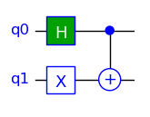
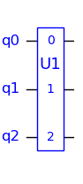
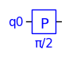
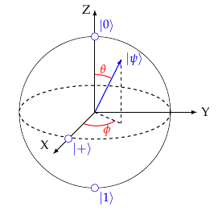
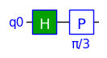
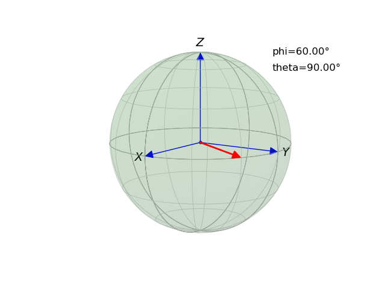

## TinyQsim User Guide

<!-- TOC -->

- [TinyQsim User Guide](#tinyqsim-user-guide)
    - [A Simple Example](#a-simple-example)
    - [Creating a Quantum Circuit](#creating-a-quantum-circuit)
    - [Drawing the Circuit](#drawing-the-circuit)
        - [1: In a Jupyter Notebook](#1-in-a-jupyter-notebook)
        - [2: Run from a Python Script](#2-run-from-a-python-script)
    - [Available Gates](#available-gates)
    - [Custom Gates](#custom-gates)
    - [Parametrized Gates](#parametrized-gates)
    - [Angle Parameters](#angle-parameters)
    - [Inspecting and Measuring the State](#inspecting-and-measuring-the-state)
        - [Quantum State Vector](#quantum-state-vector)
        - [Measurement Probabilities](#measurement-probabilities)
        - [Complex Components of State](#complex-components-of-state)
        - [Measuring the State](#measuring-the-state)
        - [Measurement Counts](#measurement-counts)
    - [Bloch Sphere](#bloch-sphere)

<!-- TOC -->

### A Simple Example

The main interface to the simulator is through the QCircuit class.

Create a quantum circuit with 2 qubits:

```
  qc = QuantumCircuit(2)
```

Then add some quantum gates:

```
  qc.x(1)       # Add an X gate to qubit 1
  qc.h(0)       # Add an H gate to qubit 0
  qc.cx(0, 1)   # Add a CX gate to qubits 0 and 1
```

Draw the circuit:

```
  qc.draw()
```

<div style="text-align: center;">

</div>

There are various ways to inspect the state:

```
  print(qc.state_vector)    # Print the quantum state
  print(qc.probabilities()) # Print the probabilities of each possible outcome
  print(qc.components())    # Dictionary of complex components of state
  print(qc.counts())        # Measurement counts for repeated experiment
```

Perform a quantum measurement (with collapse):

```
  qc.measure()
```

These features are described in more detail in the following sections.

### Creating a Quantum Circuit

To create an n-qubit quantum circuit:

```
  qc = QCircuit(n)
```

By default the quantum state is initialized to $\ket{00\dots 0}$. A random quantum state is also possible using the `init` keyword argument:

```
  qc = QuantumCircuit(3, init='random')
```

It is also possible to set the state using the `state_vector` property. The vector must have a norm of 1 and a length of $2^K$, where K is the number of qubits. For example:

```
  qc = QCircuit(2)
  qc.state_vector = np.array([0, 1, 0, 0])
```

### Drawing the Circuit

The quantum circuit can be drawn using the 'draw' method:

```
  qc.draw(*options)
  
  options:
    scale = 1.2          # Draw with specified scale (default=1.0)
    show = True          # Display the circuit (default=True)
    save = 'bloch.png'   # Save to file in home directory (default=None)
```

If the circuit has a large number of gates, it may get reduced in size to fit in the window. The following sections explain how to zoom and pan the view.

#### 1: In a Jupyter Notebook

- Double click on the circuit in the notebook. This will zoom the circuit and display scroll bars.
- Then click on the area to the left of the qubit numbers. This will expand the view vertically so that all qubits are visible.
- If the circuit is too wide to fit in the window, the horizontal scroll bar can be used to explore the circuit.

#### 2: Run from a Python Script

If TinyQsim is run from a Python program, instead of from a notebook, the circuit will appear in a window with controls at the bottom for zooming and panning the view. A region can be zoomed into with the magnifier tool and then the view can be panned using the pan tool (which has 4 arrows).

Note: There is a bug at the moment that causes a crash when attempting to resize the window.

### Available Gates

See the [TinyQsim Gates](Gates.md) guide for details of the quantum gates available in TinyQsim.

These include: CCU, CCX, CP, CS, CSWAP, CT, CU, CX, CY, CZ, H, I, P, RX, RY, S, SWAP, SX, T, U, X, Y and Z. There is also a 'measure' gate, although this is not a normal gate as it is not a unitary operator.

### Custom Gates

Custom gates are possible using the U gate that takes a unitary matrix as an argument. For example:

```
u1 = np.array([[1, 0, 0, 0],  # Define a unitary matrix
               [0, 0, 1, 0],
               [0, 1, 0, 0],
               [0, 0, 0, 1]])
                 
qc = QCircuit(3)
qc.u(u1, 'U1', 0, 1, 2)  # Apply the matrix as a gate
```

This automatically generates a symbol which is labelled with the string given as the second argument.

<div style="text-align: center;">

</div>

The are also CU and CCU variants for controlled-U and controlled-controlled-U gates.

For further details see the 'U' gate in the [TinyQsim Gates](Gates.md) guide.

### Parametrized Gates

Parameterized gates, such as the P (phase) gate are internally defined as functions that return a unitary matrix.

We can create our own custom parametrized gates in the same way. For example, suppose that we wish to create the following custom parameterized phase gate.

```math
\text{RK}(k) =\begin{bmatrix}1 & 0 \\ 0 & e^{\large\frac{2\pi i}{2^k}}\end{bmatrix}
```

One way to define it is:

```
  def rk(k: int):
      return np.array([[1, 0], [0, cexp(1j * 2 * pi / 2 ** k)]])
```

Alternatively, we could define it in terms of the existing P (phase) gate, as follows:

```
  def rk(k: int):
      return gates.P(2 * pi / 2 ** k)
```

In either case, we can apply the gate like this:

```
  qc.QCircuit(4)
  qc.u(rk(3), 'RK', 2)  # Add rk(3) to qubit 2
```

### Angle Parameters

One-qubit gates typically implement rotations of the state vector on the Bloch sphere. Some of these are fixed-angle rotations, such as X, Y, Z, S, T, etc. Others allow a user-specified rotation angle.

The P, CP, RX and RY gates have two parameters for the angle. The first is the angle in radians and the second is a label for the circuit symbol that shows the angle in a convenient form, such as a multiple of $\pi$.

The following examples show how to specify the label using a simple ASCII 'pi' or a Unicode $\pi$.

```
  PI = '\u03C0'  # PI unicode character
  
  qc.p(pi/2, 'pi/2', 1)      # ASCII 'pi/4'
  qc.p(pi/2, f'{PI}/2', 1)   # Unicode PI
```

<div style="text-align: center;">

</div>

### Inspecting and Measuring the State

It is not possible to examine the state of real qubits without collapsing them to one the basis states of the measurement basis. However, a simulator such as TinyQsim does have access to the state, which can be very useful for understanding and developing quantum algorithms.

The following methods allow the quantum state to be inspected and presented in several different ways. The state used for these examples is: $\frac{1}{\sqrt{2}}\ket{01} + \frac{1}{\sqrt{2}}\ket{10}$

#### Quantum State Vector

The quantum state vector can be accessed via a property of the quantum circuit. This returns a copy of the internal state.

```
Example:
  state = qc.state_vector
```

Example output:

```
  [0. 0.70710678 0.70710678 0.]
```

The state vector can be quite large, so it is often useful to format it to make it more readable. For example:

```
  with np.printoptions(precision=4, suppress=True, threshold=100, edgeitems=10):
      print(qc.state_vector)
```

The keywords have the following meanings:

- `suppress`  : Print in fixed-point notation
- `precision` : Set the number of decimal places
- `threshold` : Number of items that triggers summarization
- `edgeitems` : Number of array items to print at start/end of summarization

See the numpy 'printoptions' documentation for further options and details.

#### Measurement Probabilities

The probabilities of a measurement returning each basis state can be obtained as follows. This is not treated as a measurement, so the state is not collapsed.

```
API:
  qc.probabilities(*options)   # Return dictionary of state probabilities
     options: decimals=5, include_zeros=False
     
Example:
  qc.probabilities()
```

Example output:

```    
  {'01': 0.5, '10': 0.5}
```

The options are as follows:

- `decimals` : Number of decimal places
- `include_zeros` : Include zero entries

#### Complex Components of State

The projection of the quantum state onto each basis vector can be obtained as follows. This is not treated as a measurement, so the state is not collapsed. This is similar to just printing the state except that the result is in the form of a Python dictionary with keys that label the basis states.

```
API:
  qc.components(*options) # Return dictionary of complex components of state
     options: decimals=5, include_zeros=False     

Example:
  qc.components(decimals=4)
```

Example output:

```
  {'01': (0.7071+0j), '10': (0.7071+0j)}
```

The options are as follows:

- `decimals` : Number of decimal places
- `include_zeros` : Include zero entries

#### Measuring the State

A quantum measurement may be performed one or more qubits. This collapses the state as it would on a real quantum computer. If no qubits are specified, then all the qubits are measured.

```
API:
  qc.measure(*qubits)  # Measure the specified qubits
  
Examples:
  qc.qc.measure(0,1)   # Measure qubits 0 and 1
  qc.qc.measure()      # Measure all qubits
```

Example output:

```
  [0 1]
```

#### Measurement Counts

The probabilities of different outcomes cannot be measured on a real quantum system, so it is common to run a quantum program many times to find the frequency with which each outcome occurs. This provides an approximation to the true probabilities which improves as the number of test runs is increased.

TinyQsim provides the following method that simulates such a sequence of test runs and returns a dictionary of the counts for each basis state. It does not affect the state. If you want the state to be updated, just follow it with a call to 'measure()'.

```       
  qc.counts(*options)  # Return measurement counts for repeated experiment
     options: nruns=1000, include_zeros=False
```

Example output:

```
  {'01': 503, '10': 497}
```

The options are as follows:

- `nruns`         : Number of test runs
- `include_zeros` : Include zero entries

### Bloch Sphere

A state of a qubit may be mapped onto a sphere, known as the Bloch sphere:

```math
\ket{\psi} = \cos(\frac{\theta}{2})\ket{0} + e^{i\phi} \sin(\frac{\theta}{2})\ket{1}$
```

where $0 \le\theta\le\pi\,$ and $\,0\le\phi\le2\pi$.

<div style="text-align: center;">

</div>

The Bloch sphere is mostly useful for single qubits because the qubits of a multi-qubit system can become
*entangled* such that the qubits no longer have individual pure states. However, the sphere is a useful way to visualize and learn about the effects of single-qubit gates, which can then be used as part of a multi-qubit system.

The support for the Bloch Sphere in TinyQsim is at the prototype stage, so the details are likely to change. At present, it can display the Bloch sphere for a pair of angles, $\phi$ and $\theta$. For example:

```
  from tinyqsim.plot_bloch import plot_bloch
  phi = pi / 2
  theta = pi / 2
  plot_bloch(phi, theta)
```

The sphere can be rotated with the mouse when run from a Python program. When run from a Jupyter notebook, the orientation is fixed. However, the view point can be set using the optional parameters azimuth and elevation in degrees:

```
  plot_bloch(phi, theta, azimuth=35, elevation=10)
```

It is possible to create a one-qubit quantum circuit, use gates to configure the state and then plot the state on the Bloch sphere.

For example:

```
  from tinyqsim.bloch import plot_bloch
  from tinyqsim.extras import qubit_to_bloch

  qc = QCircuit(1)  # This must be 1 qubit at present
  
  qc.h(0)
  qc.p(pi/3, f'{PI}/3', 0)
  
  qc.draw()
  plot_bloch(*qubit_to_bloch(qc.state_vector))
```

<div style="text-align: center;">

</div>

<div style="text-align: center;">

</div>

The Hadamard gate rotates the state vector from its initial +Z direction $\ket{0}$ to the +X direction $\ket{+}$. Then the P($\pi$/3) gate rotates it by $\pi/3$ radians clockwise about the Z axis to the position shown by the red arrow.