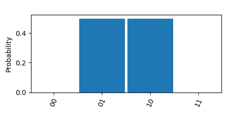
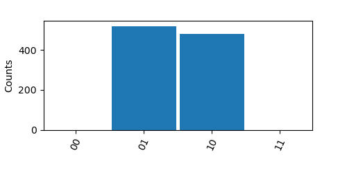
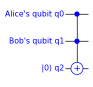
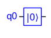
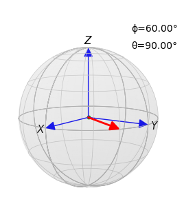

# TinyQsim User Guide


### Contents

<!-- TOC -->

- [TinyQsim User Guide](#tinyqsim-user-guide)
    - [Contents](#contents)
  - [Getting Started](#getting-started)
    - [Introduction](#introduction)
    - [Installation](#installation)
    - [A Simple Example](#a-simple-example)
  - [Further Details](#further-details)
    - [Creating a Quantum Circuit](#creating-a-quantum-circuit)
    - [Building the Circuit](#building-the-circuit)
    - [Drawing the Circuit](#drawing-the-circuit)
      - [1: In a Jupyter Notebook](#1-in-a-jupyter-notebook)
      - [2: Run from a Python Script](#2-run-from-a-python-script)
    - [Labelling the Qubits](#labelling-the-qubits)
    - [Inspecting the State](#inspecting-the-state)
      - [Quantum State Vector](#quantum-state-vector)
      - [Components of State](#components-of-state)
      - [Probabilities](#probabilities)
    - [Quantum Measurement](#quantum-measurement)
      - [General Approach](#general-approach)
      - [Measure](#measure)
      - [Counts with Measurements](#counts-with-measurements)
      - [Conditional Execution](#conditional-execution)
      - [Reset](#reset)
    - [LaTeX Formatting](#latex-formatting)
      - [Displaying the State](#displaying-the-state)
      - [Displaying Arrays and Matrices](#displaying-arrays-and-matrices)
    - [Bloch Sphere](#bloch-sphere)

<!-- TOC -->

----

## Getting Started

### Introduction

This guide provides a short introduction to using TinyQsim. The companion [TinyQsim Gates](TinyQsim_gates.md) Guide describes the circuit symbols and the different kinds of gates that can be used to build a quantum circuit.

For more-complex examples, see the Jupyter notebooks in the 'examples' directory.

### Installation

TinyQsim can be downloaded from [https://github.com/jbrumf/tinyqsim](https://github.com/jbrumf/tinyqsim).

For installation instructions, see the README file in the source distribution.

Once the software is downloaded, see the API documentation:

- [TinyQSim API](api/index.html)

In particular, select the 'qcircuit' module to browse the documentation of the QCircuit class, through which you will interact with the simulator. It may be helpful to refer to this while reading the User Guide. 

### A Simple Example

We will start with a simple example that gives a brief overview of some of the main features of TinyQsim. Subsequent sections then look at these in more detail.

The examples in this document require the following Python imports:

```
from tinyqsim.qcircuit import QCircuit
import numpy as np
```

The main interface to the simulator is through the QCircuit class.

First, let us create a quantum circuit 'qc' with 2 qubits:

```
  qc = QCircuit(2)
```

Then add some quantum gates:

```
  qc.x(1)       # Add an X gate on qubit 1
  qc.h(0)       # Add an H gate on qubit 0
  qc.cx(0, 1)   # Add a CX gate on qubits 0 and 1
```

Next, draw the circuit:

```
  qc.draw()
```

<div style="text-align: center;">

</div>

The various symbols are explained in the companion [TinyQsim Gates Guide](TinyQsim_gates.md).

This circuit creates the entangled quantum state: $\frac{1}{\sqrt{2}}\ket{01} + \frac{1}{\sqrt{2}}\ket{10}$.

We can confirm this by printing the components of the quantum state:

```
  print(qc.components())
```
The output is in the form of a Python dictionary, with zero values omitted by default:

Output: {'01': (0.7071+0j), '10': (0.7071+0j)}

The probabilities of the different measurement outcomes are the squares of the absolute values:
```
  print(qc.probabilities())
```
Output: {'01': 0.5, '10': 0.5}

The probability distribution can be plotted as follows:

```
  qc.plot_probabilities()
```

<div style="text-align: center;">

</div>

The 'probabilities' and 'plot_probabilities' methods should normally be used for circuits that do *not* contain any measurement operations, since these would collapse the state.

These methods can be given a list of arguments specifying the qubits to be considered. The default is to use all qubits.

Measurement counts may be generated using the 'counts' and 'plot_counts' methods:

```
  qc.plot_counts(runs=1000)
```

<div style="text-align: center;">

</div>

The default mode simply resamples the probability distribution from a single run. This is suitable when the circuit contains no measurement operations.

There are two other modes that build the measurement counts by running the circuit multiple times, so that they can handle circuits containing measurements:

```
  qc.plot_counts(runs=1000, mode='repeat')
```

The *repeat* mode performs multiple executions of a circuit, measuring the outputs once on each run. The circuit may contain measurement operations, including in-circuit measurements. The results are samples of the output distribution rather than the measurement outcomes.

```
  qc.plot_counts(runs=1000, mode='measure')
```

The *measure* mode performs multiple executions of a circuit containing measurement operations. The results are counts of the measurement outcomes which are not necessarily on the circuit outputs.

The above features are described in more detail in the following sections.

---

## Further Details

Documentation of the QCircuit API can be found in the [TinyQSim API](api/index.html). In particular, refer to the API of the QCircuit class in the 'qcircuit' submodule.

### Creating a Quantum Circuit

A quantum circuit is created using the QCircuit constructor. For example, to create a circuit with 2 qubits:

```
  qc = QCircuit(2)
```
See the qcircuit module in the API documentation for further details, including all parameters, options, types and defaults.

By default the quantum state is initialized to $\ket{00\dots 0}$. If a different initial state is required, it may be configured using quantum gates.

It is also possible to set the state using the `state_vector` property. The vector must have a norm of 1 and a length of $2^K$, where K is the number of qubits. For example:

```
  qc = QCircuit(2)
  qc.state_vector = np.array([0, 1, 0, 0])
```

The circuit can also be initialized with a random quantum state by using the following keyword argument:

```
  qc = QCircuit(2, init='random')
```

### Building the Circuit

The various gates and other components that can be used to build a quantum circuit are described in the [TinyQsim Gates](TinyQsim_gates.md) guide. This also explains the circuit symbols and several other matters relating to the use of gates.

The available gates include: CCU, CCX, CH, CP, CS, CSWAP, CT, CU, CX, CY, CZ, H, I, P, RX, RY, S, SDG, SWAP, SX, T, TDG, U, X, Y and Z. It is also possible to define custom gates, including ones with parameters and controls.

The Gates guide also describes other symbols including those for the 'barrier', 'measure' and 'reset' operations.

### Drawing the Circuit

The quantum circuit can be drawn using the QCircuit 'draw' method. The following are some examples of usage:
```
  qc.draw()
  qc.draw(show=False, save='image.png')
```

See the qcircuit module in the API documentation for further details, including all parameters, options, types and defaults.

If the circuit has a large number of gates, it may get reduced in size to fit in the window. The following sections explain how to zoom and pan the view.

#### 1: In a Jupyter Notebook

- Double click on the circuit in the notebook. This will zoom the circuit and display scroll bars.
- Then click on the area to the left of the qubit numbers. This will expand the view vertically so that all qubits are visible.
- If the circuit is too wide to fit in the window, the horizontal scroll bar can be used to explore the circuit.

#### 2: Run from a Python Script

If TinyQsim is run from a Python program, instead of from a notebook, the circuit will appear in a window with controls at the bottom for zooming and panning the view. A region can be zoomed into with the magnifier tool and then the view can be panned using the pan tool (which has 4 arrows).

### Labelling the Qubits

By default, the qubit lines in the schematic are labelled q0, q1, q2, etc. It is possible to add text to the labels as shown in the following example:

```
  KET0 = '|0\u27E9'
  
  qc = QCircuit(3)
  qc.qubit_labels({0: "Alice's qubit", 
                   1: "Bob's qubit",
                   2: KET0})
  qc.ccx(0,1,2)
  qc.draw()
```

<div style="text-align: center;">

</div>

The labels are defined as a Python dictionary. This need only contain entries for qubits that require a custom label. Other qubits will just get the default labels q0, q1,... The example also shows how the ket symbol $\ket{0}$ can be defined and used in a label.

If required, the default labels q0,q1... can be suppressed by adding the option 'numbers=False' to the 'qubit_labels' call. For example:

```
qc.qubit_labels({0:"Alice", 1:"Bob"}, numbers=False)
```

### Inspecting the State

On a real quantum computer, it is not possible to examine the quantum state without collapsing it to one of the basis states. Consequently, quantum algorithms usually end with a measurement of the quantum state, yielding the result as a classical state. The program is often run many times and the frequencies of the various outcomes are used to estimate their probabilities.

The situation is different with a quantum simulator like TinyQsim. We have direct access to the quantum state and can calculate the probabilities without performing any collapse measurements.

Four methods and properties are provided that allow the state to be accessed in various ways:

```
  qc.state_vector
  qc.components()
  qc.probabilities()
  qc.counts()
```

The 'state_vector' property returns a copy of the raw state vector as a numpy array. This is useful if you want to write some Python code to perform your own processing of the result.

However, for just examining the state, the other three methods may be more useful. These return the result as a Python dictionary with keys that are the labels of the basis states. By default, any elements that have probabilities close to zero are omitted to make the output easier to read.

The following subsections describe these methods in more detail.

#### Quantum State Vector

The quantum state vector can be accessed via a property of the quantum circuit. This returns a copy of the internal state as a numpy array.

For example:
```
  print(qc.state_vector)
```

Example output for state $\frac{1}{\sqrt{2}}\ket{01} + \frac{1}{\sqrt{2}}\ket{10}$ :

```
  [0. 0.70710678 0.70710678 0.]
```

It is often useful to format the state vector to make it more readable. This can be done using the numpy 'printoptions' context manager. 

For example, to print the state components to 4 decimal places:

```
 with np.printoptions(precision=4, suppress=True):
      print(qc.state_vector)
```

The state vector may have many thousands or millions of elements so, by default, only the first and last few are printed. This behaviour can be controlled as follows:

```
  with np.printoptions(threshold=1000, edgeitems=3):
      print(qc.state_vector)
```

Alternatively, the whole state vector can be printed as follows:

```
  with np.printoptions(threshold=sys.maxsize):
      print(qc.state_vector)
```

The keywords have the following meanings:

- `suppress`  : Print in fixed-point notation
- `precision` : Set the number of decimal places
- `threshold` : Number of items that triggers summarization
- `edgeitems` : Number of array items to print at start/end of summarization

See the numpy 'printoptions' documentation for details and further options.

#### Components of State

The projection of the quantum state onto each basis vector can be obtained as follows. This is similar to just printing the state except that the result is in the form of a Python dictionary with keys that are the labels the basis states. This is not a measurement, so the state is not collapsed.

Examples:

```
  qc.components()
  qc.components(decimals=4)
  qc.components(include_zeros=True)
```

See the qcircuit module in the API documentation for further details, including all parameters, options, types and defaults.

Example output for state $\frac{1}{\sqrt{2}}\ket{01} + \frac{1}{\sqrt{2}}\ket{10}$ :

```
  {'01': (0.7071+0j), '10': (0.7071+0j)}
```

The dictionaries returned by 'components', 'probabilities' and 'counts' functions can be printed using a 'print' command as follows:

```
  print(qc.components())
```

The 'print' function prints all the dictionary item on a single line, which may be hard to read if there are many items. Alternatively, when there are more than a few items, the dictionary many be printed with one item per line by using the 'display' function in a Jupyter notebook or the 'pprint' (pretty-print) function in a Python module. In a notebook, the 'display' call may be omitted entirely for the last line in a notebook cell.

```
  display(qc.components())
```


#### Probabilities

The probabilities of a measurement returning each of the basis states can be obtained as follows. This is not a measurement, so the state is not collapsed. 

The qubits to be considered are given as arguments. If they are omitted, all qubits are used.

Examples:
```
  qc.probabilities()
  qc.probabilities(1,2, decimals=3)
  qc.probabilities(1,2, include_zeros=True)
```

See the qcircuit module in the API documentation for further details, including all parameters, options, types and defaults.

Example output for state $\frac{1}{\sqrt{2}}\ket{01} + \frac{1}{\sqrt{2}}\ket{10}$ :

```    
  {'01': 0.5, '10': 0.5}
```

So, the probabilties of the measurement outcomes are:

```math
p(\ket{01}) = 0.5, \quad p(\ket{10})= 0.5
```

The 'probabilities' method is normally used *instead of* placing measurements at the end of the circuit. If it is used *after* output measurements, the state will have already been collapsed, so the result will be a single state with probability 1.0, if all the requested qubits have been measured. If only some have been measured, the probabilities returned will be the probabilities of the possible outcomes still remaining after the measurement.

Occasionally, a circuit may include a mid-circuit measurement or qubit reset operation. In this case, the probabilities are with respect to the initial outcome of the mid-circuit measurement. In this situation, it is better to use the 'counts' method instead of 'probabilities', since this has an option to re-run the whole circuit many times instead of just resampling the output of a single run.

In addition to the 'probabilities' method, which returns a dictionary, there is a similar 'plot_probabilities' method that plots the results as a histogram.

```
  qc.plot_probabilities()
```

<div style="text-align: center;">

</div>

Other examples:

```
  qc.plot_probabilities()
  qc.plot_probabilities(1,2)
  qc.plot_probabilities(height=0.5)
  qc.plot_probabilities(save='probabilities.png')
```
See the QCircuit API documentation for further details.

### Quantum Measurement

#### General Approach

With a real quantum computer, the only way to get a result is to perform a quantum measurement that collapses the state to one of the basis states. Consequently, quantum circuits typically include measurements on the final state of each qubit. Probabilities are estimated by running the program many times and looking at the frequencies of the various measurement outcomes.

The preferred approach for simulation with TinyQsim is to have quantum circuits that do not contain any measurements. This makes it possible to calculate the probabilities of the various measurement outcomes without having to run the circuit more than once. This gives a large performance advantage over a circuit containing measurements, which must be run hundreds of times to build up measurement counts to approximate the probabilities.

Measurements at the end of a circuit can simply be removed. Mid-circuit measurements are more tricky, but the circuit can in principle always be rearranged into an equivalent circuit with all measurements at the end, using the *Principle of deferred measurement*. These measurements can then be removed.

Sometimes, it is useful to see measurement counts, instead of just probabilities. If the circuit contains no measurements, then we can efficiently resample the probability distribution many times without rerunning the circuit. This operation is provided by the 'counts' and 'plot_counts' methods in their default 'resample' mode:

```
  qc.counts()
```

Output:  {'01': 503, '10': 497}

```
  qc.plot_counts()
```

<div style="text-align: center;">

</div>

Note that the measurement counts on a real quantum computer may also fluctuate as a result of noise and decoherence, but these effects are not modelled by TinyQsim.

Other examples:

```
  qc.counts()
  qc.counts(1,2)
  qc.counts(runs=1000)
  qc.counts(mode='resample')
  qc.counts(1,2, include_zeros=True)
  
  qc.plot_counts()
  qc.plot_counts(runs=1000)
  qc.plot_counts(mode='resample')
  qc.plot_counts(height=0.6)
  qc.plot_counts(save='counts.png')
```

If the 'runs' option is omitted, a value of 1000 is used by default.

In cases where the circuit contains measurement operations, the 'counts' method provides two other modes for generating measurement counts from multiple runs of the circuit:

```
  qc.counts(1,2, mode='repeat')
  qc.counts(1,2, mode='measure')
```

Theses are discussed below.

In its default 'resample' mode, the 'counts' function does not re-execute measurements in the circuit, so this is intended for circuits containing no measurements.

#### Measure

A quantum measurement may be performed on one or more qubits. This collapses the state as it would on a real quantum computer. 

The arguments specify the qubits to be measured. If they are omitted, all qubits are measured.

Examples:
```
  qc.measure()
  qc.measure(1,2)
```

<div style="text-align: center;">

</div>

The results may be accessed from the return value of the 'measure' call:

```
  m0, m1 = qc.measure(0,1)
```

Alternatively, the 'results' method can be used to get a dictionary of the latest measured values for each measured qubit:

```
  print(qc.results())
```
Output: {0:0, 1:1}

See the qcircuit module in the API documentation for further details, including all parameters, options, types and defaults.

#### Counts with Measurements

If the circuit contains measurements, either the option mode='repeat' or mode='measure' can be used to force re-execution of the whole circuit. If there are no measurements, then the default approach is faster as the circuit is only executed once. This may be important when the circuit has many qubits.

- The *repeat* mode performs multiple executions of a circuit which may contain measurement operations, measuring the outputs once on each run. The results are samples of the outputs rather than the measurement results.

- The *measure* mode performs multiple executions of a circuit containing measurement operations. The results are counts of the measurement outcomes which are not necessarily on the circuit outputs. If there are measurement operations on any qubits that are not requested, then their outcomes are not included in the output.

The default mode is 'resample':

- The *resample* mode performs a single execution of the circuit and then samples the resulting probability distribution multiple times. The circuit should not contain any measurement operations. This mode is much faster than the 'repeat' and 'measure' modes.

See the QCircuit API documentation for further details.

#### Conditional Execution

Some quantum simulators support classical bits as well as quantum bits. These allow a quantum circuit to contain gates whose execution is dependant on the outcome of a preceding measurement. TinyQsim does not support classical bits, but the same effect can be achieved using Python code to perform the conditional operations. In this case, the quantum circuit diagram shows the gates actually executed in a particular run, rather than including the full control logic.

Another way to achieve conditional operations in TinyQsim is to perform a mid-circuit measurement using a CX gate instead of a measurement operation, with an ancilla qubit for the measurement result. This can then be used to control a subsequent quantum operation. This allows the control logic to be included in the circuit diagram.

#### Reset

The 'reset' operation resets a qubit to the $\ket{0}$ state. One application is to allow a qubit to be reused, which is useful since the maximum number of qubits available is quite limited. For example, ancilla qubits may no longer be needed once they have been used, so it may be possible to reset them and reuse them in a later part of the circuit.

Example:
```
  qc.reset(0)  # Reset qubit 0 to |0>
```
<div style="text-align: center;">

</div>

See the qcircuit module in the API documentation for further details, including all parameters, options, types and defaults.

The behaviour of reset is equivalent to a measurement of the qubit followed by an X operation conditional on the measurement result being 1. This forces the qubit into the $\ket{0}$ state. Any other qubits that were entangled with the reset qubit are affected in the same way as if the reset were a measurment.

Although 'reset' effectively performs a measurement, it is not included in the output of the 'results' call. If this is needed, the 'reset' should be preceded by an explicit measurement.

### LaTeX Formatting

Some support is provided for pretty-printing states and arrays using LaTeX, primarily for use in Jupyter notebooks. The raw LaTeX output is also available, which could be useful for pasting the results into LaTeX or Markdown documents.

#### Displaying the State

The state may be displayed using the QCircuit 'display_state' method. For example:
```
  qc.display_state()
```
$\qquad 0.70711\,\ket{01} + 0.70711\,\ket{10}$

A LaTeX prefix can be included and the number of decimal places can be specified:
```
  qc.display_state(r'\ket{\psi} = ', decimals=4)
```
$\qquad\ket{\psi} = 0.7071\,\ket{01} + 0.7071\,\ket{10}$

If required, the raw LaTeX can be obtained as follows. For example, this may be useful for inclusion in a LaTeX or Markdown document.
```
  from tinyqsim.latex import latex_state
  print(latex_state(qc.state_vector, r'\ket{\psi} = ', decimals=4))
```
Output:
```
  \ket{\psi} = 0.7071\,\ket{01} + 0.7071\,\ket{10}
```
LaTeX math strings can be displayed in a notebook using the IPython Math class:

```
  Math(latex_state(qc.state_vector, decimals=4))
```
$\qquad 0.7071\,\ket{01} + 0.7071\,\ket{10}$

The IPython 'display' function is called automatically for the last line in a notebook cell, otherwise it needs to be called explicitly:

```
  display(Math(latex_state(qc.state_vector, decimals=4)))
```
The QCircuit 'display_state' method provides a more convenient way to do this for a quantum circuit.
```
  qc.display_state(decimals=4)
```

#### Displaying Arrays and Matrices

The 'latex_array' function can be used to format a numpy 1D or 2D array in LaTeX. The IPython 'Math' class can then be used to display it in a notebook:

```
  from tinyqsim.latex import latex_array
  Math(latex_array(qc.state_vector, decimals=4)
```
$\qquad\begin{bmatrix}0.0&0.7071&0.7071&0.0 \end{bmatrix}$

```
  from tinyqsim.gates import CX
  Math(latex_array(CX, r'\text{CX} = '))
```

$\qquad\text{CX} = \begin{bmatrix}1&0&0&0\\0&1&0&0\\0&0&0&1\\0&0&1&0 \end{bmatrix}$

### Bloch Sphere

A state of a qubit may be mapped onto a sphere, known as the Bloch sphere:

```math
\ket{\psi} = \cos(\frac{\theta}{2})\ket{0} + e^{i\phi} \sin(\frac{\theta}{2})\ket{1}
```

where $0 \le\theta\le\pi\,$ and $\,0\le\phi\le2\pi$.

<div style="text-align: center;">

</div>

The Bloch sphere is mostly useful for single qubits because the qubits of a multi-qubit system can become *entangled* such that the qubits no longer have individual pure states. However, the sphere is a useful way to visualize and learn about the effects of single-qubit gates, which can then be used as part of a multi-qubit system.

The following example shows how to create a one-qubit quantum circuit, use gates to configure the state and then plot the state on the Bloch sphere.

For example:

```
  from tinyqsim.bloch import plot_bloch

  qc = QCircuit(1)  # This must be 1 qubit
  qc.h(0)
  qc.p(pi/3, f'{PI}/3', 0)
  qc.draw()
  plot_bloch(qc.state_vector)
```

<div style="text-align: center;">

</div>

<div style="text-align: center;">

</div>

The Hadamard gate rotates the state vector from its initial +Z direction $\ket{0}$ to the +X direction $\ket{+}$. Then the P($\pi$/3) gate rotates it by $\pi/3$ radians clockwise about the Z axis to the position shown by the red arrow.

The sphere can be rotated with the mouse when run from a Python program. When run from a Jupyter notebook, the orientation is fixed. However, the view point can be set using the optional parameters azimuth and elevation in degrees as follows:

```
  plot_bloch(psi, azimuth=35, elevation=10)
```

It is also possible to display the Bloch sphere for a pair of angles, $\phi$ and $\theta$. For example:

```
  from tinyqsim.plot_bloch import plot_bloch_angles
  phi = pi / 2
  theta = pi / 2
  plot_bloch_angles(phi, theta)
```

The support for the Bloch Sphere in TinyQsim is at the prototype stage, so the details may change.
