$\newcommand{\bra}[1]{\left\langle{#1}\right|}
\newcommand{\ket}[1]{\left|{#1}\right\rangle}$
## Tutorial 2: Exploring Further

### Contents

- [Tutorial 2: Exploring Further](#tutorial-2-exploring-further)
  - [Contents](#contents)
  - [Introduction](#introduction)
  - [Imports](#imports)
  - [Creating a Quantum Circuit](#creating-a-quantum-circuit)
  - [Initialization](#initialization)
  - [Building the Circuit](#building-the-circuit)
  - [Drawing the Circuit](#drawing-the-circuit)
  - [Panning and Zooming the Circuit](#panning-and-zooming-the-circuit)
    - [(i) In a Jupyter Notebook](#i-in-a-jupyter-notebook)
    - [(ii) In a Python Script](#ii-in-a-python-script)
  - [Labelling the Qubits](#labelling-the-qubits)
  - [Accessing the State](#accessing-the-state)
  - [Probabilities](#probabilities)
  - [Quantum Measurement](#quantum-measurement)
    - [General Approach](#general-approach)
    - [Simulated Counts](#simulated-counts)
    - [Adding Measurements](#adding-measurements)
    - [Measurement Counts](#measurement-counts)
      - [mode='repeat'](#mode-repeat)
      - [mode='measure'](#mode-measure)
      - [mode='resample'](#mode-resample)
  - [Reset](#reset)
  - [Sub-Circuits](#sub-circuits)
  - [Re-Execution](#re-execution)
  - [LaTeX Formatting](#latex-formatting)
    - [Displaying the State](#displaying-the-state)
    - [Accessing the Raw LaTeX](#accessing-the-raw-latex)
    - [LaTeX Arrays and Matrices](#latex-arrays-and-matrices)
  - [The Unitary Matrix of a Circuit](#the-unitary-matrix-of-a-circuit)
  - [Bloch Sphere](#bloch-sphere)

### Introduction

This notebook should be read after the Getting Started notebook. It looks in more detail at the features introduced in that notebook. The API documentation for the QCircuit class gives further details, including parameters, options, types and defaults.

### Imports

The QCircuit class is needed as it provides the main interface to the simulator. The numpy package is also useful. Other imports will be introduced as they are needed.


```python
import numpy as np

from tinyqsim.qcircuit import QCircuit
```

### Creating a Quantum Circuit

A quantum circuit is created using the QCircuit constructor. For example, to create a circuit with 3 qubits:


```python
qc = QCircuit(3)
```

This 3-qubit state has 8 basis states, labelled $\ket{000},\ket{001}\dots\ket{111}$. It is initialized to $\ket{000}$.

### Initialization

By default the quantum state is initialized to $\ket{00\dots 0}$. We can see this by displaying the state:


```python
qc.display_state()
```


$\displaystyle 1\ \ket{000}$


If a different initial state is required, it can be configured by adding some quantum gates at the start of the circuit. Because they are part of the circuit, the initialization will appear in the circuit diagram and will get re-executed when the circuit is rerun.

For example, to initialize the state to $\ket{011}$, we can use X-gates (NOT gates) to invert qubits 1 and 2:


```python
qc = QCircuit(3)
qc.x(1)  # Invert qubit 1
qc.x(2)  # Invert qubit 2
qc.barrier()
qc.draw()
qc.display_state()
```


    
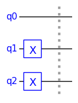
    


$\displaystyle 1\ \ket{011}$


The dotted vertical line is called a 'barrier' and can be used to separate the initialization from the main circuit for clarity.

The circuit can also be initialized with a random quantum state as follows. This is mainly useful for test purposes since a quantum circuit normally needs to be initialised to a known state.


```python
qc = QCircuit(2, init='random')
qc.display_state(decimals=4)
```


$\displaystyle (0.0695+0.5648j)\ \ket{00} + (-0.3076+0.1935j)\ \ket{01} + (-0.4872-0.4658j)\ \ket{10} + (-0.2975+0.0363j)\ \ket{11}$


Another possible way to initialize the state is to set the `state_vector` property. For example:


```python
qc = QCircuit(3)
qc.state_vector = np.array([0, 0, 0, 1, 0, 0, 0, 0])
qc.display_state()
```


$\displaystyle 1\ \ket{011}$


Note that setting the state vector does not form part of the circuit and does not get re-executed if the circuit is rerun.

### Building the Circuit

The gates and other components that can be used to build a quantum circuit are described in tutorial 3. There are 26 types of gates available, which are: CCU, CCX, CH, CP, CS, CSWAP, CT, CU, CX, CY, CZ, H, I, P, RX, RY, S, SDG, SWAP, SX, T, TDG, U, X, Y and Z. It is also possible to define custom gates, including ones with parameters and controls. See Tutorial 3 for further details.

Gates are added to the circuit using the corresponding method of the QCircuit class. Gates are referred to by upper-case names, such as 'H', with the corresponding method name in lower-case to comply with Python naming conventions. TinyQsim uses the big-endian qubit convention in which qubit 0 is the most-significant qubit. This is drawn as the top qubit in the circuit diagram.

The following circuit is just to illustrate how gates are added to a circuit. It is not intended to perform a useful function.


```python
PI = '\u03C0'  # Unicode pi for annotation

qc = QCircuit(3)
qc.h(0)  # Add an H gate to qubit 0
qc.x(1)  # Add an X gate to qubit 1
qc.cx(0, 1)  # Add a CX gate to qubits 0 and 1
qc.p(np.pi / 3, f'{PI}/3', 2)  # Add a pi/3 phase gate to qubit 2
qc.cx(2, 0)  # Add a CX gate to qubits 2 and 0

qc.draw()
```


    
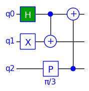
    


The arguments of most gates are  just a list of qubits although some gates have additional arguments for parameters. For example, the P gate shown above is a phase gate that has extra parameters for the phase angle and a label for annotation beneath the gate.

The gate shown with a '+' sign is a CX (controlled-NOT) gate, with the control signified by a black dot. The qubit arguments of gates are in order of decreasing significance, with the most-significant qubit first. Gates with controls have the control qubits first, so 'cx(0,1)' treats qubit '0' as the control and qubit '1' as the target, whereas 'cx(2,0)' treats qubit 2 as the control and qubit '0' as the target.

### Drawing the Circuit

The quantum circuit is drawn using the 'draw' method:


```python
qc = QCircuit(2)
qc.h(0)
qc.x(1)
qc.draw()
```


    
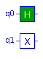
    


The qubits are represented as horizontal lines on which the gates are placed. TinyQsim uses the big-endian qubit convention in which qubit 'q0' is the most-significant qubit. This qubit is drawn at the top of the diagram. Consequently, this circuit corresponds to the tensor product: $H \otimes X$.

We can add more components and draw the circuit again:


```python
qc.cx(0, 1)
qc.draw()
```


    

    


We can draw the circuit and print its current state at any time as we build the circuit. There is no need to run the simulator explicitly, although there is an 'execute' method to re-execute a circuit if required as discussed later.


```python
qc.display_state()
```


$\displaystyle 0.70711\ \ket{01} + 0.70711\ \ket{10}$


The circuit diagram can be saved as a PNG file as follows:


```python
qc.draw(save='image.png')
```


    
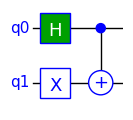
    


The file is saved in the user's home directory by default, but an absolute or relative path name can be used if required.

### Panning and Zooming the Circuit

If the circuit has a large number of gates, it may get reduced in size to fit in the window. The way that the circuit is panned and zoomed depends on whether it is run in a Jupyter notebook or from a Python script:

#### (i) In a Jupyter Notebook

- Double click on the circuit in the notebook. This will zoom the circuit and display scroll bars.
- Then click on the area to the left of the qubit numbers. This will expand the view vertically so that all qubits are visible.
- If the circuit is too wide to fit in the window, the horizontal scroll bar can be used to explore the circuit.

#### (ii) In a Python Script

If TinyQsim is run from a Python script, instead of from a notebook, the circuit will appear in a window with controls at the bottom for zooming and panning the view. A region can be zoomed into with the magnifier tool and then the view can be panned using the pan tool (which has 4 arrows).

### Labelling the Qubits

By default, the qubit lines in the circuit diagram are labelled q0, q1, q2, etc. It is possible to add text to the labels as shown in the following example:


```python
qc = QCircuit(3)
qc.qubit_labels({0: "Alice's qubit",
                 1: "Bob's qubit"})
qc.ccx(0, 1, 2)
qc.draw()
```


    
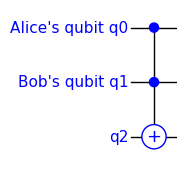
    


The labels are given as a Python dictionary. The dictionary need only contain entries for qubits that require a custom label. Other qubits will just get the default labels q0, q1,...

If required, the qubit numbers q0,q1... can be suppressed by adding the option 'numbers=False' to the 'qubit_labels' call. For example:


```python
qc = QCircuit(2)
qc.cx(0, 1)
qc.qubit_labels({0: "Alice", 1: "Bob"}, numbers=False)
qc.draw()
```


    
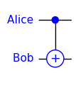
    


It is sometimes useful to label qubits with the ket symbol $\ket{0}$ to make it clear they are initialised to $\ket{0}$.


```python
KET0 = '|0\u27E9'

qc = QCircuit(2)
qc.qubit_labels({0: KET0, 1: KET0})
qc.h(0)
qc.cx(0, 1)
qc.draw()
```


    
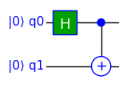
    


### Accessing the State

Consider the following circuit which generates the entangled state $\frac{1}{\sqrt{2}}\ket{01} + \frac{1}{\sqrt{2}}\ket{10}$.


```python
qc = QCircuit(2)
qc.h(0)
qc.x(1)
qc.cx(0, 1)
qc.draw()
```


    

    


The raw state_vector is available as a property of a QCircuit:


```python
qc.state_vector
```


    array([0.        , 0.70710678, 0.70710678, 0.        ])


However, we often just want to print the state in a more human-readable form that relates to the components to the basis state labels.

The 'display_state' method uses LaTeX to pretty-print the  state in a Jupyter notebook:


```python
qc.display_state()
```


$\displaystyle 0.70711\ \ket{01} + 0.70711\ \ket{10}$


By default, this prints 5 decimal places and omits values that round to zero. These defaults can be overridden as follows and a LaTeX prefix can be provided:


```python
qc.display_state(r'\ket{\psi} = ', decimals=4, include_zeros=True)
```


$\displaystyle \ket{\psi} = 0\ \ket{00} + 0.7071\ \ket{01} + 0.7071\ \ket{10} + 0\ \ket{11}$


Alternatively, the state can be printed using the 'format_state' method. This is similar to 'display_state' but produces ASCII output instead of LaTeX, for use in a Python script, for example.


```python
print(qc.format_state())
```

    0.70711|01⟩ + 0.70711|10⟩


```python
print(qc.format_state(decimals=7, include_zeros=True))
```

    0|00⟩ + 0.7071068|01⟩ + 0.7071068|10⟩ + 0|11⟩


The 'format_state' method also has a 'table' mode that is better when there are more than a few qubits and the output starts to wrap around.


```python
print(qc.format_state('table'))
```

    |01⟩  0.70711
    |10⟩  0.70711


```python
print(qc.format_state('table', decimals=7, include_zeros=True))
```

    |00⟩  0
    |01⟩  0.7071068
    |10⟩  0.7071068
    |11⟩  0


Note that commands such as 'format_state' and 'display_state' are used interactively and do not form part of the circuit.

If there are more than a few qubits, the table may become quite large. In this case, only a few elements will be printed at the start and end of the table, separated by an elipsis. The maximum number of edge elements can be controlled by using the 'edge' option. This is illustated here using a random 4-qubit quantum state:


```python
qc1 = QCircuit(4, init='random')
print(qc1.format_state('table', edge=3))
```

    |0000⟩  (-0.28141-0.18465j)
    |0001⟩  (0.00729+0.11895j)
    |0010⟩  (0.18316+0.07809j)
    ...
    |1101⟩  (-0.044-0.00517j)
    |1110⟩  (-0.10498-0.22845j)
    |1111⟩  (-0.10862-0.23692j)


### Probabilities

The probabilities of different measurement outcomes can be obtained as follows.

As an example, consider the following circuit:


```python
qc = QCircuit(2)
qc.x(1)
qc.h(0)
qc.p(np.pi / 3, 'pi/3', 0)
qc.h(0)
qc.cx(0, 1)
qc.draw()
qc.display_state(r'\ket{\psi} = ')
```


    
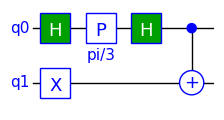
    


$\displaystyle \ket{\psi} = (0.75+0.43301j)\ \ket{01} + (0.25-0.43301j)\ \ket{10}$


The probabilities of the possible measurement outcomes are the squares of the absolute values of the complex amplitudes in the state vector, which in this case are $[0, \frac{3}{4},  \frac{1}{4}, 0]$. This array of values can be obtained as a numpy array as follows:


```python
qc.probability_array()
```


    array([0.  , 0.75, 0.25, 0.  ])


However, we often just want to print the probabilities in a more human-readable form that relates them to the basis state labels. One way do this is using the 'format_probabilities' method. This method should be called in a 'print' statement for proper formatting.


```python
print(qc.format_probabilities())
```

    |01⟩  0.75
    |10⟩  0.25


The format can be customised by specifying various options. For example:


```python
print(qc.format_probabilities(include_zeros=True, decimals=4))
```

    |00⟩  0
    |01⟩  0.75
    |10⟩  0.25
    |11⟩  0


```python
print(qc.format_probabilities(include_zeros=True, decimals=4, trim=False))
```

    |00⟩  0.0000
    |01⟩  0.7500
    |10⟩  0.2500
    |11⟩  0.0000


Alternatively, the probabilities can be displayed as a histogram:


```python
qc.plot_probabilities()
```


    
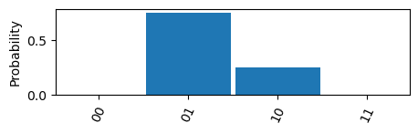
    


The 'height' option scales the vertical height of the plot relative to its default size


```python
qc.plot_probabilities(height=1.3)
```


    
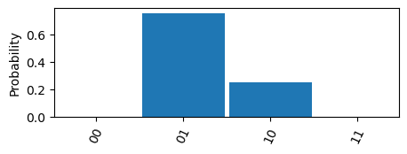
    


The 'probability_array', format_probabilities' and 'plot_probabilities' methods can be given a list of arguments specifying the qubits to be considered. The probabilities are then summed over the other qubits that are not included.

### Quantum Measurement

#### General Approach

With a real quantum computer, the only way to get a result is to perform a quantum measurement that collapses the state to one of the basis states. Consequently, quantum circuits typically include measurements on the final state of each qubit. Probabilities are estimated by running the program many times and looking at the frequencies of the various measurement outcomes.

The preferred approach for simulation with TinyQsim is to have quantum circuits that do not contain any measurements. This makes it possible to calculate the probabilities of the various measurement outcomes without having to run the circuit more than once. This gives a large performance advantage over a circuit containing measurements, which must be run hundreds of times to build up measurement counts to approximate the probabilities.

Measurements at the end of a circuit can simply be removed. Mid-circuit measurements are more tricky, but the circuit can in principle always be rearranged into an equivalent circuit with all measurements at the end, using the *Principle of deferred measurement*. These measurements can then be removed.

#### Simulated Counts

Sometimes, it is useful to see measurement counts, instead of just probabilities. If the circuit contains no measurements, then we can efficiently resample the probability distribution many times without rerunning the circuit. This operation is provided by the 'counts' and 'plot_counts' methods in their default 'resample' mode.

We will use the same example as before:


```python
qc = QCircuit(2)
qc.x(1)
qc.h(0)
qc.cx(0, 1)
qc.draw()
```


    

    


```python
qc.counts()
```


    {'01': 505, '10': 495}


If we repeat the experiment, we are likely to get different values:


```python
qc.counts()
```


    {'01': 478, '10': 522}


```python
qc.plot_counts()
```


    
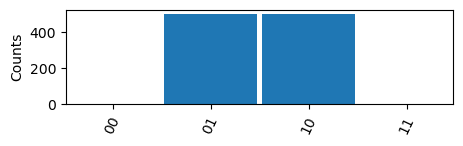
    


The result is similar to the one for probabilities except that it contains statistical variations.

Note that the measurement counts on a real quantum computer may also fluctuate as a result of noise and decoherence, but these effects are not modelled by TinyQsim.

#### Adding Measurements

A quantum measurement may be performed on one or more qubits. This collapses the state as it would on a real quantum computer.

The arguments specify the qubits to be measured. If they are omitted, all qubits are measured.


```python
qc.measure()
qc.draw()
```


    
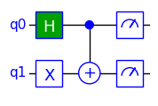
    


The results may be accessed from the return value of the 'measure' call. Alternatively, the 'results' method can be used to get a dictionary of the latest measured values for each measured qubit:


```python
qc.results()
```


    {0: 1, 1: 0}


If we now look at the state, we will find that it has collapsed to either $\ket{01}$ or $\ket{10}$:


```python
qc.display_state()
```


$\displaystyle 1\ \ket{10}$


#### Measurement Counts

If the circuit contains measurements, either the count option mode='measure' or mode='repeat' can be used to force re-execution of the whole circuit. If there are no measurements, then the default 'resample' mode is faster as the circuit is only executed once. This may be important when the circuit has many qubits.


```python
qc = QCircuit(2)
qc.x(1)
qc.h(0)
qc.cx(0, 1)
qc.measure()
qc.draw()
```


    

    


The following demonstrates the 'measure' mode:


```python
qc.counts(mode='measure')
```


    {'01': 491, '10': 509}


```python
qc.plot_counts(mode='measure')
```


    
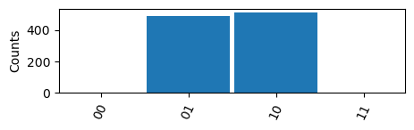
    


The 'repeat' mode is similar:


```python
qc.counts(mode='repeat')
```


    {'01': 507, '10': 493}


```python
qc.plot_counts(mode='repeat')
```


    
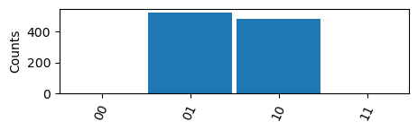
    


It doesn't matter whether we use the 'measure' or 'repeat' mode on this simple circuit because the measurements are on the outputs.

The effect of the various count modes is as follows:

##### mode='repeat'

Perform multiple executions of the circuit, measuring the outputs once on each run. The circuit may contain measurement operations, including mid-circuit measurements. The results are samples of the output distribution rather than the measurement outcomes.

##### mode='measure'

Perform multiple executions of a circuit containing measurement operations. The results are counts of the measurement outcomes which are not necessarily on the circuit outputs. If there is no measurement "gate" on any of the requested qubits, the corresponding bit position in the output will be zero. If there are measurement operations on any qubits that are not requested, then their outcomes are not included in the output.

##### mode='resample'

Perform a single execution of the circuit and sample the resulting probability distribution multiple times. The circuit should not contain any measurement operations. This mode is much faster than the 'repeat' and 'measure' modes. This is the default mode that is used for circuits that do not contain measurements.

See the QCircuit API documentation for further details.

### Reset

Reset is an experimental feature and its use is not recommended.

The 'reset' operation resets a qubit to the $\ket{0}$ state. One application is to allow a qubit to be reused, which may be useful since the maximum number of qubits available is quite limited. For example, ancilla qubits may no longer be needed once they have been used, so it may be possible to reset them and reuse them in a later part of the circuit.


```python
qc = QCircuit(1)
qc.x(0)
qc.display_state(r'\textrm{Before}:')
qc.reset(0)  # Reset qubit 0 to |0>
qc.display_state(r'\textrm{After}:')
qc.draw()
```


$\displaystyle \textrm{Before}:1\ \ket{1}$


$\displaystyle \textrm{After}:1\ \ket{0}$


    
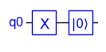
    


The behaviour of reset is equivalent to a measurement of the qubit followed by an X operation conditional on the measurement result being 1. This forces the qubit into the $\ket{0}$ state. Any other qubits that were entangled with the reset qubit are affected in the same way as if the reset were a measurement.

Although 'reset' effectively performs a measurement, it is not included in the output of the 'results' call. If this is needed, the 'reset' should be preceded by an explicit measurement.

### Sub-Circuits

TinyQsim does not provide explicit support for defining sub-circuits. However, a sub-circuit may be defined as a Python function and then used in a QCircuit.

This is illustrated by the following example that defines a function 'interfere'. This creates single-qubit interference by creating a superposition of $\ket{0}$ and $\ket{1}$ and then interfering them with a relative phase angle. The function has arguments to specify the qubit to which it is applied, the phase angle and a label.


```python
def interfere(qc, qubit: int, phase: float, label: str):
    qc.h(qubit)
    qc.p(phase, label, qubit)
    qc.h(qubit)
```

We can then use this in different circuits or multiple times in the same circuit.


```python
qc = QCircuit(2)
interfere(qc, 0, np.pi / 3, 'pi/3')
interfere(qc, 1, np.pi / 4, 'pi/4')

qc.draw()
print(qc.format_probabilities())
```


    
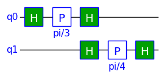
    


    |00⟩  0.64017
    |01⟩  0.10983
    |10⟩  0.21339
    |11⟩  0.03661


### Re-Execution

TinyQsim executes each gate as it is added to the circuit so that the state is always up-to-date. This is very convenient as it avoids having to explicitly run a simulator on the circuit. However, it is sometimes useful to be able to re-run a circuit.

Consider a simple circuit that creates a Bell state:


```python
qc = QCircuit(2)
qc.h(0)
qc.cx(0, 1)
```

Suppose that we wish to run the circuit 4 times, with the inputs $\ket{00}$, $\ket{01}$, $\ket{10}$ and $\ket{11}$ to generate the 4 Bell states:

We can use the 'execute' method to re-run the circuit multiple times. It is called with 'init' option 'none' so that the normal initialization of the state to $\ket{00\dots 0}$ is skipped.

The numpy 'eye(N)' function creates an 'NxN' identity matrix. This provides a convenient way to iterate over the basis vectors.


```python
for init in np.eye(4):
    qc.state_vector = init
    qc.execute(init='none')
    print(qc.format_state())
```

    0.70711|00⟩ + 0.70711|11⟩
    0.70711|01⟩ + 0.70711|10⟩
    0.70711|00⟩ - 0.70711|11⟩
    0.70711|01⟩ - 0.70711|10⟩


Another way to obtain the same result would be create a new circuit each time:


```python
for init in np.eye(4):
    qc = QCircuit(2)
    qc.state_vector = init
    qc.h(0)
    qc.cx(0, 1)
    print(qc.format_state())
```

    0.70711|00⟩ + 0.70711|11⟩
    0.70711|01⟩ + 0.70711|10⟩
    0.70711|00⟩ - 0.70711|11⟩
    0.70711|01⟩ - 0.70711|10⟩


### LaTeX Formatting

States, arrays and matrices can be formatted as LaTeX and included in Jupyter notebooks or cut-and-pasted into LaTeX or Markdown documents.

#### Displaying the State

For this example, we will create a tripartite entanglement known as a GHZ state:


```python
qc = QCircuit(3)
qc.h(0)
qc.cx(0, 1)
qc.cx(1, 2)
qc.draw()
```


    
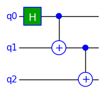
    


The state can be displayed in a notebook using the 'display_state' method. A LaTeX prefix can be included if required and the number of decimal places can be specified:


```python
qc.display_state()
```


$\displaystyle 0.70711\ \ket{000} + 0.70711\ \ket{111}$


```python
qc.display_state(r'\ket{\psi} = ', decimals=4)
```


$\displaystyle \ket{\psi} = 0.7071\ \ket{000} + 0.7071\ \ket{111}$


#### Accessing the Raw LaTeX

The raw LaTeX can be obtained for inclusion in other documents, as follows:


```python
print(qc.format_state('latex', decimals=4))
```

    0.7071\ \ket{000} + 0.7071\ \ket{111}


#### LaTeX Arrays and Matrices

The 'latex_array' function can be used to format a numpy 1D or 2D array as a LaTeX string:


```python
from tinyqsim.format import latex_array
from IPython.display import Math

print(latex_array(qc.state_vector))
```

    \begin{bmatrix}0.7071&0.0&0.0&0.0&0.0&0.0&0.0&0.7071 \end{bmatrix}


This can be displayed in a notebook as follows:


```python
display(Math(latex_array(qc.state_vector, decimals=4)))
```


$\displaystyle \begin{bmatrix}0.7071&0.0&0.0&0.0&0.0&0.0&0.0&0.7071 \end{bmatrix}$


The next example shows how the unitary matrix of the CX gate can be displayed:


```python
from tinyqsim.gates import CX

display(Math(latex_array(CX, r'\text{CX} = ')))
```


$\displaystyle \text{CX} = \begin{bmatrix}1&0&0&0\\0&1&0&0\\0&0&0&1\\0&0&1&0 \end{bmatrix}$


The 'display' call can be omitted for the last line in a notebook cell.

### The Unitary Matrix of a Circuit

It is occasionally useful to obtain the unitary matrix corresponging to a circuit. This can be done with the QCircuit 'to_unitary' method, as shown in the following example. 

The unitary matrix of a K-qubit circuit has $2^{2K}$ elements, so can become very large. Consequently, this method is mainly useful for small circuits.


```python
qc = QCircuit(2)
qc.h(0)
qc.cx(0, 1)
u = qc.to_unitary()
print(u)
```

    [[ 0.70710678  0.          0.70710678  0.        ]
     [ 0.          0.70710678  0.          0.70710678]
     [ 0.          0.70710678  0.         -0.70710678]
     [ 0.70710678  0.         -0.70710678  0.        ]]


This unitary matrix can be pretty-printed using LaTeX if required and a LaTeX prefix can be provided.

In the following example, a factor of $\frac{1}{\sqrt{2}}$ is extracted and included in the prefix:


```python
from math import sqrt
from tinyqsim.format import latex_array
from IPython.display import Math

Math(latex_array(u * sqrt(2), r'\text{U} = \frac{1}{\sqrt{2}}'))
```


$\displaystyle \text{U} = \frac{1}{\sqrt{2}}\begin{bmatrix}1.0&0.0&1.0&0.0\\0.0&1.0&0.0&1.0\\0.0&1.0&0.0&-1.0\\1.0&0.0&-1.0&0.0 \end{bmatrix}$


### Bloch Sphere

A state of a qubit may be mapped onto a sphere, known as the Bloch sphere:

$\ket{\psi} = \cos(\frac{\theta}{2})\ket{0} + e^{i\phi} \sin(\frac{\theta}{2})\ket{1}$

where $0 \le\theta\le\pi\,$ and $\,0\le\phi\le2\pi$.

<div style="text-align: center;">

</div>

The Bloch sphere is mainly useful for single qubits because the qubits of a multi-qubit system can become *entangled* such that the qubits no longer have individual pure states. However, the sphere is a useful way to visualize and learn about the effects of single-qubit gates, which can then be used as part of a multi-qubit system.

The following example shows how to create a one-qubit quantum circuit, use gates to configure the state and then plot the state on the Bloch sphere.


```python
from tinyqsim.bloch import plot_bloch
```


```python
qc = QCircuit(1)  # This must be 1 qubit
qc.display_state(prefix=r'\ket{\phi} = ')
plot_bloch(qc.state_vector)
```


$\displaystyle \ket{\phi} = 1\ \ket{0}$


    
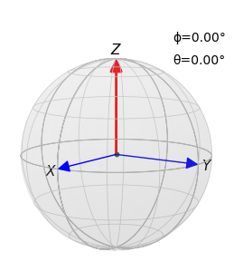
    


The initial $\ket{0}$ state is shown by the red arrow.

We can apply some gates and observe the effect on the state vector:


```python
PI = '\u03C0'  # Unicode pi

qc.h(0)
qc.p(np.pi / 3, f'{PI}/3', 0)
qc.draw()
qc.display_state(prefix=r'\ket{\phi} = ')
plot_bloch(qc.state_vector)
```


    
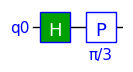
    


$\displaystyle \ket{\phi} = 0.70711\ \ket{0} + (0.35355+0.61237j)\ \ket{1}$


    
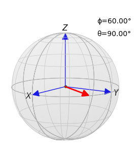
    


The Hadamard gate rotates the state vector from its initial +Z direction $\ket{0}$ to the +X direction $\ket{+}$. Then the P($\pi$/3) gate rotates it by $\pi/3$ radians clockwise about the Z axis to the position shown by the red arrow.

The sphere can be rotated with the mouse when run from a Python script. When run from a Jupyter notebook, the orientation is fixed but the view point can be set using the optional parameters azimuth and elevation (in degrees).

It is also possible to display the Bloch sphere for a pair of angles, $\phi$ and $\theta$. For example:


```python
from tinyqsim.bloch import plot_bloch_angles

phi = np.pi / 3
theta = np.pi / 2
plot_bloch_angles(phi, theta)
```


    

    


The support for the Bloch Sphere in TinyQsim is at the prototype stage, so the details may change.
