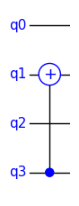
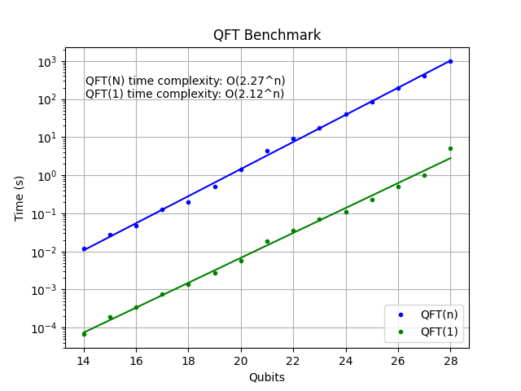

## TinyQsim Design Notes

This document provides some informal notes on the design of TinyQsim, as well as some ideas for further development.

<!-- TOC -->

- [TinyQsim Design Notes](#tinyqsim-design-notes)
  - [Introduction](#introduction)
  - [Use of Tensors](#use-of-tensors)
  - [Simulation](#simulation)
  - [Endianness](#endianness)
  - [Performance](#performance)
  - [Software Modules](#software-modules)

<!-- TOC -->

### Introduction

TinyQsim was originally started as a fun project to learn about quantum computation and as a framework to explore new ideas. The aim was to 'keep it simple', rather than worrying about optimization. Nevertheless, it is capable of simulating a 20-qubit Quantum Fourier Transform in about one second. This is sufficient for most textbook examples.

The software is intended as a tool for interactive experiments. It is written in Python, using Jupyter notebooks as an environment for interaction. TinyQsim works in an incremental fashion by executing each gate as it is added to the circuit, so that the state is always up to date. This makes it very easy to examine the state, probabilities, etc, at any time, without having to run a simulator on the model each time. This is very convenient for interactive use, but limits the scope for circuit optimization. However, there is an experimental deferred-execution mode that allows a circuit to be constructed before it is run.

### Use of Tensors

Textbooks often give examples of gates as unitary matrices that are applied to state vectors. Although it is possible to write a simulator using this approach, it is very slow and limited to just a few qubits. Even a one-qubit gate can affect all the elements of the state vector, so the matrix has to be expanded to operate on the full state. This results in an enormous overhead in memory requirements and execution speed. Another problem is that the state vector needs to be permuted before and after the matrix multiplication, so that the gate is applied to the correct qubits. Some optimisation is possible, but this only makes a small improvement.

Instead, quantum simulators typically use tensors to describe both the state and the unitary operators. This greatly improves the speed and memory usage.

As an example, a 2-qubit state can be expresed as a tensor $\psi^{ab}$, where the indices refer to the qubits. Similarly, a 2-qubit unitary operator can be expressed as a tensor $U_{kl}^{ij}$. The operator can be applied to the state by tensor contraction as follows:

$\qquad U_{ab}^{ij}\ \psi^{ab} \rightarrow \psi^{ij}$

Since the indices correspond to qubits, the operator can be applied directly to whichever qubits are appropriate. For example, to apply $U$ to qubits (3,1), that is (d,b), of a 4-qubit state $\psi^{abcd}$:

$\qquad U_{db}^{ij}\ \psi^{abcd} \rightarrow \psi^{ajci}$ 

### Simulation

TinyQsim uses tensors for both quantum states and unitary operators (i.e gates). The tensors are represented internally as multi-dimensional arrays with one dimension per tensor index.

When a new instance of QCircuit is created, the quantum state is initialized to the all-zero state $\ket{000\dots 0}$, expressed as a tensor. Executing a quantum circuit just involves applying each gate in the circuit, in turn, to the quantum state using tensor contraction.

For example, consider the following circuit:

<div style="text-align: center;">

</div>

This corresponds to the earlier example, where a 2-qubit unitary $U$ was applied to qubits (3,1) of a 4-qubit state $\psi$. In this case, the unitary is a CX (controlled-NOT) gate.

This can be expressed in Einstein summation notation as the tensor contraction:

$\qquad U_{ijdb}\,\psi_{abcd}\,\rightarrow \psi_{ajci}$

This can be implemented in Python using the numpy 'einsum' function as follows:

```
  s = einsum('ijdb,abcd->ajci', u, psi)
```

Numpy implements multi-dimensional arrays as 'strided' arrays. The internal data structure is a one-dimensional array with a separate small 'stride' array that holds the step size between elements for each dimension. Permuting the indices simply involves permuting the small stride array, without altering the data array. The same one-dimensional data-array may have multiple 'views' each with its own stride array. Consequently, the state-vector and tensor representations of the state can share the same data array, simply by creating a new view.

The tensor view 't' of an n-qubit state vector 's' can be obtained as a new view simply by reshaping it, without changing the internal data array.

```
   t = s.reshape([2] * n)
```

Similarly, a tensor view 'u' of a k-qubit unitary matrix 'm', representing a quantum operator, can be obtained as follows':
```
   u = m.reshape([2] * k * 2)
```   

TinyQsim also uses 'einsum' to construct a unitary-matrix representation of a quantum circuit. It is also used to calculate measurement probabilities for a subset of qubits by summing over the remaining qubits.

### Endianness

Some books, papers and online resources use the *big-endian* convention, in which qubit 0 is the most-significant qubit, while others use the *little-endian* convention, in which qubit 0 is the least significant qubit. This can lead to confusion when comparing examples from different sources.

The big-endian convention was chosen for TinyQsim as it is popular in books and published papers on quantum computing.

Using tensors, swapping endianness simply involves reversing the order of indices.

For example, to swap the endianness of a 4-qubit state $\psi$:

$\qquad \psi^{ijkl} \rightarrow \psi^{lkji}$

Similarly, to swap the endianness of a unitary operator $U$:

$\qquad U_{abcd}^{ijkl} \rightarrow U_{dcba}^{lkji}$

So, an endian-swapped operator, applied to an endian-swapped state, gives an endian-swapped result:

$\qquad U_{dcba}^{lkji}\ \psi^{dcba} \rightarrow (U\psi)^{lkji}$

TinyQsim currently only supports the big-endian convention, but it would not be too difficult to add support for little-endian at a later date.

### Performance

The following graph shows the execution time of a Quantum Fourier Transform (QFT) plotted against the numbers of qubits. The time axis is logarithmic, so a straight line corresponds to a time complexity that is exponential in the number of qubits.

The test was run on a Mac Mini M2 Pro with 32GB of RAM, starting with a random N-qubit state for each run. The times are for execution of the QFT algorithm, excluding the initialisation of the random state.

<div style="text-align: center;">

</div>

The green plot shows the time taken for a one-qubit QFT (which is just a single Hadamard gate) on the most-significant qubit. This provides a baseline against which to compare an N-qubit QFT. Although the Hadamard gate is only applied to one qubit, it will normally change all elements of the state vector. Hence the time complexity is of order $\mathcal{O}(2^N)$. The plot shows that the actual execution time increases by a factor of 2.12 for each qubit that is added.

The approximate time to run a given algorithm will be this baseline time multiplied by the number of qubits in the circuit, if run on the same computer, assuming simple one or two qubit gates.

The blue plot shows the execution time for an N-qubit QFT operating on the full N-qubit state. The QFT algorithm has a complexity of $\mathcal{O}(N^2)$ gates. On a real quantum computer, this is also the time complexity if it is assumed that the different gates take equal times. However, in the simulation, the time taken per gate approximately doubles for each qubit, so the overall time complexity is expected to be $\mathcal{O}(N^2\ 2^N) \approx \mathcal{O}(2^N)$.

In conclusion, the simulator is quite responsive for interactive use with up to 20 qubits. However, with 28 qubits a QFT of all the qubits takes around 1000 seconds. Of course, these figures depend on the processor's performance and memory available.

There are a number of ways in which the performance could be further improved, but an initial design goal of TinyQsim was to keep it simple.

### Software Modules

The Python software modules are as follows:

| Module    | Purpose                                             | 
|:----------|:----------------------------------------------------|
| qcircuit  | User API for a quantum circuit                      |
| quantum   | Functions for quantum operations                    |       
| gates     | Gates defined as unitary matrices                   |
| model     | Model of a quantum circuit                          |
| simulator | Simulation of state evolution                       |
| unitary_sim | Creates unitary matrix from circuit model         |
| schematic | Graphics for drawing quantum circuits               |
| plotting  | Functions for plotting histograms etc               |
| bloch     | Graphics for Bloch sphere                           |
| format    | Formatting of data for display                      |
| utils     | General utility functions                           |

QCircuit is an API wrapper that presents the quantum circuit to the user as an object. Most of the actual functionality is in the other modules.
